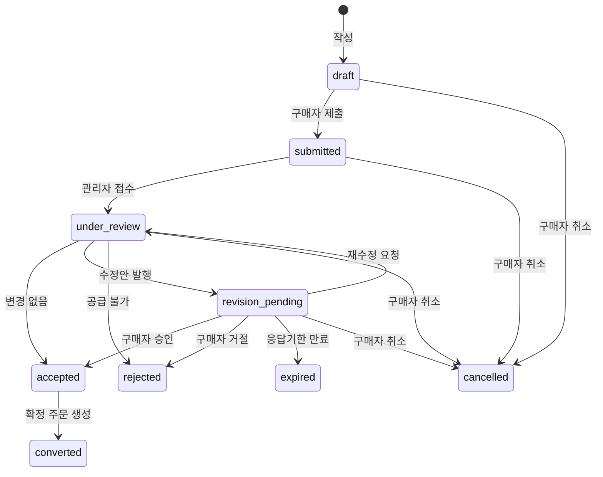
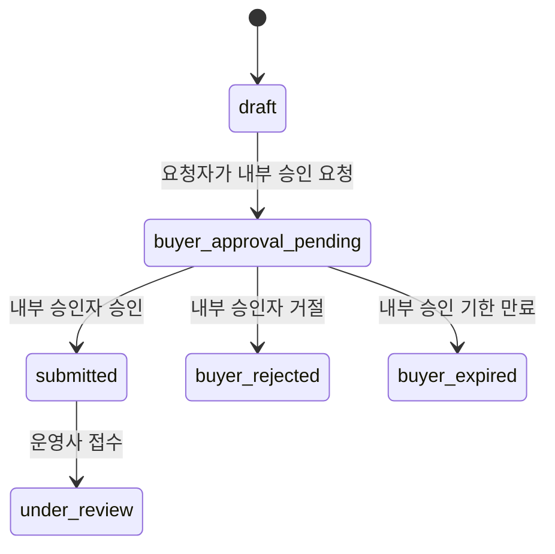
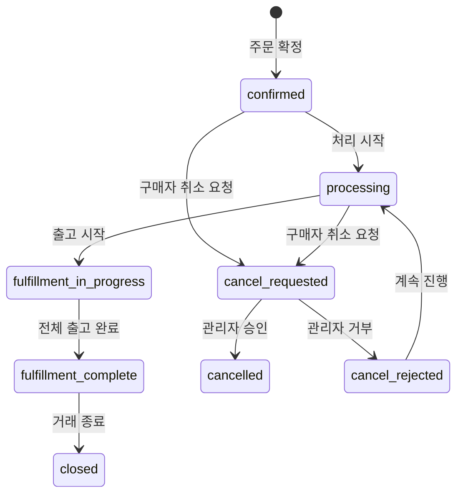
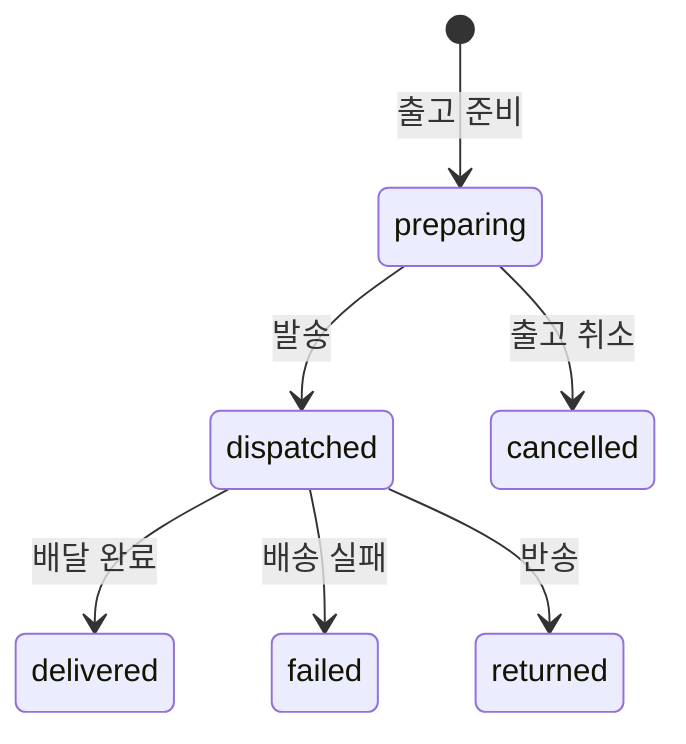

# Business Rules

이 문서는 **가격, VAT, MOQ, UOM, 주문, 출고 규칙의 Single Source of Truth(SSOT)**입니다.

다른 문서에서 가격·주문·출고 규칙을 기술할 때는 이 문서를 참조합니다.

> **범위**: Business Evolution Stage 1~2 기준. Stage 3 이후 공급업체 포털·정산 규칙은 해당 Phase에서 확장합니다.

---

## 1. 판매 주체 및 책임

### 1.1 기본 원칙

Business Evolution Stage 1과 Stage 2에서 **[운영사명]이 구매 거래처에 대한 유일한 판매 주체이자 고객응대 주체**입니다.

| 책임 | Stage 1~2 담당 | Stage 3 이후 |
|---|---|---|
| 주문 접수 및 확인 | 운영사 | 운영사 (통합 창구) |
| 가격 및 재고 확인 | 운영사 | 운영사 |
| 주문 확정 | 운영사 | 운영사 |
| 고객 문의 | 운영사 | 운영사 |
| 반품 접수 | 운영사 | 운영사 (내부적으로 공급업체 전달) |
| 배송사고 대응 | 운영사 | 운영사 (공급업체 직배송 포함) |
| 세금계산서 발행 | 운영사 | OPEN_DECISIONS.md OD-019 참조 |

### 1.2 통합 구매 경험

구매자에게 제공하는 통합 경험:

```
한 번 로그인
→ 자기 거래가격 확인
→ 여러 브랜드 상품 검색
→ 하나의 장바구니
→ 하나의 주문 요청
→ 운영사를 통한 통합 주문상태 확인
```

공급업체 직배송이 발생하더라도 구매 거래처에는 **운영사가 단일 주문창구**로 보입니다.

### 1.3 반품·교환·클레임

출고가 시작된 이후에는 일반 취소가 아니라 **반품, 교환, 또는 클레임 절차**로 전환합니다.

반품·교환·클레임의 상세 구현은 MVP 범위 밖에 둘 수 있지만, 이 원칙은 확정된 규칙입니다.

---

## 2. 판매단위 (UOM) 규칙

### 2.1 복수 판매단위

공구 유통에서는 낱개(EA), 팩(PACK), 세트(SET), 박스(BOX) 등 여러 주문단위를 함께 사용합니다.

각 SKU는 하나의 **기본단위(base_unit)**를 가지며, 주문 가능한 판매단위를 `sku_uoms` 테이블에서 관리합니다.

> DB 스키마 상세는 DATABASE_SCHEMA.md 참조

### 2.2 UOM 예시

**SKU**: OLFA 교체날 LB-10 (SAMPLE)

| UOM 코드 | 기본단위 변환 | 주문 가능 | 기본 판매단위 | MOQ | 증가단위 |
|---|---|---|---|---|---|
| EA | 1 | ✅ | — | 10 | 1 |
| PACK | 10 | ✅ | ✅ | 1 | 1 |
| BOX | 100 | ✅ | — | 1 | 1 |

- 기본단위(base_unit): EA
- PACK 1개 = EA 10개
- BOX 1개 = EA 100개

### 2.3 MOQ와 주문 증가단위 검증

| 규칙 | 설명 |
|---|---|
| 최소주문수량(MOQ) | 선택된 UOM 기준으로 적용 |
| 주문 증가단위 | MOQ 이상에서 이 단위로만 증가 가능 |
| 검증 시점 | 장바구니 추가 시 안내, 주문 제출 시 서버에서 재검증 |

**예시** (SAMPLE):

MOQ = 10 EA, 증가단위 = 5 EA인 상품:
- 사용자가 12 EA 입력 → "10개 또는 15개로 조정해 주세요" 안내
- 유효한 수량: 10, 15, 20, 25, ...

### 2.4 주문 스냅샷의 UOM 보존

주문 품목에는 다음을 스냅샷으로 보존합니다:

- `ordered_uom_code`: 주문 시 선택한 판매단위
- `ordered_quantity`: 해당 단위 기준 수량
- `conversion_to_base`: 주문 시점의 변환비율
- `base_quantity`: 기본단위 환산 수량
- `minimum_order_quantity`: 주문 시점 MOQ
- `order_increment`: 주문 시점 증가단위

판매단위가 나중에 변경되더라도 **과거 주문의 단위와 수량은 변하지 않습니다**.

---

## 3. 가격 규칙

### 3.1 가격 우선순위

거래처에 표시되는 가격은 다음 순서로 결정합니다:

| 순위 | 가격 소스 | 설명 |
|---|---|---|
| 1순위 | 거래처 개별 지정가격 | `organization_price_overrides`에서 해당 거래처 + SKU UOM + 수량구간 일치 |
| 2순위 | 거래처 배정 가격표 | `organization_price_books`로 배정된 가격표의 SKU UOM + 수량구간 일치 |
| 3순위 | 기본 B2B 가격표 | 기본 가격표의 SKU UOM + 수량구간 일치 |
| 4순위 | 견적문의 | 일치하는 가격이 없으면 견적문의 또는 주문 불가 |

### 3.2 수량구간 가격 (Tiered Pricing)

가격표는 수량에 따른 단계별 가격을 지원합니다.

**예시** (SAMPLE): OLFA 칼날 PACK 단위

| 구간 | 수량 | 단가 |
|---|---|---|
| 1 | 1~4 PACK | 10,000원 |
| 2 | 5~9 PACK | 9,500원 |
| 3 | 10 PACK 이상 | 9,000원 |

규칙:
- 수량구간은 **선택된 UOM의 수량**을 기준으로 평가합니다
- EA 10개와 BOX 1개는 동일한 기본수량이더라도 서로 다른 판매단위 가격을 가질 수 있습니다
- `max_quantity`가 null이면 상한이 없는 구간입니다
- 동일한 (price_book + sku_uom + 적용기간) 조합에서 **수량구간이 겹치면 등록을 거부**합니다

### 3.3 가격 선택 규칙 상세

```
1. 거래처 개별가격 중 UOM + 수량구간 일치 → 사용
2. 없으면 → 거래처 배정 가격표 중 UOM + 수량구간 일치 → 사용
3. 없으면 → 기본 B2B 가격표 중 UOM + 수량구간 일치 → 사용
4. 없으면 → 견적문의 또는 주문 불가
```

### 3.4 거래처 개별가격

거래처 개별가격도 필요 시 수량구간을 지원합니다:

- `sku_uom_id`
- `min_quantity` / `max_quantity`
- `unit_price`
- `valid_from` / `valid_to`

### 3.5 가격 계산 예시 (SAMPLE)

**상황**: B등급 거래처가 TTC 니퍼 150mm를 EA 단위로 5개 주문

| 순위 | 검색 | 결과 |
|---|---|---|
| 1순위 | 해당 거래처 개별가격에 TTC 니퍼 150mm EA 있는가? | 없음 → 다음 |
| 2순위 | B등급 가격표에 TTC 니퍼 150mm EA의 5개 구간 가격이 있는가? | **10,800원** 발견 |
| 3순위 | (사용하지 않음) | — |

**적용가격**: 10,800원 × 5 = 54,000원 (공급가)

### 3.6 가격 보안

- 비회원과 승인대기 회원에게 가격을 공개하지 않습니다
- 매입가격과 공급업체 원가는 `can_view_purchase_cost` 권한이 있는 운영사 관리자만 조회합니다
- 브라우저에서 전달된 가격과 주문총액을 **신뢰하지 않습니다**
- 주문 생성 시 **서버에서 가격을 다시 계산**합니다
- 수량 또는 UOM이 변경되면 가격을 서버에서 다시 계산합니다

### 3.7 금액 관리

| 항목 | 설명 |
|---|---|
| 통화 | KRW 기본, 통화코드(`currency_code`) 저장 |
| KRW 정밀도 | 원 단위 정수 |
| 해외 통화 | 향후 통화별 최소단위를 고려한 money 구조 |

구분해서 관리하는 금액:
- 공급업체 공급가격 (supplier_offers)
- 당사 매입가격 (supplier_offers)
- 기본 B2B 판매가 (price_book_items)
- 가격등급별 판매가 (price_book_items)
- 거래처별 개별 판매가 (organization_price_overrides)
- 부가세
- 주문 최종금액

### 3.8 가격 스냅샷

확정 주문에는 다음 가격 정보를 스냅샷으로 보존합니다:

| 필드 | 설명 |
|---|---|
| `price_source_type` | individual / price_book / base |
| `price_source_id` | 출처 레코드 ID |
| `price_source_version` | 출처 버전 |
| `price_calculated_at` | 가격 계산 시각 |
| `price_book_code` | 적용 가격표 코드 |
| `ordered_uom_code` | 주문 판매단위 |
| `tier_min_quantity` | 적용된 구간 최소수량 |
| `tier_max_quantity` | 적용된 구간 최대수량 |
| `unit_price` | 단가 |
| `currency_code` | 통화 |
| `tax_inclusion_mode` | 세금 포함 여부 |
| `supply_cost` | 공급가 (관리자 전용) |
| `tax_amount` | 부가세 |
| `line_total` | 품목 총액 |

가격 구간이 변경되어도 **과거 확정 주문의 가격은 변하지 않습니다**.

---

## 4. VAT 규칙

> [!WARNING]
> VAT 계산 정책은 **미확정**입니다. 상세는 OPEN_DECISIONS.md OD-005, OD-006, OD-007, OD-008을 참조하세요.

### 4.1 화면 표시

거래처 화면과 주문서에는 다음을 구분해서 표시합니다:

- 공급가 (부가세 별도)
- 부가세
- 총액

### 4.2 시스템 설정

VAT 정책은 `system_settings`에서 다음 키로 관리하며, 확정 전까지 값을 고정하지 않습니다:

| 설정 키 | 설명 | 후보 값 |
|---|---|---|
| `tax_calculation_basis` | 세액 계산 기준 | `per_line_item`, `order_total` |
| `tax_rounding_mode` | 원 단위 처리 | `floor`, `round`, `ceil` |
| `price_display_mode` | 가격 표시 방식 | `tax_exclusive`, `tax_inclusive` |

### 4.3 일관성 원칙

VAT 정책이 한 번 정해지면 **상품목록, 장바구니, 주문서, 견적서에서 동일하게 적용**합니다.

---

## 5. 주문 흐름

### 5.1 3개 독립 State Machine

주문 요청, 확정 주문, 출고를 **하나의 상태 필드로 관리하지 않습니다**.

다음 3개의 독립된 State Machine으로 설계합니다:

1. **Order Request State Machine** — 구매자가 운영사에 제출하는 주문 요청
2. **Sales Order State Machine** — 구매자와 운영사가 합의한 확정 주문
3. **Shipment State Machine** — 실제 출고 단위

### 5.2 Order Request State Machine



**상태 목록:**

| 상태 | 설명 |
|---|---|
| `draft` | 작성 중 (아직 제출되지 않음) |
| `submitted` | 구매자가 운영사에 제출 |
| `under_review` | 관리자가 검토 중 |
| `revision_pending` | 수정안이 발행되어 구매자 응답 대기 |
| `accepted` | 구매자와 운영사가 합의 |
| `converted_to_sales_order` | 확정 주문으로 전환 완료 (종료) |
| `rejected` | 거절됨 (종료) |
| `cancelled` | 구매자가 취소 (종료) |
| `expired` | 수정안 응답기한 만료 (종료) |

### 5.3 구매사 내부 승인 Subflow

> 이 기능은 **기본 비활성화**, Feature Flag로 활성화합니다. 상세는 USER_ROLES.md 참조.

내부 승인이 활성화된 경우:



| 상태 | 필드 | 설명 |
|---|---|---|
| `not_required` | `buyer_approval_status` | 내부 승인 불필요 (기본값) |
| `pending` | `buyer_approval_status` | 내부 승인 대기 |
| `approved` | `buyer_approval_status` | 내부 승인 완료 |
| `rejected` | `buyer_approval_status` | 내부 승인 거절 |
| `cancelled` | `buyer_approval_status` | 내부 승인 취소 |
| `expired` | `buyer_approval_status` | 내부 승인 만료 |

**핵심**: `buyer_approval_status`와 `order_request_status`는 **별도 필드**입니다. 혼합하지 않습니다.

운영사는 구매사가 내부 승인 중인 `draft` 주문을 볼 수 없습니다.

### 5.4 수정안 (Revision)

관리자가 가격·수량·납기를 변경하면 **수정안을 발행**하고 구매자의 재승인을 받습니다.

| 테이블 | 역할 |
|---|---|
| `order_revisions` | 수정안 메타데이터: revision_number, status, reason, expires_at |
| `order_revision_items` | 품목별 변경: proposed_quantity, proposed_unit_price, proposed_lead_time, change_reason |

수정안 상태: `pending` → `approved` / `rejected` / `expired` / `superseded`

### 5.5 Sales Order State Machine



| 상태 | 설명 |
|---|---|
| `confirmed` | 주문 확정 |
| `processing` | 처리 중 |
| `fulfillment_in_progress` | 출고 진행 중 (부분 출고 포함) |
| `fulfillment_complete` | 전체 출고 완료 |
| `closed` | 거래 종료 |
| `cancel_requested` | 구매자가 취소 요청 (관리자 승인 필요) |
| `cancelled` | 취소 완료 |
| `cancel_rejected` | 취소 거부 |

**중요**: 출고가 시작된 이후에는 일반 취소가 아니라 반품·교환·클레임 절차로 전환합니다.

### 5.6 Shipment State Machine



| 상태 | 설명 |
|---|---|
| `preparing` | 출고 준비 중 |
| `dispatched` | 발송 완료 (송장번호 등록) |
| `delivered` | 배달 완료 |
| `failed` | 배송 실패 |
| `returned` | 반송 |
| `cancelled` | 출고 취소 |

하나의 Sales Order는 여러 Shipment를 가질 수 있습니다.

지원하는 출고 유형:
- 전체 출고
- 부분 출고
- 여러 차례 분할 출고
- 택배 / 화물 / 방문수령 / 공급업체 직배송

### 5.7 상태 분리 원칙

다음 상태를 **하나의 필드로 합치지 않습니다**:

| 상태 유형 | 필드 | 값 예시 |
|---|---|---|
| 주문 상태 | `order_status` | confirmed, processing, closed |
| 이행 상태 | `fulfillment_status` | not_started, partial, shipped, delivered |
| 결제 상태 | `payment_status` | not_due, due, partially_paid, paid, overdue |
| 세금계산서 상태 | `tax_invoice_status` | not_issued, issued, cancelled |

**"거래완료"라는 모호한 단일 상태를 사용하지 않습니다.** 배송이 완료되었다고 결제와 세금계산서 처리가 완료된 것은 아닙니다.

---

## 6. 주문 품목 수량 모델

### 6.1 수량 필드

| 필드 | 정의 |
|---|---|
| `requested_quantity` | 구매자가 처음 요청한 수량 |
| `accepted_quantity` | 운영사와 구매자가 최종 합의한 수량 |
| `rejected_quantity` | 확정 전에 공급 불가 또는 구매자 거절로 제외된 수량 |
| `shipped_quantity` | **저장하지 않음.** shipment_items의 유효 출고수량 합계로 계산 (DEC-028) |
| `cancelled_quantity` | 주문 확정 후 취소 승인된 수량 |
| `open_quantity` | **저장하지 않음.** `accepted - shipped(계산) - cancelled`로 도출 |
| `backordered_quantity` | open_quantity 중 재고 부족·입고 대기로 분류된 수량 |

### 6.2 불변식

```
accepted_quantity + rejected_quantity = requested_quantity
shipped_quantity + cancelled_quantity + open_quantity = accepted_quantity
backordered_quantity <= open_quantity
```

**DB CHECK 제약조건** (sales_order_items):

```
CHECK (accepted_quantity + rejected_quantity = requested_quantity)
CHECK (cancelled_quantity <= accepted_quantity)
CHECK (backordered_quantity <= accepted_quantity - cancelled_quantity)
CHECK (모든 수량 >= 0)
```

> [!NOTE]
> `backordered <= accepted - shipped - cancelled`와 `shipped + cancelled <= accepted`는
> shipped_quantity가 저장 컬럼이 아니므로 일반 CHECK로 강제할 수 없다.
> 대신 `fn_record_shipment` 트랜잭션에서 Application 검증으로 강제한다.

### 6.3 검증

- 수량 계산값은 브라우저 값만 신뢰하지 않고 **서버에서 검증**합니다
- 수량 변화는 **감사로그와 상태이력**에 기록합니다

### 6.4 출고 트랜잭션 규칙 (DEC-034)

출고 기록은 `fn_record_shipment`에서 단일 트랜잭션으로 실행합니다:

1. 대상 `sales_order_item`을 `FOR UPDATE`로 잠금
2. 현재 유효 `shipment_items` 출고수량 합계 계산
3. 신규 출고수량을 포함한 최종 출고수량 계산
4. `shipped(계산) + cancelled <= accepted` 검증
5. `backordered <= accepted - shipped(계산) - cancelled` 검증
6. 조건 미충족 시 **전체 Rollback**
7. 조건 충족 시:
   - `shipments` 및 `shipment_items` INSERT
   - 출고 대상이 backorder 물량이면 `backordered_quantity`를 같은 트랜잭션에서 감소
   - `shipment_status_history` INSERT
   - `audit_logs` INSERT
   - OCC version 확인
8. 실패 시 shipment, status history, audit log 모두 Rollback

**Backorder 정책**: 출고 후 `backordered > open_quantity`가 되는 상태를 허용하지 않는다.
출고 대상이 backorder 물량을 포함하면 같은 트랜잭션에서 `backordered_quantity`를
`max(0, backordered - shipped)` 값으로 조정한다.

---

## 7. 확정 전 취소 vs 확정 후 취소

| 구분 | 확정 전 취소 | 확정 후 취소 요청 |
|---|---|---|
| 주체 | 구매자 직접 | 구매자 요청, 관리자 승인 필요 |
| 시점 | draft ~ revision_pending | confirmed 이후 |
| 승인 | 불필요 (즉시 취소) | 관리자 승인 필요 |
| 출고 영향 | 없음 | 출고 진행 시 거부 가능 |
| 출고 후 | — | 반품·교환·클레임으로 전환 |

---

## 8. 주문 확정 스냅샷

주문이 확정될 때 다음 정보를 복사하여 보존합니다. 향후 원본 데이터가 변경되어도 과거 주문 내용이 변하지 않습니다.

### 주문 수준

- 거래처 회사정보 (회사명, 대표자)
- 사업자등록번호
- 주문 담당자 (이름, 연락처)
- 배송지 (전체 주소)
- 결제조건
- 배송방법
- 적용 가격표 ID 및 가격 산출 근거
- VAT 정책 (`tax_calculation_basis`, `tax_rounding_mode`)

### 품목 수준

- 상품명, 브랜드, 모델명, 규격
- SKU 코드 (`internal_sku_code`)
- 주문 판매단위 (`ordered_uom_code`)
- 기본단위 변환비율
- 단가, 수량, 부가세, 품목 총액
- 가격 출처 및 적용 구간
- 예상 납기, 출고방식
- 공급업체 (내부 참조용)

---

## 9. 출고 규칙

### 9.1 출고방식

| 출고방식 | 설명 |
|---|---|
| 당사 재고 출고 | 운영사 창고에서 직접 출고 |
| 공급업체 직배송 | 공급업체가 구매 거래처에 직접 배송 (운영사 명의) |
| 주문 후 조달 | 재고 없이 주문 후 매입하여 출고 |
| 주문제작 | 주문 후 제작하여 출고 |
| 방문수령 | 구매자가 직접 방문하여 수령 |
| 화물배송 | 대형 화물 운송 |

### 9.2 출고 원칙

- 구매자에게 주문 전에 **예상 출고주체와 납기를 명확히** 보여줍니다
- 하나의 주문에 **여러 출고(Shipment)가 포함**될 수 있습니다
- 부분 출고와 분할 출고를 지원합니다

---

## 10. 결제조건

초기에는 온라인 카드결제를 필수로 구현하지 않습니다.

기존 거래처 조건에 따라 다음 결제방식을 **기록**할 수 있게 합니다:

| 결제방식 | 설명 |
|---|---|
| 월말결제 | 월말에 일괄 정산 |
| 선입금 | 주문 전 입금 |
| 현금 | 현금 결제 |
| 카드 | 카드 결제 |
| 방문결제 | 방문 시 결제 |
| 별도 협의 | 특수 조건 |

---

## 11. 공급조건 (supplier_offers)

### 11.1 공급조건 정보

Stage 1에서도 운영사의 매입처 정보를 관리합니다:

| 필드 | 설명 |
|---|---|
| 공급업체 | 매입처 |
| SKU | 상품 |
| 공급업체 상품코드 | `supplier_item_code` |
| 공급가격 | 매입 단가 |
| 통화 | 기본 KRW |
| MOQ | 공급업체 최소주문수량 |
| 재고상태 | in_stock, limited, out_of_stock, discontinued |
| 예상 납기 | lead_time_min_days ~ lead_time_max_days |
| 출고방식 | 당사출고, 직배송 등 |
| 직배송 가능 여부 | |

### 11.2 공급조건 신선도

| 필드 | 설명 |
|---|---|
| `valid_from` | 유효 시작일 |
| `valid_to` | 유효 종료일 |
| `last_verified_at` | 마지막 검증일 |
| `last_stock_checked_at` | 마지막 재고 확인일 |
| `stock_source` | 재고 정보 출처 (manual, api, excel) |

오랫동안 갱신되지 않은 공급가격·재고상태·납기는 관리자 대시보드에 **"정보 갱신 필요"**로 표시합니다.

---

## 12. 엑셀 Import 정책 (사업 원칙)

### 12.1 STRICT_ATOMIC 정책

MVP의 기본 Import 정책은 **STRICT_ATOMIC**입니다.

- 1,000행 중 3행에 Blocking Error가 있으면 → **997행도 반영하지 않습니다**
- 전체 배치를 반영하지 않습니다
- 오류 행과 원인을 결과파일로 제공합니다
- 오류를 수정한 뒤 전체 파일을 다시 업로드합니다
- `internal_sku_code` 기반 idempotent import로 중복 생성을 방지합니다

### 12.2 원자적 적용 대상

다음 데이터의 Import에는 Partial Commit을 허용하지 않습니다:

- SKU Master Import
- Price Book Import
- Supplier Offer Import
- 주문 데이터
- 사용자 및 권한
- 거래처 개별가격

### 12.3 이유

- 일부만 반영된 가격표 방지
- 상품과 가격 관계 불일치 방지
- 공급조건의 반쪽 업데이트 방지
- 운영자가 현재 적용상태를 오해하는 문제 방지

> Import 기술 상세는 DATA_IMPORT_SPEC.md 참조

---

## 13. 포장단위와 바코드

- 바코드는 SKU의 기본키로 사용하지 않습니다
- 포장단위별 복수 바코드를 `sku_barcodes` 테이블에서 관리합니다
- `sku_barcodes`는 가능하면 `sku_uom_id`를 참조하여 포장단위별 바코드를 구분합니다
- 바코드는 TEXT 타입으로 저장합니다 (선행 0 보존)

---

## 관련 문서

| 문서 | 참조 내용 |
|---|---|
| DATABASE_SCHEMA.md | 테이블, 컬럼, 관계 상세 |
| SECURITY_RULES.md | 가격 접근 권한, RLS 정책 |
| USER_ROLES.md | 역할별 기능 접근 |
| USER_FLOWS.md | 주문 흐름 다이어그램 상세 |
| DATA_IMPORT_SPEC.md | 엑셀 Import 기술 사양 |
| OPEN_DECISIONS.md | VAT, 배송비, 반품 등 미확정 사항 |
