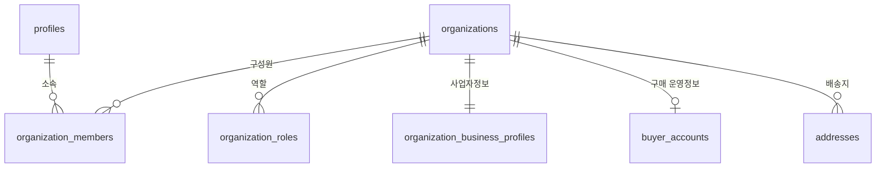
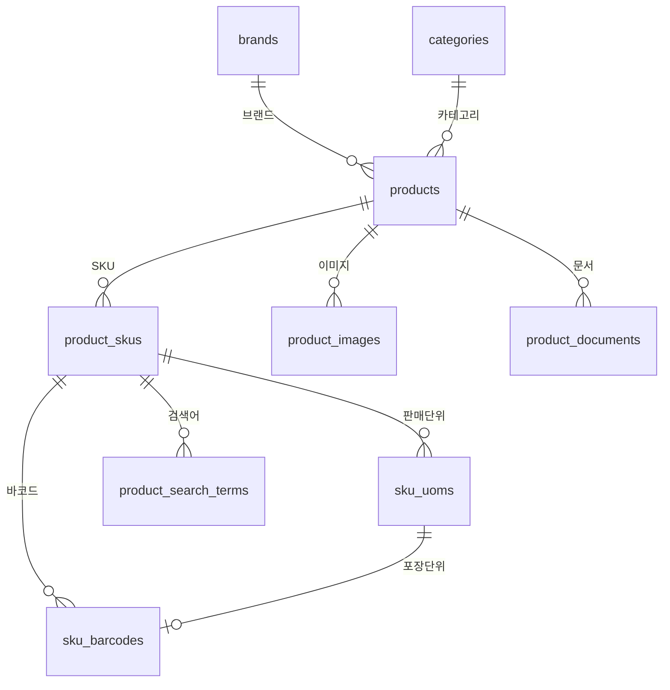
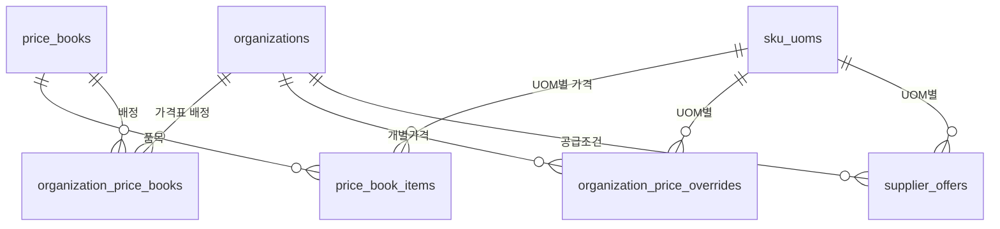
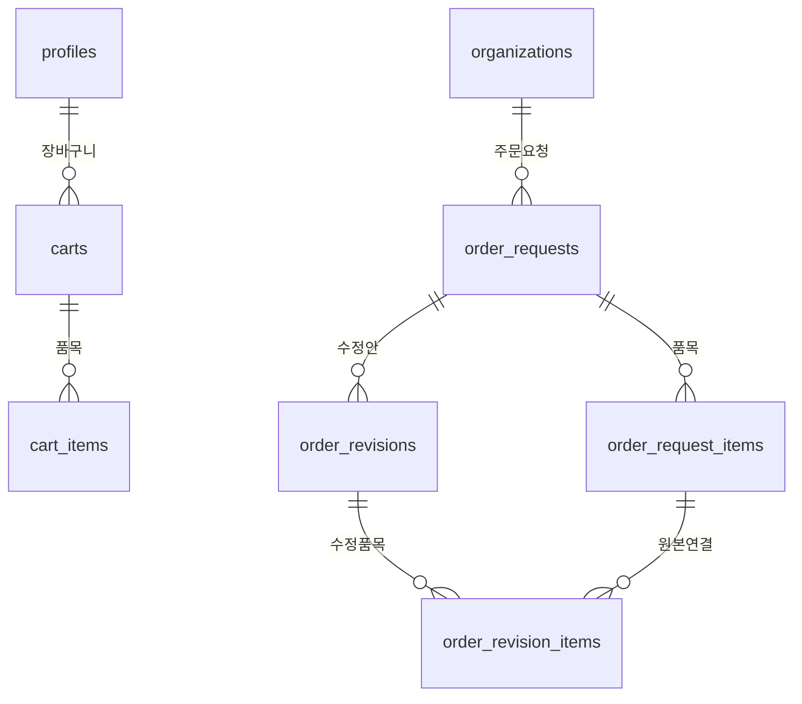
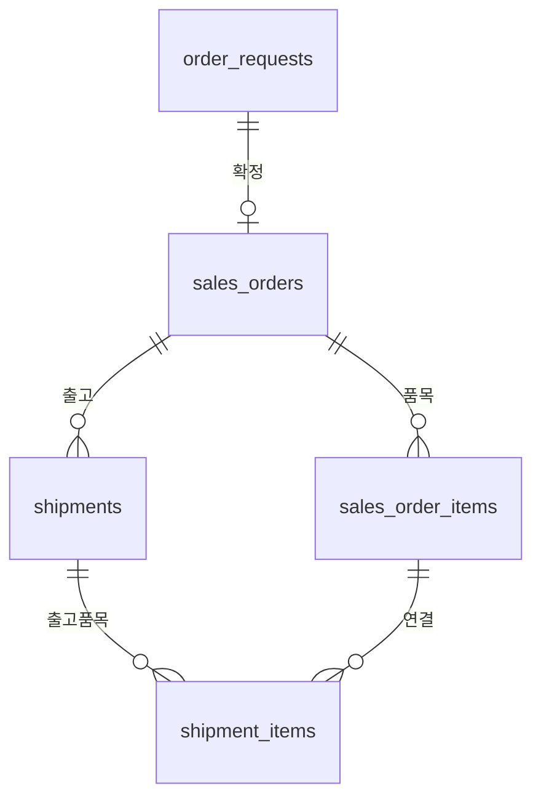
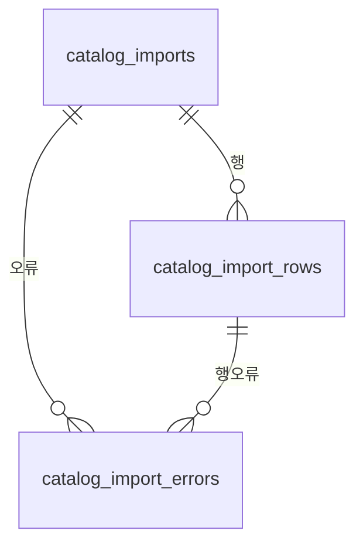
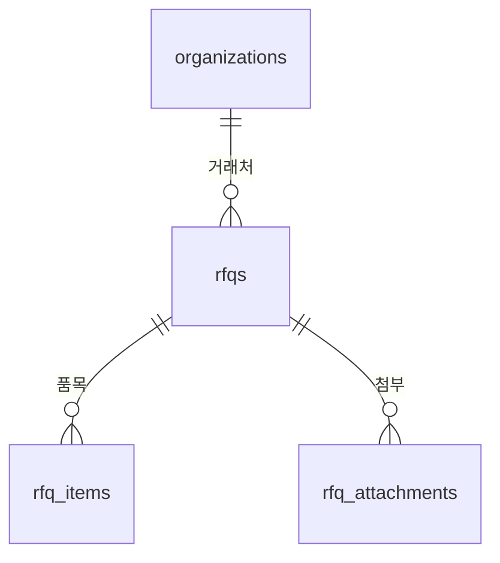

# DATABASE_SCHEMA.md

이 문서는 **테이블, 컬럼, 관계, 데이터형, 제약조건, 인덱스, 삭제정책, RLS 적용대상의 Single Source of Truth(SSOT)**입니다.

> **SSOT 참조**
> - 가격·주문·출고 규칙 → [BUSINESS_RULES.md](BUSINESS_RULES.md)
> - 기능 범위 → [PRODUCT_REQUIREMENTS.md](PRODUCT_REQUIREMENTS.md)
> - 보안·권한 → [SECURITY_RULES.md](SECURITY_RULES.md)
> - Import 사양 → [DATA_IMPORT_SPEC.md](DATA_IMPORT_SPEC.md)
> - 확정 결정 → [DECISION_LOG.md](DECISION_LOG.md)

---

## 1. 명명 및 기본 데이터 규칙

### 1.1 Primary Key

- 모든 테이블의 PK는 **UUID** (`gen_random_uuid()`)
- public URL이나 사용자 화면에 내부 UUID를 직접 노출하지 않음

### 1.2 업무번호 (Human-readable Code)

사람이 조회하고 전화나 문서에서 말할 수 있는 식별자:

| 업무번호 | 예시 | 생성 규칙 |
|---|---|---|
| `organization_code` | ORG-0001 | 자동 채번, 수정 불가 |
| `internal_sku_code` | TTC-NP150-EA | 관리자 지정, UNIQUE, NOT NULL, 수정 불가 |
| `price_book_code` | PB-B2B-DEFAULT | 관리자 지정, UNIQUE |
| `supplier_code` | SUP-001 | 관리자 지정, UNIQUE |
| `order_request_number` | OR-2026-00001 | 자동 채번, 연도+순번 |
| `sales_order_number` | SO-2026-00001 | 자동 채번 |
| `shipment_number` | SHP-2026-00001 | 자동 채번 |
| `rfq_number` | RFQ-2026-00001 | 자동 채번 |
| `import_batch_number` | IMP-2026-00001 | 자동 채번 |

### 1.3 날짜·시각

- 모든 시각은 `timestamptz`로 저장 (UTC)
- UI에서 `Asia/Seoul`로 변환하여 표시

### 1.4 금액 — NUMERIC + currency_code (DEC-019)

금액에 FLOAT/DOUBLE을 사용하지 않음.

| 항목 | 데이터형 | 근거 |
|---|---|---|
| 단가 (unit_price, purchase_price) | `NUMERIC(19,4)` | 다중통화 대비, 소수 4자리 |
| 금액 합계 (subtotal, tax, total) | `NUMERIC(19,4)` | 다중통화 대비, KRW는 Application에서 소수부 0 검증 |
| 수량 | `NUMERIC(18,6)` | M, KG 등 소수 허용 단위 대비 |
| 단위변환비 (conversion_to_base) | `NUMERIC(18,6)` | 정밀 변환 |
| 환율 | `NUMERIC(20,8)` | 환율 정밀도 확보 |
| 세율 (tax_rate) | `NUMERIC(9,6)` | 소수 비율 (0.100000 = 10%) |
| 통화코드 | `TEXT` (ISO 4217) | 금액과 항상 함께 저장 |

> KRW 확정 주문은 적용된 세금 정책에 따라 최종 금액의 소수부분이 0인지 Application에서 검증한다. DB 컬럼은 다중통화 확장을 위해 NUMERIC(19,4)로 통일한다.

### 1.5 수량 — NUMERIC + precision 메타

수량에 FLOAT/DOUBLE을 사용하지 않음.

| 항목 | 데이터형 | 설명 |
|---|---|---|
| 수량 (모든 단위) | `NUMERIC(18,6)` | 정수·소수 통합, quantity_precision으로 제어 |
| conversion_to_base | `NUMERIC(18,6)` | 단위 변환 비율 |

각 `sku_uoms` 레코드의 `quantity_precision`과 `allow_fractional_quantity`로 해당 UOM의 소수 허용 여부를 제어.

### 1.6 공통 컬럼

모든 업무 테이블에 포함:

| 컬럼 | 타입 | 설명 |
|---|---|---|
| `id` | UUID PK | `gen_random_uuid()` |
| `created_at` | timestamptz | 자동, NOT NULL |
| `updated_at` | timestamptz | 자동, NOT NULL |

중요 업무 데이터에 추가:

| 컬럼 | 타입 | 설명 |
|---|---|---|
| `created_by` | UUID FK → profiles | 생성자 |
| `updated_by` | UUID FK → profiles | 수정자 |
| `version` | INTEGER | 낙관적 동시성 제어 (OCC) |

### 1.7 Soft Delete 정책

모든 테이블에 무조건 soft delete를 넣지 않음. 테이블별 삭제 전략:

| 전략 | 적용 대상 |
|---|---|
| **status 비활성화** | products, product_skus, sku_uoms, brands, categories, price_books, supplier_offers |
| **deleted_at** | carts, cart_items, favorites |
| **삭제 금지 (append-only)** | audit_logs, 상태 이력 테이블, 확정 Import |
| **삭제 금지 (archivable)** | sales_orders, sales_order_items, shipments, order_requests (완료 후 보존) |
| **hard delete 허용** | draft 장바구니 항목, 임시 데이터 |

---

## 2. 스키마 계층 및 테이블 총괄

### 2.1 계층 요약

| 계층 | 테이블 수 | 설명 |
|---|---|---|
| **Release 1 Required** | **44 테이블 + 1 View** | MVP 출시에 반드시 필요 |
| **Release 1 Optional** | **10** | Feature Flag로 선택적 활성화 |
| **Future Extension** | **15** | Stage 3 이후 |
| **합계** | **67** | |

### 2.2 Schema Inventory — Release 1 Required

이 표가 Release 1 Required 테이블의 **SSOT**입니다.

| # | table_name | schema_tier | phase | mg | pilot | api_exposure | rls | audit | pii | fin | read_path | write_path |
|---|---|---|---|---|---|---|---|---|---|---|---|---|
| 1 | profiles | Req | Ph2 | 01 | ✅ | authenticated_direct | ✅ | ✅ | ✅ | ❌ | direct_authenticated_rls | direct_authenticated_rls |
| 2 | organizations | Req | Ph2 | 01 | ✅ | authenticated_direct | ✅ | ❌ | ❌ | ❌ | direct_authenticated_rls | server_route_service_role |
| 3 | organization_roles | Req | Ph2 | 01 | ✅ | authenticated_direct | ✅ | ❌ | ❌ | ❌ | direct_authenticated_rls | server_route_service_role |
| 4 | organization_business_profiles | Req | Ph2 | 01 | ✅ | authenticated_direct | ✅ | ❌ | ✅ | ❌ | direct_authenticated_rls | server_route_service_role |
| 5 | buyer_accounts | Req | Ph2 | 01 | ✅ | authenticated_direct | ✅ | ✅ | ❌ | ✅ | direct_authenticated_rls | server_route_service_role |
| 6 | organization_members | Req | Ph2 | 01 | ✅ | authenticated_direct | ✅ | ❌ | ❌ | ❌ | direct_authenticated_rls | server_route_service_role |
| 7 | addresses | Req | Ph2 | 01 | ✅ | authenticated_direct | ✅ | ❌ | ✅ | ❌ | direct_authenticated_rls | direct_authenticated_rls |
| 8 | brands | Req | Ph3 | 02 | ✅ | public_read | ✅ | ❌ | ❌ | ❌ | direct_public_rls | direct_authenticated_rls |
| 9 | categories | Req | Ph3 | 02 | ✅ | public_read | ✅ | ❌ | ❌ | ❌ | direct_public_rls | direct_authenticated_rls |
| 10 | products | Req | Ph3 | 02 | ✅ | public_read | ✅ | ❌ | ❌ | ❌ | direct_public_rls | direct_authenticated_rls |
| 11 | product_skus | Req | Ph3 | 02 | ✅ | public_read | ✅ | ❌ | ❌ | ❌ | direct_public_rls | direct_authenticated_rls |
| 12 | product_images | Req | Ph3 | 02 | ❌ | public_read | ✅ | ❌ | ❌ | ❌ | direct_public_rls | direct_authenticated_rls |
| 13 | product_documents | Req | Ph3 | 02 | ❌ | public_read | ✅ | ❌ | ❌ | ❌ | direct_public_rls | direct_authenticated_rls |
| 14 | search_synonyms | Req | Ph3 | 02 | ❌ | public_read | ✅ | ❌ | ❌ | ❌ | direct_public_rls | direct_authenticated_rls |
| 15 | sku_uoms | Req | Ph3 | 03 | ✅ | public_read | ✅ | ❌ | ❌ | ❌ | direct_public_rls | direct_authenticated_rls |
| 16 | sku_barcodes | Req | Ph3 | 03 | ❌ | public_read | ✅ | ❌ | ❌ | ❌ | direct_public_rls | direct_authenticated_rls |
| 17 | product_search_terms | Req | Ph3 | 03 | ❌ | public_read | ✅ | ❌ | ❌ | ❌ | direct_public_rls | direct_authenticated_rls |
| 18 | search_events | Req | Ph5 | 03 | ✅ | server_only | ✅ | ❌ | ⚠️ | ❌ | server_route_service_role | server_route_service_role |
| 19 | price_books | Req | Ph4 | 04 | ✅ | operator_direct | ✅ | ✅ | ❌ | ✅ | direct_authenticated_rls | direct_authenticated_rls |
| 20 | price_book_items | Req | Ph4 | 04 | ✅ | operator_direct | ✅ | ✅ | ❌ | ✅ | direct_authenticated_rls | direct_authenticated_rls |
| 21 | organization_price_books | Req | Ph4 | 04 | ✅ | authenticated_direct | ✅ | ✅ | ❌ | ❌ | direct_authenticated_rls | direct_authenticated_rls |
| 22 | organization_price_overrides | Req | Ph4 | 04 | ✅ | authenticated_direct | ✅ | ✅ | ❌ | ✅ | direct_authenticated_rls | direct_authenticated_rls |
| 23 | supplier_offers | Req | Ph3 | 04 | ✅ | operator_direct | ✅ | ✅ | ❌ | ✅ | direct_authenticated_rls | direct_authenticated_rls |
| 24 | carts | Req | Ph4 | 05 | ❌ | authenticated_direct | ✅ | ❌ | ❌ | ❌ | direct_authenticated_rls | direct_authenticated_rls |
| 25 | cart_items | Req | Ph4 | 05 | ❌ | authenticated_direct | ✅ | ❌ | ❌ | ❌ | direct_authenticated_rls | direct_authenticated_rls |
| 26 | order_requests | Req | Ph4 | 05 | ✅ | authenticated_direct | ✅ | ✅ | ❌ | ✅ | direct_authenticated_rls | invoker_rpc |
| 27 | order_request_items | Req | Ph4 | 05 | ✅ | authenticated_direct | ✅ | ❌ | ❌ | ✅ | direct_authenticated_rls | invoker_rpc |
| 28 | order_revisions | Req | Ph4 | 05 | ✅ | authenticated_direct | ✅ | ❌ | ❌ | ❌ | direct_authenticated_rls | direct_authenticated_rls |
| 29 | order_revision_items | Req | Ph4 | 05 | ✅ | authenticated_direct | ✅ | ❌ | ❌ | ❌ | direct_authenticated_rls | direct_authenticated_rls |
| 30 | sales_orders | Req | Ph4 | 06 | ✅ | authenticated_direct | ✅ | ✅ | ✅ | ✅ | direct_authenticated_rls | definer_rpc |
| 31 | sales_order_items | Req | Ph4 | 06 | ✅ | authenticated_direct | ✅ | ❌ | ❌ | ✅ | direct_authenticated_rls | definer_rpc |
| 32 | shipments | Req | Ph4 | 06 | ✅ | authenticated_direct | ✅ | ✅ | ❌ | ❌ | direct_authenticated_rls | definer_rpc |
| 33 | shipment_items | Req | Ph4 | 06 | ✅ | authenticated_direct | ✅ | ❌ | ❌ | ❌ | direct_authenticated_rls | definer_rpc |
| 34 | order_request_status_history | Req | Ph4 | 06 | ❌ | authenticated_direct | ✅ | ❌ | ❌ | ❌ | direct_authenticated_rls | definer_rpc |
| 35 | sales_order_status_history | Req | Ph4 | 06 | ❌ | authenticated_direct | ✅ | ❌ | ❌ | ❌ | direct_authenticated_rls | definer_rpc |
| 36 | catalog_imports | Req | Ph3 | 07 | ✅ | operator_direct | ✅ | ❌ | ❌ | ❌ | direct_authenticated_rls | direct_authenticated_rls |
| 37 | catalog_import_rows | Req | Ph3 | 07 | ❌ | operator_direct | ✅ | ❌ | ❌ | ❌ | direct_authenticated_rls | definer_rpc |
| 38 | catalog_import_errors | Req | Ph3 | 07 | ❌ | operator_direct | ✅ | ❌ | ❌ | ❌ | direct_authenticated_rls | definer_rpc |
| 39 | audit_logs | Req | Ph2 | 07 | ✅ | server_only | ✅ | ❌ | ❌ | ❌ | server_route_service_role | server_route_service_role |
| 40 | rfqs | Req | Ph5 | 08 | ✅ | authenticated_direct | ✅ | ❌ | ❌ | ❌ | direct_authenticated_rls | direct_authenticated_rls |
| 41 | rfq_items | Req | Ph5 | 08 | ❌ | authenticated_direct | ✅ | ❌ | ❌ | ✅ | direct_authenticated_rls | direct_authenticated_rls |
| 42 | rfq_attachments | Req | Ph5 | 08 | ❌ | authenticated_direct | ✅ | ❌ | ❌ | ❌ | direct_authenticated_rls | direct_authenticated_rls |
| 43 | shipment_status_history | Req | Ph4 | 08 | ❌ | authenticated_direct | ✅ | ❌ | ❌ | ❌ | direct_authenticated_rls | definer_rpc |
| 44 | tax_policies | Req | Ph4 | 08 | ❌ | operator_direct | ✅ | ❌ | ❌ | ❌ | direct_authenticated_rls | direct_authenticated_rls |
| V1 | sku_search_index (View) | Req | Ph3 | 03 | ❌ | view_only | ✅* | ❌ | ❌ | ❌ | direct_public_rls | no_write |

**합계: 44 테이블 + 1 View = 45 항목**

*V1의 RLS는 SECURITY INVOKER를 통한 기반 테이블 RLS 적용

`api_exposure` 정의:

| 값 | 설명 | RLS | 테이블 수 |
|---|---|---|---|
| `public_read` | anon/authenticated SELECT (active 필터), operator INSERT/UPDATE | ✅ | 10 |
| `authenticated_direct` | authenticated 사용자 조직 범위 접근 | ✅ | 25 |
| `operator_direct` | 운영사 권한자만 접근 | ✅ | 7 |
| `server_only` | 서버 함수/service_role만 접근 | ✅ | 2 |
| `view_only` | SECURITY INVOKER View | ✅* | 1 |

`write_path` 정의:

| 값 | 설명 | authenticated GRANT |
|---|---|---|
| `direct_authenticated_rls` | 인증된 사용자가 RLS 범위에서 직접 쓰기 | SELECT, INSERT, UPDATE |
| `invoker_rpc` | SECURITY INVOKER RPC 경유 | SELECT, INSERT, UPDATE |
| `definer_rpc` | SECURITY DEFINER RPC 경유 (서버 함수) | SELECT only |
| `server_route_service_role` | Server Action/Edge Function 경유 (service_role) | SELECT only 또는 REVOKE ALL |
| `no_write` | 쓰기 불가 (View) | SELECT only |

### 2.3 Migration Group 총괄

| Group | 이름 | 테이블 수 | 대응 Phase |
|---|---|---|---|
| MG-01 | Identity & Organizations | 7 | Phase 2 |
| MG-02 | Catalog Core | 7 | Phase 3 |
| MG-03 | UOM & Search | 4 테이블 + 1 View | Phase 3~5 |
| MG-04 | Pricing | 5 | Phase 3~4 |
| MG-05 | Cart & Order Request | 6 | Phase 4 |
| MG-06 | Sales Order & Shipment | 6 | Phase 4 |
| MG-07 | Import & Audit | 4 | Phase 2~5 |
| MG-08 | RFQ & Pilot | 5 | Phase 4~5 |
| MG-OPT | Optional Features | 10 | Phase 4~6 |
| MG-FUT | Future Extension | 15 | Phase 7+ |

---

## 3. Release 1 Required 테이블 상세

### MG-01: Identity & Organizations

---

#### `profiles`

Supabase Auth 사용자와 연결되는 최소 사용자 정보.

| 메타 | 값 |
|---|---|
| schema_tier | Required |
| first_needed_phase | Phase 2 |
| required_for_pilot | ✅ |
| migration_group | MG-01 |
| contains_personal_data | ✅ |
| contains_financial_data | ❌ |
| rls_required | ✅ |
| audit_required | ✅ (역할·상태 변경) |
| 삭제 정책 | status 비활성화 |

| 컬럼 | 타입 | 제약 | 설명 |
|---|---|---|---|
| id | UUID PK | = auth.users.id | Supabase Auth UID |
| email | TEXT | UNIQUE, NOT NULL | 로그인 이메일 |
| full_name | TEXT | NOT NULL | 이름 |
| phone | TEXT | | 연락처 |
| avatar_url | TEXT | | 프로필 이미지 |
| locale | TEXT | DEFAULT 'ko-KR' | 선호 언어 |
| status | TEXT | NOT NULL, DEFAULT 'active' | active, suspended, deactivated |
| mfa_enabled | BOOLEAN | DEFAULT false | MFA 활성화 여부 |
| last_login_at | timestamptz | | 마지막 로그인 |
| created_at | timestamptz | NOT NULL | |
| updated_at | timestamptz | NOT NULL | |

---

#### `organizations`

조직의 기본 식별자.

| 메타 | 값 |
|---|---|
| schema_tier | Required |
| first_needed_phase | Phase 2 |
| required_for_pilot | ✅ |
| migration_group | MG-01 |
| contains_personal_data | ❌ |
| rls_required | ✅ |
| 삭제 정책 | status 비활성화 |

| 컬럼 | 타입 | 제약 | 설명 |
|---|---|---|---|
| id | UUID PK | | |
| organization_code | TEXT | UNIQUE, NOT NULL | 업무번호 (ORG-XXXX) |
| display_name | TEXT | NOT NULL | 표시명 |
| status | TEXT | NOT NULL, DEFAULT 'active' | active, suspended, deactivated |
| created_at | timestamptz | NOT NULL | |
| updated_at | timestamptz | NOT NULL | |

---

#### `organization_roles`

조직의 다중 역할. 한 조직이 buyer, supplier, brand_owner 등을 동시에 가질 수 있음.

| 메타 | 값 |
|---|---|
| schema_tier | Required |
| first_needed_phase | Phase 2 |
| required_for_pilot | ✅ |
| migration_group | MG-01 |
| rls_required | ✅ |

| 컬럼 | 타입 | 제약 | 설명 |
|---|---|---|---|
| id | UUID PK | | |
| organization_id | UUID FK | NOT NULL, → organizations | |
| role_type | TEXT | NOT NULL | operator, buyer, supplier, brand_owner, export_buyer |
| status | TEXT | DEFAULT 'active' | active, inactive |
| created_at | timestamptz | NOT NULL | |

UNIQUE(organization_id, role_type)

---

#### `organization_business_profiles`

조직의 사업자 정보. 회사 공통정보.

| 메타 | 값 |
|---|---|
| schema_tier | Required |
| first_needed_phase | Phase 2 |
| required_for_pilot | ✅ |
| migration_group | MG-01 |
| contains_personal_data | ✅ (대표자명) |
| rls_required | ✅ |

| 컬럼 | 타입 | 제약 | 설명 |
|---|---|---|---|
| id | UUID PK | | |
| organization_id | UUID FK | UNIQUE, NOT NULL, → organizations | 1:1 |
| business_registration_number | TEXT | | 사업자등록번호 |
| company_name_ko | TEXT | NOT NULL | 한국어 회사명 |
| company_name_en | TEXT | | 영문 회사명 |
| representative_name | TEXT | | 대표자명 |
| business_type | TEXT | | 업종 |
| business_category | TEXT | | 업태 |
| address_line1 | TEXT | | 사업장 주소 |
| address_line2 | TEXT | | 상세 주소 |
| city | TEXT | | 시/도 |
| postal_code | TEXT | | 우편번호 |
| phone | TEXT | | 대표 연락처 |
| fax | TEXT | | 팩스 |
| email | TEXT | | 대표 이메일 |
| registration_document_url | TEXT | | 사업자등록증 파일 (signed URL) |
| created_at | timestamptz | | |
| updated_at | timestamptz | | |

---

#### `buyer_accounts`

구매 거래처 운영정보. organization_business_profiles와 분리.

| 메타 | 값 |
|---|---|
| schema_tier | Required |
| first_needed_phase | Phase 2 |
| required_for_pilot | ✅ |
| migration_group | MG-01 |
| contains_financial_data | ✅ (credit_limit) |
| rls_required | ✅ |
| audit_required | ✅ |

| 컬럼 | 타입 | 제약 | 설명 |
|---|---|---|---|
| id | UUID PK | | |
| organization_id | UUID FK | UNIQUE, NOT NULL, → organizations | 1:1 |
| approval_status | TEXT | NOT NULL, DEFAULT 'pending' | pending, approved, rejected, suspended |
| account_status | TEXT | NOT NULL, DEFAULT 'active' | active, on_hold, closed |
| approved_at | timestamptz | | 승인 시각 |
| approved_by | UUID FK | → profiles | 승인자 |
| payment_terms_code | TEXT | | 결제조건 코드 |
| default_price_book_id | UUID FK | → price_books | 기본 가격표 |
| credit_limit | NUMERIC(19,4) | | 신용한도 (OD-011) |
| order_hold_reason | TEXT | | 주문 보류 사유 |
| buyer_approval_enabled | BOOLEAN | DEFAULT false | 내부 승인 활성화 |
| notes | TEXT | | 관리자 메모 |
| created_at | timestamptz | | |
| updated_at | timestamptz | | |
| version | INTEGER | DEFAULT 1 | OCC |

---

#### `organization_members`

사용자와 조직의 소속 관계.

| 메타 | 값 |
|---|---|
| schema_tier | Required |
| first_needed_phase | Phase 2 |
| required_for_pilot | ✅ |
| migration_group | MG-01 |
| rls_required | ✅ |

| 컬럼 | 타입 | 제약 | 설명 |
|---|---|---|---|
| id | UUID PK | | |
| organization_id | UUID FK | NOT NULL, → organizations | |
| user_id | UUID FK | NOT NULL, → profiles | |
| member_role | TEXT | NOT NULL | owner, admin, staff, viewer |
| status | TEXT | DEFAULT 'active' | active, invited, suspended, removed |
| permissions | JSONB | DEFAULT '[]' | 세부 권한 배열 |
| invited_at | timestamptz | | 초대 시각 |
| invited_by | UUID FK | → profiles | 초대자 |
| joined_at | timestamptz | | 가입 시각 |
| created_at | timestamptz | | |
| updated_at | timestamptz | | |

UNIQUE(organization_id, user_id)

permissions JSONB 예시:
```json
["can_manage_orders", "can_manage_products", "can_view_purchase_cost"]
```

---

#### `addresses`

조직의 배송지.

| 메타 | 값 |
|---|---|
| schema_tier | Required |
| first_needed_phase | Phase 2 |
| required_for_pilot | ✅ |
| migration_group | MG-01 |
| contains_personal_data | ✅ |
| rls_required | ✅ |

| 컬럼 | 타입 | 제약 | 설명 |
|---|---|---|---|
| id | UUID PK | | |
| organization_id | UUID FK | NOT NULL, → organizations | |
| label | TEXT | | 배송지명 (예: 본사, 공장) |
| recipient_name | TEXT | NOT NULL | 수령인 |
| phone | TEXT | NOT NULL | 연락처 |
| postal_code | TEXT | NOT NULL | 우편번호 |
| address_line1 | TEXT | NOT NULL | 기본주소 |
| address_line2 | TEXT | | 상세주소 |
| city | TEXT | | 시/도 |
| is_default | BOOLEAN | DEFAULT false | 기본 배송지 |
| notes | TEXT | | 배송 요청사항 |
| created_at | timestamptz | | |
| updated_at | timestamptz | | |

---

### MG-02: Catalog Core

---

#### `brands`

| 메타 | 값 |
|---|---|
| schema_tier | Required |
| first_needed_phase | Phase 3 |
| required_for_pilot | ✅ |
| migration_group | MG-02 |
| rls_required | ❌ (공개 읽기, 관리자 쓰기) |

| 컬럼 | 타입 | 제약 | 설명 |
|---|---|---|---|
| id | UUID PK | | |
| brand_code | TEXT | UNIQUE, NOT NULL | 업무번호 |
| name_ko | TEXT | NOT NULL | 한국어명 |
| name_en | TEXT | | 영문명 |
| slug | TEXT | UNIQUE | URL 슬러그 |
| logo_url | TEXT | | 로고 이미지 |
| description | TEXT | | 소개 |
| owner_organization_id | UUID FK | → organizations | 브랜드 소유 조직 |
| origin_country | TEXT | | 원산지 국가코드 |
| website_url | TEXT | | 공식 웹사이트 |
| sort_order | INTEGER | DEFAULT 0 | 정렬 순서 |
| status | TEXT | DEFAULT 'active' | active, inactive |
| created_at | timestamptz | | |
| updated_at | timestamptz | | |

---

#### `categories`

| 메타 | 값 |
|---|---|
| schema_tier | Required |
| first_needed_phase | Phase 3 |
| required_for_pilot | ✅ |
| migration_group | MG-02 |

| 컬럼 | 타입 | 제약 | 설명 |
|---|---|---|---|
| id | UUID PK | | |
| category_code | TEXT | UNIQUE, NOT NULL | 업무번호 |
| parent_id | UUID FK | → categories | 상위 카테고리 |
| name_ko | TEXT | NOT NULL | 한국어명 |
| name_en | TEXT | | 영문명 |
| slug | TEXT | UNIQUE | URL 슬러그 |
| depth | INTEGER | NOT NULL | 계층 깊이 (0=대분류) |
| sort_order | INTEGER | DEFAULT 0 | |
| status | TEXT | DEFAULT 'active' | |
| created_at | timestamptz | | |
| updated_at | timestamptz | | |

---

#### `products`

상품 마스터. 하나의 상품에 여러 SKU가 연결됨.

| 메타 | 값 |
|---|---|
| schema_tier | Required |
| first_needed_phase | Phase 3 |
| required_for_pilot | ✅ |
| migration_group | MG-02 |

| 컬럼 | 타입 | 제약 | 설명 |
|---|---|---|---|
| id | UUID PK | | |
| brand_id | UUID FK | NOT NULL, → brands | |
| category_id | UUID FK | NOT NULL, → categories | |
| name_ko | TEXT | NOT NULL | 상품명 |
| name_en | TEXT | | 영문 상품명 |
| description | TEXT | | 상품 설명 |
| status | TEXT | DEFAULT 'draft' | draft, active, discontinued |
| created_by | UUID FK | → profiles | |
| created_at | timestamptz | | |
| updated_at | timestamptz | | |

---

#### `product_skus`

SKU — 상품의 개별 규격/옵션 변형. 가격과 재고는 여기에 저장하지 않음.

| 메타 | 값 |
|---|---|
| schema_tier | Required |
| first_needed_phase | Phase 3 |
| required_for_pilot | ✅ |
| migration_group | MG-02 |

| 컬럼 | 타입 | 제약 | 설명 |
|---|---|---|---|
| id | UUID PK | | |
| product_id | UUID FK | NOT NULL, → products | |
| internal_sku_code | TEXT | UNIQUE, NOT NULL | 업무번호, 불변 |
| model_name | TEXT | | 모델명 |
| specification_text | TEXT | | 규격 텍스트 (예: 150mm) |
| specifications | JSONB | DEFAULT '{}' | 구조화된 규격 |
| base_uom_code | TEXT | NOT NULL, DEFAULT 'EA' | 기본단위 코드 |
| origin_country_code | TEXT | | 원산지 |
| weight_g | NUMERIC(10,2) | | 순중량(g) |
| gross_weight_g | NUMERIC(10,2) | | 총중량(g) |
| dimensions | JSONB | | {length, width, height, unit} |
| hs_code | TEXT | | HS Code |
| sort_order | INTEGER | DEFAULT 0 | |
| status | TEXT | DEFAULT 'active' | active, inactive, discontinued |
| created_by | UUID FK | → profiles | |
| created_at | timestamptz | | |
| updated_at | timestamptz | | |
| version | INTEGER | DEFAULT 1 | OCC |

**specifications JSONB 관리**:
- 카테고리별 권장 키를 `category_spec_templates` (Future) 또는 관리자 가이드로 관리
- 예시: `{"material": "SK-5", "blade_type": "heavy_duty", "blade_count": 10}`
- JSONB에 무질서하게 넣지 않고, 검색·필터에 반복 사용되는 속성은 향후 정식 속성 테이블로 승격

---

#### `product_images`

| 메타 | 값 |
|---|---|
| schema_tier | Required |
| first_needed_phase | Phase 3 |
| migration_group | MG-02 |

| 컬럼 | 타입 | 제약 | 설명 |
|---|---|---|---|
| id | UUID PK | | |
| product_id | UUID FK | NOT NULL, → products | |
| sku_id | UUID FK | → product_skus | SKU 특정 이미지 |
| image_url | TEXT | NOT NULL | Storage URL |
| alt_text | TEXT | | 대체 텍스트 |
| sort_order | INTEGER | DEFAULT 0 | |
| is_primary | BOOLEAN | DEFAULT false | 대표 이미지 |
| owner_organization_id | UUID FK | → organizations | 자산 소유자 |
| permission_status | TEXT | DEFAULT 'pending' | pending, approved, rejected |
| allowed_channels | TEXT[] | | 허용 채널 |
| valid_from | timestamptz | | |
| valid_to | timestamptz | | |
| created_at | timestamptz | | |

---

#### `product_documents`

기술자료, 카탈로그, 인증서.

| 메타 | 값 |
|---|---|
| schema_tier | Required |
| first_needed_phase | Phase 3 |
| migration_group | MG-02 |

| 컬럼 | 타입 | 제약 | 설명 |
|---|---|---|---|
| id | UUID PK | | |
| product_id | UUID FK | → products | |
| sku_id | UUID FK | → product_skus | |
| document_type | TEXT | NOT NULL | datasheet, catalog, certificate, manual |
| title | TEXT | NOT NULL | |
| file_url | TEXT | NOT NULL | Storage URL |
| file_size_bytes | INTEGER | | |
| mime_type | TEXT | | |
| owner_organization_id | UUID FK | → organizations | |
| permission_status | TEXT | DEFAULT 'pending' | |
| created_at | timestamptz | | |

---

#### `search_synonyms`

검색 동의어 사전.

| 메타 | 값 |
|---|---|
| schema_tier | Required |
| first_needed_phase | Phase 3 |
| migration_group | MG-02 |

| 컬럼 | 타입 | 제약 | 설명 |
|---|---|---|---|
| id | UUID PK | | |
| term | TEXT | NOT NULL | 검색어 |
| synonym | TEXT | NOT NULL | 동의어 |
| category | TEXT | | 동의어 분류 |
| status | TEXT | DEFAULT 'active' | |
| created_at | timestamptz | | |

UNIQUE(term, synonym)

---

### MG-03: UOM & Search

---

#### `sku_uoms`

SKU별 판매단위. EA, PACK, BOX 등 복수 주문단위.

| 메타 | 값 |
|---|---|
| schema_tier | Required |
| first_needed_phase | Phase 3 |
| required_for_pilot | ✅ |
| migration_group | MG-03 |

| 컬럼 | 타입 | 제약 | 설명 |
|---|---|---|---|
| id | UUID PK | | |
| sku_id | UUID FK | NOT NULL, → product_skus | |
| uom_code | TEXT | NOT NULL | EA, PACK, SET, BOX 등 |
| conversion_to_base | NUMERIC(18,6) | NOT NULL, DEFAULT 1 | 기본단위 변환비율 |
| quantity_precision | INTEGER | NOT NULL, DEFAULT 0 | 소수 자릿수 |
| allow_fractional_quantity | BOOLEAN | DEFAULT false | 소수 수량 허용 |
| is_orderable | BOOLEAN | DEFAULT true | 주문 가능 여부 |
| is_default_sales_uom | BOOLEAN | DEFAULT false | 기본 판매단위 |
| minimum_order_quantity | NUMERIC(18,6) | NOT NULL, DEFAULT 1 | MOQ |
| order_increment | NUMERIC(18,6) | NOT NULL, DEFAULT 1 | 주문 증가단위 |
| packaging_level | TEXT | | inner, case, pallet |
| active | BOOLEAN | DEFAULT true | |
| created_at | timestamptz | | |
| updated_at | timestamptz | | |

UNIQUE(sku_id, uom_code)

CHECK: SKU당 is_default_sales_uom = true인 행이 최대 1개

---

#### `sku_barcodes`

포장단위별 복수 바코드.

| 메타 | 값 |
|---|---|
| schema_tier | Required |
| first_needed_phase | Phase 3 |
| migration_group | MG-03 |

| 컬럼 | 타입 | 제약 | 설명 |
|---|---|---|---|
| id | UUID PK | | |
| sku_id | UUID FK | NOT NULL, → product_skus | |
| sku_uom_id | UUID FK | → sku_uoms | 포장단위 연결 |
| barcode_value | TEXT | NOT NULL | 바코드 값 (TEXT — 선행 0 보존) |
| barcode_type | TEXT | | EAN-13, CODE128, QR 등 |
| is_primary | BOOLEAN | DEFAULT false | |
| created_at | timestamptz | | |

UNIQUE(barcode_value)

---

#### `product_search_terms`

SKU별 검색 키워드.

| 메타 | 값 |
|---|---|
| schema_tier | Required |
| first_needed_phase | Phase 3 |
| migration_group | MG-03 |

| 컬럼 | 타입 | 제약 | 설명 |
|---|---|---|---|
| id | UUID PK | | |
| sku_id | UUID FK | NOT NULL, → product_skus | |
| search_term | TEXT | NOT NULL | 검색어 |
| normalized_term | TEXT | NOT NULL | 정규화된 검색어 |
| term_type | TEXT | DEFAULT 'keyword' | keyword, alias, field_term, specification |
| created_at | timestamptz | | |

---

#### `search_events`

검색 이벤트 로그 — 검색 성공률 측정용.

| 메타 | 값 |
|---|---|
| schema_tier | Required |
| first_needed_phase | Phase 5 |
| required_for_pilot | ✅ |
| migration_group | MG-03 |
| contains_personal_data | ⚠️ (user_id — 최소수집) |

| 컬럼 | 타입 | 제약 | 설명 |
|---|---|---|---|
| id | UUID PK | | |
| user_id | UUID FK | → profiles | NULL 허용 (비회원 검색) |
| organization_id | UUID FK | → organizations | |
| query_text | TEXT | NOT NULL | 원본 검색어 |
| normalized_query | TEXT | | 정규화된 검색어 |
| result_count | INTEGER | NOT NULL | 결과 수 |
| clicked_sku_id | UUID FK | → product_skus | 클릭한 SKU |
| ordered_after_search | BOOLEAN | DEFAULT false | 검색 후 주문 전환 |
| created_at | timestamptz | NOT NULL | |

> 개인정보 보관: 90일 후 user_id를 NULL로 익명화, 180일 후 행 삭제 또는 집계 전환

---

#### `sku_search_index (SECURITY INVOKER View)`

검색 성능을 위한 정규화된 검색 인덱스 **View** (SECURITY INVOKER).

| 메타 | 값 |
|---|---|
| schema_tier | Required |
| type | **View** (SECURITY INVOKER) |
| first_needed_phase | Phase 3 |
| migration_group | MG-03 |
| api_exposure | view_only |
| security_invoker | ✅ |
| rls_required | ✅ (기반 테이블 RLS 적용) |

초기 1,000 SKU에서는 일반 SECURITY INVOKER View로 시작한다.
Materialized View 전환은 검색 성능이 목표를 초과할 때 검토한다 (OD-022).
Materialized View로 전환 시에는 비노출 스키마에 배치하고 안전한 View/RPC로만 노출한다.

| 컬럼 | 타입 | 설명 |
|---|---|---|
| sku_id | UUID | |
| internal_sku_code | TEXT | 정확일치용 |
| model_name_normalized | TEXT | 정규화된 모델명 |
| product_name_normalized | TEXT | 정규화된 상품명 |
| brand_name | TEXT | 브랜드명 |
| specification_text | TEXT | 규격 |
| all_barcodes | TEXT[] | 바코드 배열 |
| all_search_terms | TEXT[] | 검색어 배열 |
| search_vector | tsvector | 전문 검색용 |

인덱스:
- `idx_search_sku_code` — internal_sku_code 정확일치 (btree)
- `idx_search_barcode` — GIN on all_barcodes
- `idx_search_model` — model_name_normalized (btree, prefix)
- `idx_search_trgm` — GIN(pg_trgm) on product_name_normalized
- `idx_search_vector` — GIN on search_vector

---

### MG-04: Pricing

---

#### `price_books`

가격표 마스터.

| 메타 | 값 |
|---|---|
| schema_tier | Required |
| first_needed_phase | Phase 4 |
| required_for_pilot | ✅ |
| migration_group | MG-04 |
| contains_financial_data | ✅ |
| rls_required | ✅ (운영사만 관리) |
| audit_required | ✅ |

| 컬럼 | 타입 | 제약 | 설명 |
|---|---|---|---|
| id | UUID PK | | |
| price_book_code | TEXT | UNIQUE, NOT NULL | 업무번호 |
| name | TEXT | NOT NULL | 가격표명 |
| description | TEXT | | |
| currency_code | TEXT | NOT NULL, DEFAULT 'KRW' | ISO 4217 |
| is_default | BOOLEAN | DEFAULT false | 기본 B2B 가격표 |
| status | TEXT | DEFAULT 'active' | active, inactive |
| valid_from | timestamptz | | |
| valid_to | timestamptz | | |
| created_by | UUID FK | → profiles | |
| created_at | timestamptz | | |
| updated_at | timestamptz | | |
| version | INTEGER | DEFAULT 1 | |

---

#### `price_book_items`

가격표 품목 — 수량구간 가격 포함.

| 메타 | 값 |
|---|---|
| schema_tier | Required |
| first_needed_phase | Phase 4 |
| required_for_pilot | ✅ |
| migration_group | MG-04 |
| contains_financial_data | ✅ |
| audit_required | ✅ |

| 컬럼 | 타입 | 제약 | 설명 |
|---|---|---|---|
| id | UUID PK | | |
| price_book_id | UUID FK | NOT NULL, → price_books | |
| sku_uom_id | UUID FK | NOT NULL, → sku_uoms | SKU+UOM 조합 |
| min_quantity | NUMERIC(18,6) | NOT NULL, DEFAULT 1 | 구간 최소수량 |
| max_quantity | NUMERIC(18,6) | | NULL = 상한 없음 |
| unit_price | NUMERIC(19,4) | NOT NULL | 단가 |
| currency_code | TEXT | NOT NULL, DEFAULT 'KRW' | |
| tax_inclusion_mode | TEXT | NOT NULL, DEFAULT 'exclusive' | exclusive, inclusive |
| valid_from | timestamptz | | |
| valid_to | timestamptz | | |
| status | TEXT | DEFAULT 'active' | |
| version | INTEGER | DEFAULT 1 | |
| created_at | timestamptz | | |
| updated_at | timestamptz | | |

제약: 동일 (price_book_id, sku_uom_id, 적용기간) 내 수량구간 중복 금지 — Application-level + DB trigger 검증

---

#### `organization_price_books`

거래처에 가격표 배정.

| 메타 | 값 |
|---|---|
| schema_tier | Required |
| first_needed_phase | Phase 4 |
| required_for_pilot | ✅ |
| migration_group | MG-04 |
| rls_required | ✅ |
| audit_required | ✅ |

| 컬럼 | 타입 | 제약 | 설명 |
|---|---|---|---|
| id | UUID PK | | |
| organization_id | UUID FK | NOT NULL, → organizations | |
| price_book_id | UUID FK | NOT NULL, → price_books | |
| priority | INTEGER | DEFAULT 0 | 높을수록 우선 |
| created_at | timestamptz | | |

UNIQUE(organization_id, price_book_id)

---

#### `organization_price_overrides`

거래처 개별 지정가격 — 수량구간 지원.

| 메타 | 값 |
|---|---|
| schema_tier | Required |
| first_needed_phase | Phase 4 |
| required_for_pilot | ✅ |
| migration_group | MG-04 |
| contains_financial_data | ✅ |
| rls_required | ✅ |
| audit_required | ✅ |

| 컬럼 | 타입 | 제약 | 설명 |
|---|---|---|---|
| id | UUID PK | | |
| organization_id | UUID FK | NOT NULL, → organizations | |
| sku_uom_id | UUID FK | NOT NULL, → sku_uoms | |
| min_quantity | NUMERIC(18,6) | NOT NULL, DEFAULT 1 | |
| max_quantity | NUMERIC(18,6) | | NULL = 상한 없음 |
| unit_price | NUMERIC(19,4) | NOT NULL | |
| currency_code | TEXT | NOT NULL, DEFAULT 'KRW' | |
| tax_inclusion_mode | TEXT | NOT NULL, DEFAULT 'exclusive' | |
| valid_from | timestamptz | | |
| valid_to | timestamptz | | |
| notes | TEXT | | |
| created_by | UUID FK | → profiles | |
| created_at | timestamptz | | |
| updated_at | timestamptz | | |
| version | INTEGER | DEFAULT 1 | |

---

#### `supplier_offers`

공급업체 매입 조건.

| 메타 | 값 |
|---|---|
| schema_tier | Required |
| first_needed_phase | Phase 3 |
| required_for_pilot | ✅ |
| migration_group | MG-04 |
| contains_financial_data | ✅ |
| rls_required | ✅ (운영사 + 해당 공급업체만) |
| audit_required | ✅ |

| 컬럼 | 타입 | 제약 | 설명 |
|---|---|---|---|
| id | UUID PK | | |
| supplier_organization_id | UUID FK | NOT NULL, → organizations | 공급업체 |
| sku_uom_id | UUID FK | NOT NULL, → sku_uoms | |
| supplier_item_code | TEXT | | 공급업체 상품코드 |
| purchase_price | NUMERIC(19,4) | NOT NULL | 매입 단가 |
| currency_code | TEXT | DEFAULT 'KRW' | |
| minimum_order_quantity | NUMERIC(18,6) | DEFAULT 1 | 공급업체 MOQ |
| order_increment | NUMERIC(18,6) | DEFAULT 1 | |
| stock_status | TEXT | DEFAULT 'unknown' | in_stock, limited, out_of_stock, discontinued, unknown |
| available_quantity | NUMERIC(18,6) | | |
| lead_time_min_days | INTEGER | | 최소 납기(일) |
| lead_time_max_days | INTEGER | | 최대 납기(일) |
| direct_ship_available | BOOLEAN | DEFAULT false | 직배송 가능 |
| valid_from | timestamptz | | |
| valid_to | timestamptz | | |
| last_verified_at | timestamptz | | 마지막 검증일 |
| last_stock_checked_at | timestamptz | | 마지막 재고 확인 |
| stock_source | TEXT | DEFAULT 'manual' | manual, api, excel |
| is_preferred | BOOLEAN | DEFAULT false | 우선 공급업체 |
| status | TEXT | DEFAULT 'active' | active, inactive |
| notes | TEXT | | |
| created_at | timestamptz | | |
| updated_at | timestamptz | | |
| version | INTEGER | DEFAULT 1 | |

---

### MG-05: Cart & Order Request

---

#### `carts`

장바구니.

| 메타 | 값 |
|---|---|
| schema_tier | Required |
| first_needed_phase | Phase 4 |
| migration_group | MG-05 |
| rls_required | ✅ |
| 삭제 정책 | deleted_at |

| 컬럼 | 타입 | 제약 | 설명 |
|---|---|---|---|
| id | UUID PK | | |
| user_id | UUID FK | NOT NULL, → profiles | |
| organization_id | UUID FK | NOT NULL, → organizations | |
| status | TEXT | DEFAULT 'active' | active, converted, abandoned |
| created_at | timestamptz | | |
| updated_at | timestamptz | | |

---

#### `cart_items`

| 컬럼 | 타입 | 제약 | 설명 |
|---|---|---|---|
| id | UUID PK | | |
| cart_id | UUID FK | NOT NULL, → carts ON DELETE CASCADE | |
| sku_id | UUID FK | NOT NULL, → product_skus | |
| sku_uom_id | UUID FK | NOT NULL, → sku_uoms | |
| quantity | NUMERIC(18,6) | NOT NULL | |
| notes | TEXT | | 품목 메모 |
| created_at | timestamptz | | |
| updated_at | timestamptz | | |

UNIQUE(cart_id, sku_id, sku_uom_id)

---

#### `order_requests`

주문 요청.

| 메타 | 값 |
|---|---|
| schema_tier | Required |
| first_needed_phase | Phase 4 |
| required_for_pilot | ✅ |
| migration_group | MG-05 |
| contains_financial_data | ✅ |
| rls_required | ✅ |
| audit_required | ✅ |
| 삭제 정책 | 삭제 금지 |

| 컬럼 | 타입 | 제약 | 설명 |
|---|---|---|---|
| id | UUID PK | | |
| order_request_number | TEXT | UNIQUE, NOT NULL | 업무번호 |
| organization_id | UUID FK | NOT NULL, → organizations | 구매 거래처 |
| requested_by | UUID FK | NOT NULL, → profiles | 요청자 |
| order_request_status | TEXT | NOT NULL, DEFAULT 'draft' | BUSINESS_RULES.md 섹션 5.2 참조 |
| buyer_approval_status | TEXT | NOT NULL, DEFAULT 'not_required' | 내부 승인 상태 (별도 필드) |
| buyer_approved_by | UUID FK | → profiles | 내부 승인자 |
| buyer_approved_at | timestamptz | | |
| submitted_at | timestamptz | | 운영사 제출 시각 |
| address_id | UUID FK | → addresses | 배송지 |
| payment_terms_code | TEXT | | 결제조건 |
| delivery_method | TEXT | | parcel, freight, pickup |
| customer_notes | TEXT | | 요청사항 |
| admin_notes | TEXT | | 관리자 내부 메모 |
| response_deadline | timestamptz | | 수정안 응답기한 |
| subtotal | NUMERIC(19,4) | | 공급가 합계 |
| tax_amount | NUMERIC(19,4) | | 부가세 합계 |
| total_amount | NUMERIC(19,4) | | 총액 |
| currency_code | TEXT | DEFAULT 'KRW' | |
| created_at | timestamptz | | |
| updated_at | timestamptz | | |
| version | INTEGER | DEFAULT 1 | |

---

#### `order_request_items`

| 컬럼 | 타입 | 제약 | 설명 |
|---|---|---|---|
| id | UUID PK | | |
| order_request_id | UUID FK | NOT NULL, → order_requests | |
| sku_id | UUID FK | NOT NULL, → product_skus | |
| sku_uom_id | UUID FK | NOT NULL, → sku_uoms | |
| requested_quantity | NUMERIC(18,6) | NOT NULL | 요청 수량 |
| ordered_uom_code | TEXT | NOT NULL | 스냅샷 |
| conversion_to_base | NUMERIC(18,6) | NOT NULL | 스냅샷 |
| base_quantity | NUMERIC(18,6) | NOT NULL | 기본단위 환산 |
| minimum_order_quantity | NUMERIC(18,6) | | 스냅샷 |
| order_increment | NUMERIC(18,6) | | 스냅샷 |
| unit_price | NUMERIC(19,4) | | 요청 시점 단가 |
| price_source_type | TEXT | | individual, price_book, base |
| price_source_id | UUID | | |
| tier_min_quantity | NUMERIC(18,6) | | 적용 구간 |
| tier_max_quantity | NUMERIC(18,6) | | |
| line_subtotal | NUMERIC(19,4) | | |
| line_tax | NUMERIC(19,4) | | |
| line_total | NUMERIC(19,4) | | |
| product_name_snapshot | TEXT | | 상품명 스냅샷 |
| brand_name_snapshot | TEXT | | 브랜드명 스냅샷 |
| model_name_snapshot | TEXT | | 모델명 스냅샷 |
| spec_snapshot | TEXT | | 규격 스냅샷 |
| notes | TEXT | | |
| created_at | timestamptz | | |

---

#### `order_revisions`

수정안 메타데이터.

| 컬럼 | 타입 | 제약 | 설명 |
|---|---|---|---|
| id | UUID PK | | |
| order_request_id | UUID FK | NOT NULL, → order_requests | |
| revision_number | INTEGER | NOT NULL | 순번 |
| status | TEXT | NOT NULL, DEFAULT 'pending' | pending, approved, rejected, expired, superseded |
| reason | TEXT | | 수정 사유 |
| revised_by | UUID FK | NOT NULL, → profiles | 관리자 |
| expires_at | timestamptz | | 응답기한 |
| responded_at | timestamptz | | 구매자 응답 시각 |
| responded_by | UUID FK | → profiles | |
| response_notes | TEXT | | 구매자 응답 메모 |
| created_at | timestamptz | | |

UNIQUE(order_request_id, revision_number)

---

#### `order_revision_items`

수정안 품목별 변경.

| 컬럼 | 타입 | 제약 | 설명 |
|---|---|---|---|
| id | UUID PK | | |
| revision_id | UUID FK | NOT NULL, → order_revisions | |
| order_request_item_id | UUID FK | NOT NULL, → order_request_items | |
| proposed_quantity | NUMERIC(18,6) | | 제안 수량 |
| proposed_unit_price | NUMERIC(19,4) | | 제안 단가 |
| proposed_lead_time_days | INTEGER | | 제안 납기 |
| change_reason | TEXT | | 변경 사유 |
| item_status | TEXT | DEFAULT 'proposed' | proposed, accepted, rejected |
| created_at | timestamptz | | |

---

### MG-06: Sales Order & Shipment

---

#### `sales_orders`

확정 주문 — 구매자와 운영사가 합의한 최종 주문.

| 메타 | 값 |
|---|---|
| schema_tier | Required |
| first_needed_phase | Phase 4 |
| required_for_pilot | ✅ |
| migration_group | MG-06 |
| contains_financial_data | ✅ |
| contains_personal_data | ✅ (스냅샷) |
| rls_required | ✅ |
| audit_required | ✅ |
| 삭제 정책 | 삭제 금지 |

| 컬럼 | 타입 | 제약 | 설명 |
|---|---|---|---|
| id | UUID PK | | |
| sales_order_number | TEXT | UNIQUE, NOT NULL | 업무번호 |
| order_request_id | UUID FK | → order_requests | 원본 주문 요청 |
| organization_id | UUID FK | NOT NULL, → organizations | 구매 거래처 |
| order_status | TEXT | NOT NULL, DEFAULT 'confirmed' | BUSINESS_RULES.md 섹션 5.5 |
| fulfillment_status | TEXT | NOT NULL, DEFAULT 'not_started' | not_started, partial, shipped, delivered |
| payment_status | TEXT | NOT NULL, DEFAULT 'not_due' | not_due, due, partially_paid, paid, overdue |
| tax_invoice_status | TEXT | NOT NULL, DEFAULT 'not_issued' | not_issued, issued, cancelled |
| confirmed_at | timestamptz | NOT NULL | 확정 시각 |
| confirmed_by | UUID FK | → profiles | |
| — 스냅샷: 거래처 — | | | |
| buyer_company_name | TEXT | NOT NULL | |
| buyer_brn | TEXT | | 사업자등록번호 |
| buyer_representative | TEXT | | 대표자 |
| buyer_contact_name | TEXT | | 담당자 |
| buyer_contact_phone | TEXT | | |
| buyer_contact_email | TEXT | | |
| — 스냅샷: 배송 — | | | |
| shipping_recipient | TEXT | | 수령인 |
| shipping_phone | TEXT | | |
| shipping_postal_code | TEXT | | |
| shipping_address1 | TEXT | | |
| shipping_address2 | TEXT | | |
| shipping_method | TEXT | | parcel, freight, pickup, supplier_direct |
| — 스냅샷: 결제·세금 — | | | |
| payment_terms_code | TEXT | | |
| tax_policy_code | TEXT | | 적용 세금정책 |
| tax_policy_version | INTEGER | | |
| — 금액 — | | | |
| subtotal | NUMERIC(19,4) | NOT NULL | |
| tax_amount | NUMERIC(19,4) | NOT NULL | |
| total_amount | NUMERIC(19,4) | NOT NULL | |
| currency_code | TEXT | NOT NULL, DEFAULT 'KRW' | |
| — 관리 — | | | |
| admin_notes | TEXT | | |
| cancel_requested_at | timestamptz | | |
| cancel_reason | TEXT | | |
| cancelled_at | timestamptz | | |
| closed_at | timestamptz | | |
| created_at | timestamptz | | |
| updated_at | timestamptz | | |
| version | INTEGER | DEFAULT 1 | |

---

#### `sales_order_items`

확정 주문 품목 — accepted_quantity 기반 수량 모델.

| 컬럼 | 타입 | 제약 | 설명 |
|---|---|---|---|
| id | UUID PK | | |
| sales_order_id | UUID FK | NOT NULL, → sales_orders | |
| order_request_item_id | UUID FK | → order_request_items | 원본 |
| sku_id | UUID FK | NOT NULL, → product_skus | |
| — 스냅샷 — | | | |
| internal_sku_code | TEXT | NOT NULL | |
| product_name | TEXT | NOT NULL | |
| brand_name | TEXT | | |
| model_name | TEXT | | |
| specification_text | TEXT | | |
| ordered_uom_code | TEXT | NOT NULL | |
| conversion_to_base | NUMERIC(18,6) | NOT NULL | |
| — 수량 (BUSINESS_RULES 섹션 6) — | | | |
| requested_quantity | NUMERIC(18,6) | NOT NULL | |
| accepted_quantity | NUMERIC(18,6) | NOT NULL | |
| rejected_quantity | NUMERIC(18,6) | NOT NULL, DEFAULT 0 | |
| cancelled_quantity | NUMERIC(18,6) | NOT NULL, DEFAULT 0 | |
| backordered_quantity | NUMERIC(18,6) | NOT NULL, DEFAULT 0 | |
| line_status | TEXT | NOT NULL, DEFAULT 'open' | open, partially_shipped, shipped, cancelled, backordered |
| — 가격 스냅샷 — | | | |
| unit_price | NUMERIC(19,4) | NOT NULL | |
| price_source_type | TEXT | | individual, price_book, base |
| price_source_id | UUID | | |
| price_source_version | INTEGER | | |
| price_calculated_at | timestamptz | | |
| price_book_code | TEXT | | |
| tier_min_quantity | NUMERIC(18,6) | | |
| tier_max_quantity | NUMERIC(18,6) | | |
| supply_cost | NUMERIC(19,4) | | 공급가 (관리자 전용) |
| tax_inclusion_mode | TEXT | | |
| line_subtotal | NUMERIC(19,4) | NOT NULL | |
| line_tax | NUMERIC(19,4) | NOT NULL | |
| line_total | NUMERIC(19,4) | NOT NULL | |
| currency_code | TEXT | DEFAULT 'KRW' | |
| — 납기 — | | | |
| expected_lead_time_days | INTEGER | | |
| fulfillment_method | TEXT | | warehouse, supplier_direct, made_to_order |
| supplier_organization_id | UUID FK | → organizations | |
| notes | TEXT | | |
| created_at | timestamptz | | |
| updated_at | timestamptz | | |

**shipped_quantity**: 저장하지 않고 **계산**으로 도출.
`shipped_quantity = SUM(shipment_items.shipped_quantity) WHERE shipment.shipment_status IN ('dispatched', 'delivered')`

Source of Truth: `shipment_items` 테이블의 유효 출고수량 합계.
근거: sales_order_items에 중복 저장하면 shipment_items와의 동기화 부담 발생. 1,000 SKU 규모에서 JOIN 계산 비용은 무시 가능.

**open_quantity**: 저장하지 않고 **계산**으로 도출.
`open_quantity = accepted_quantity - shipped_quantity(계산) - cancelled_quantity`

**수량 불변식 — DB CHECK 제약조건:**

```sql
CHECK (requested_quantity >= 0)
CHECK (accepted_quantity >= 0)
CHECK (rejected_quantity >= 0)
CHECK (cancelled_quantity >= 0)
CHECK (backordered_quantity >= 0)
CHECK (accepted_quantity + rejected_quantity = requested_quantity)
CHECK (cancelled_quantity <= accepted_quantity)
CHECK (backordered_quantity <= accepted_quantity - cancelled_quantity)
```

`shipped_quantity`는 저장 컬럼이 아니므로 CHECK 대상이 아님. Application과 DB Function에서 다음을 검증:
`SUM(shipment_items.shipped_quantity) + cancelled_quantity <= accepted_quantity`

> [!NOTE]
> `backordered <= accepted - shipped - cancelled` 검증은 shipped_quantity가 저장 컬럼이 아니므로 DB CHECK로 강제할 수 없다.
> 대신 `fn_record_shipment` 트랜잭션에서 Application 검증으로 강제한다.
> 기존 CHECK `backordered_quantity <= accepted_quantity - cancelled_quantity`는 shipped=0일 때의 상한으로 유지한다.

---

#### `shipments`

출고 건.

| 메타 | 값 |
|---|---|
| schema_tier | Required |
| first_needed_phase | Phase 4 |
| required_for_pilot | ✅ |
| migration_group | MG-06 |
| rls_required | ✅ |
| audit_required | ✅ |
| 삭제 정책 | 삭제 금지 |

| 컬럼 | 타입 | 제약 | 설명 |
|---|---|---|---|
| id | UUID PK | | |
| shipment_number | TEXT | UNIQUE, NOT NULL | |
| sales_order_id | UUID FK | NOT NULL, → sales_orders | |
| shipment_status | TEXT | NOT NULL, DEFAULT 'preparing' | BUSINESS_RULES.md 섹션 5.6 |
| shipping_method | TEXT | | parcel, freight, pickup, supplier_direct |
| carrier_name | TEXT | | 택배사명 |
| tracking_number | TEXT | | 송장번호 |
| tracking_url | TEXT | | 추적 URL |
| shipped_at | timestamptz | | 발송 시각 |
| delivered_at | timestamptz | | 배달 확인 시각 |
| supplier_organization_id | UUID FK | → organizations | 직배송 공급업체 |
| shipping_address_snapshot | JSONB | | 배송지 스냅샷 |
| notes | TEXT | | |
| created_by | UUID FK | → profiles | |
| created_at | timestamptz | | |
| updated_at | timestamptz | | |

---

#### `shipment_items`

출고 품목 — sales_order_items와 연결.

| 컬럼 | 타입 | 제약 | 설명 |
|---|---|---|---|
| id | UUID PK | | |
| shipment_id | UUID FK | NOT NULL, → shipments ON DELETE CASCADE | |
| sales_order_item_id | UUID FK | NOT NULL, → sales_order_items | |
| shipped_quantity | NUMERIC(18,6) | NOT NULL | 이 출고 건의 수량 |
| notes | TEXT | | |
| created_at | timestamptz | | |

#### 출고 트랜잭션 (`fn_record_shipment`)

출고 기록은 다음 단계를 하나의 트랜잭션으로 실행한다:

1. 대상 `sales_order_item`을 `FOR UPDATE`로 잠금
2. 현재 유효 `shipment_items` 출고수량 합계를 계산
3. 신규 출고수량을 포함한 최종 출고수량 계산
4. `shipped(계산) + cancelled <= accepted` 검증
5. `backordered <= accepted - shipped(계산) - cancelled` 검증
6. 조건 미충족 시 전체 Rollback
7. 조건 충족 시:
   - `shipments` 및 `shipment_items` INSERT
   - 출고 대상이 backorder 물량이면 `backordered_quantity`를 같은 트랜잭션에서 감소
   - `shipment_status_history` INSERT
   - `audit_logs` INSERT
8. OCC version 확인

**Backorder 정책**: 출고 대상이 backorder 물량을 포함하면, 같은 트랜잭션에서 `backordered_quantity`를 `max(0, backordered - shipped)` 값으로 조정한다. 출고 후 `backordered > open_quantity`가 되는 상태를 허용하지 않는다. (DEC-034)

---

#### `order_request_status_history`

주문 요청 상태 이력.

| 메타 | 값 |
|---|---|
| schema_tier | Required |
| first_needed_phase | Phase 4 |
| migration_group | MG-06 |
| 삭제 정책 | 삭제 금지 (append-only) |

| 컬럼 | 타입 | 제약 | 설명 |
|---|---|---|---|
| id | UUID PK | | |
| order_request_id | UUID FK | NOT NULL, → order_requests | |
| from_status | TEXT | | |
| to_status | TEXT | NOT NULL | |
| actor_user_id | UUID FK | → profiles | |
| actor_organization_id | UUID FK | → organizations | |
| reason | TEXT | | |
| metadata | JSONB | | |
| created_at | timestamptz | NOT NULL | |

---

#### `sales_order_status_history`

확정 주문 상태 이력.

| 컬럼 | 타입 | 제약 | 설명 |
|---|---|---|---|
| id | UUID PK | | |
| sales_order_id | UUID FK | NOT NULL, → sales_orders | |
| status_type | TEXT | NOT NULL | order, fulfillment, payment, tax_invoice |
| from_status | TEXT | | |
| to_status | TEXT | NOT NULL | |
| actor_user_id | UUID FK | → profiles | |
| actor_organization_id | UUID FK | → organizations | |
| reason | TEXT | | |
| metadata | JSONB | | |
| created_at | timestamptz | NOT NULL | |

> 4개 상태(order/fulfillment/payment/tax_invoice) 이력을 `status_type`으로 구분하여 하나의 테이블에 저장. FK로 `sales_order_id`를 직접 참조하므로 무결성 보장. 테이블 수를 줄이면서도 RLS와 감사가 가능.

---

### MG-07: Import & Audit

---

#### `catalog_imports`

엑셀 Import 배치.

| 메타 | 값 |
|---|---|
| schema_tier | Required |
| first_needed_phase | Phase 3 |
| required_for_pilot | ✅ |
| migration_group | MG-07 |
| 삭제 정책 | 삭제 금지 |

| 컬럼 | 타입 | 제약 | 설명 |
|---|---|---|---|
| id | UUID PK | | |
| import_batch_number | TEXT | UNIQUE, NOT NULL | |
| import_type | TEXT | NOT NULL | sku_master, price_book, supplier_offer |
| import_mode | TEXT | NOT NULL, DEFAULT 'strict_atomic' | strict_atomic |
| source_file_hash | TEXT | NOT NULL | SHA-256 |
| source_file_name | TEXT | | 원본 파일명 |
| source_file_storage_path | TEXT | | Storage 경로 |
| template_version | TEXT | | 템플릿 버전 |
| mapping_snapshot | JSONB | | 컬럼 매핑 스냅샷 |
| target_data_version | TEXT | | 대상 데이터 버전 |
| import_status | TEXT | NOT NULL, DEFAULT 'uploaded' | DATA_IMPORT_SPEC.md 참조 |
| dry_run_created_at | timestamptz | | |
| approved_by | UUID FK | → profiles | |
| approved_at | timestamptz | | |
| applied_at | timestamptz | | |
| blocking_error_count | INTEGER | DEFAULT 0 | |
| warning_count | INTEGER | DEFAULT 0 | |
| total_rows | INTEGER | DEFAULT 0 | |
| created_count | INTEGER | DEFAULT 0 | |
| updated_count | INTEGER | DEFAULT 0 | |
| unchanged_count | INTEGER | DEFAULT 0 | |
| failed_count | INTEGER | DEFAULT 0 | |
| result_file_path | TEXT | | 결과 파일 경로 |
| created_by | UUID FK | → profiles | |
| created_at | timestamptz | | |
| updated_at | timestamptz | | |

---

#### `catalog_import_rows`

Import 행별 상세.

| 컬럼 | 타입 | 제약 | 설명 |
|---|---|---|---|
| id | UUID PK | | |
| import_id | UUID FK | NOT NULL, → catalog_imports | |
| row_number | INTEGER | NOT NULL | 엑셀 행 번호 |
| raw_data | JSONB | NOT NULL | 원본 데이터 |
| parsed_data | JSONB | | 파싱된 데이터 |
| row_status | TEXT | DEFAULT 'pending' | pending, valid, error, warning, applied |
| business_code | TEXT | | internal_sku_code 등 |
| action | TEXT | | create, update, unchanged |
| created_at | timestamptz | | |

---

#### `catalog_import_errors`

Import 오류/경고 상세.

| 컬럼 | 타입 | 제약 | 설명 |
|---|---|---|---|
| id | UUID PK | | |
| import_id | UUID FK | NOT NULL, → catalog_imports | |
| row_id | UUID FK | → catalog_import_rows | |
| row_number | INTEGER | | |
| column_name | TEXT | | |
| error_code | TEXT | NOT NULL | |
| error_message | TEXT | NOT NULL | |
| severity | TEXT | NOT NULL | blocking, warning |
| suggestion | TEXT | | 수정 안내 |
| created_at | timestamptz | | |

---

#### `audit_logs`

감사로그 — append-only.

| 메타 | 값 |
|---|---|
| schema_tier | Required |
| first_needed_phase | Phase 2 |
| required_for_pilot | ✅ |
| migration_group | MG-07 |
| 삭제 정책 | **삭제 금지, append-only** |
| rls_required | ✅ (운영사 관리자만) |

| 컬럼 | 타입 | 제약 | 설명 |
|---|---|---|---|
| id | UUID PK | | |
| actor_user_id | UUID FK | → profiles | 행위자 |
| actor_organization_id | UUID FK | → organizations | |
| action | TEXT | NOT NULL | create, update, delete, approve, reject 등 |
| target_type | TEXT | NOT NULL | 대상 테이블명 |
| target_id | UUID | NOT NULL | 대상 레코드 |
| before_data | JSONB | | 변경 전 (민감 필드 제외) |
| after_data | JSONB | | 변경 후 |
| reason | TEXT | | |
| request_id | TEXT | | 요청 추적 ID |
| ip_address | INET | | (보안 정책에 따라) |
| created_at | timestamptz | NOT NULL | |

---

### MG-08: RFQ & Pilot

---

#### `rfqs`

견적 요청.

| 메타 | 값 |
|---|---|
| schema_tier | Required |
| first_needed_phase | Phase 5 |
| required_for_pilot | ✅ |
| migration_group | MG-08 |
| rls_required | ✅ |

| 컬럼 | 타입 | 제약 | 설명 |
|---|---|---|---|
| id | UUID PK | | |
| rfq_number | TEXT | UNIQUE, NOT NULL | |
| organization_id | UUID FK | NOT NULL, → organizations | 요청 거래처 |
| requested_by | UUID FK | NOT NULL, → profiles | |
| status | TEXT | DEFAULT 'submitted' | submitted, reviewing, quoted, accepted, rejected, cancelled, expired |
| customer_notes | TEXT | | |
| admin_notes | TEXT | | |
| quoted_at | timestamptz | | |
| quoted_by | UUID FK | → profiles | |
| expires_at | timestamptz | | 견적 유효기한 |
| created_at | timestamptz | | |
| updated_at | timestamptz | | |

---

#### `rfq_items`

| 컬럼 | 타입 | 제약 | 설명 |
|---|---|---|---|
| id | UUID PK | | |
| rfq_id | UUID FK | NOT NULL, → rfqs | |
| product_name | TEXT | NOT NULL | |
| brand_name | TEXT | | |
| model_name | TEXT | | |
| specification | TEXT | | 규격 |
| quantity | NUMERIC(18,6) | | |
| uom_code | TEXT | | |
| desired_delivery_date | DATE | | 원하는 납기 |
| notes | TEXT | | |
| — 견적 응답 — | | | |
| quoted_unit_price | NUMERIC(19,4) | | |
| quoted_currency | TEXT | | |
| quoted_lead_time_days | INTEGER | | |
| quoted_notes | TEXT | | |
| created_at | timestamptz | | |

---

#### `rfq_attachments`

| 컬럼 | 타입 | 제약 | 설명 |
|---|---|---|---|
| id | UUID PK | | |
| rfq_id | UUID FK | NOT NULL, → rfqs | |
| file_url | TEXT | NOT NULL | Storage URL |
| file_name | TEXT | | |
| file_size_bytes | INTEGER | | |
| mime_type | TEXT | | |
| uploaded_by | UUID FK | → profiles | |
| created_at | timestamptz | | |

---

#### `shipment_status_history`

출고 상태 이력.

| 컬럼 | 타입 | 제약 | 설명 |
|---|---|---|---|
| id | UUID PK | | |
| shipment_id | UUID FK | NOT NULL, → shipments | |
| from_status | TEXT | | |
| to_status | TEXT | NOT NULL | |
| actor_user_id | UUID FK | → profiles | |
| reason | TEXT | | |
| metadata | JSONB | | |
| created_at | timestamptz | NOT NULL | |

---

### MG-08 추가: `tax_policies`

세금 정책 버전 관리.

| 메타 | 값 |
|---|---|
| schema_tier | Required |
| first_needed_phase | Phase 4 |
| migration_group | MG-08 |

| 컬럼 | 타입 | 제약 | 설명 |
|---|---|---|---|
| id | UUID PK | | |
| code | TEXT | NOT NULL | 정책 코드 |
| version | INTEGER | NOT NULL | |
| tax_rate | NUMERIC(9,6) | NOT NULL | 세율 (예: 0.1000 = 10%) |
| tax_calculation_basis | TEXT | | per_line_item, order_total (OD-005) |
| tax_rounding_mode | TEXT | | floor, round, ceil (OD-006) |
| price_display_mode | TEXT | | tax_exclusive, tax_inclusive |
| valid_from | timestamptz | | |
| valid_to | timestamptz | | |
| status | TEXT | DEFAULT 'active' | |
| created_at | timestamptz | | |

UNIQUE(code, version)

---

## 4. Release 1 Optional 테이블

| 테이블 | 기능 | migration_group | first_needed_phase |
|---|---|---|---|
| `favorites` | 즐겨찾기 | MG-OPT | Phase 4 |
| `product_relations` | 상품 연관관계 | MG-OPT | Phase 5 |
| `brand_stories` | 브랜드 스토리 | MG-OPT | Phase 5 |
| `promotions` | 프로모션 | MG-OPT | Phase 5 |
| `promotion_items` | 프로모션 품목 | MG-OPT | Phase 5 |
| `notifications` | 알림 | MG-OPT | Phase 5 |
| `buyer_approval_policies` | 내부 승인 정책 | MG-OPT | Phase 6 |
| `order_request_approvals` | 내부 승인 이력 | MG-OPT | Phase 6 |
| `external_item_mappings` | 외부코드 매핑 | MG-OPT | Phase 4 |
| `price_change_history` | 가격변경 이력 | MG-OPT | Phase 4 |

### 4.1 Content 논리 구조 Handoff

Checkpoint C1에서는 Migration이나 물리 테이블을 추가하지 않는다. Phase 5 설계·구현 시 기존 `brand_stories`, `promotions`, `promotion_items`를 아래 논리 레코드에 매핑할지, 정규화 테이블로 대체할지 별도 승인한다. 따라서 아래 이름은 현재 67개 테이블 Inventory에 포함되지 않는다.

| 논리 레코드 | 책임 | 핵심 계약 | first_needed_phase |
|---|---|---|---|
| `content_record` | 콘텐츠 본문, 상태, 기간, owner, CTA | Public·Buyer·Admin Preview가 동일 record/version 사용 | Phase 5 |
| `content_claim` | Claim 문구, 출처, 검증, 기한, 허용 Surface | `CONTENT_SYSTEM.md` §11 Publication Gate 적용 | Phase 5 |
| `content_placement` | Surface와 variant별 배치 | visibility rule을 변경하지 않고 레이아웃만 선택 | Phase 5 |

물리 구조 확정 시 `content_claim`은 하나의 `content_record`에 여러 개 연결될 수 있어야 하며, Claim 검증 이력과 게시 철회가 감사 가능해야 한다. 구체 컬럼·RLS·Migration Group은 Phase 5 승인 범위에서 결정한다.

---

## 5. Future Extension 테이블

| 테이블 | Stage | 설명 |
|---|---|---|
| `supplier_accounts` | 3 | 공급업체 운영정보 |
| `supplier_portal_settings` | 3 | 포털 설정 |
| `supplier_order_assignments` | 4 | 주문 분배 |
| `supplier_settlements` | 4 | 정산 |
| `settlement_items` | 4 | 정산 품목 |
| `brand_mini_stores` | 5 | 브랜드 미니몰 |
| `brand_store_themes` | 5 | 테마 설정 |
| `product_translations` | 6 | 다국어 상품 |
| `category_translations` | 6 | 다국어 카테고리 |
| `export_rfqs` | 6 | 해외 RFQ |
| `exchange_rates` | 6 | 환율 |
| `pwa_push_subscriptions` | 6 | PWA 푸시 |
| `buyer_approval_steps` | R1-Opt 확장 | 다단계 승인 |
| `category_spec_templates` | 향후 | 카테고리별 규격 템플릿 |
| `returns_and_claims` | 향후 | 반품·클레임 |

---

## 6. ERD

### 6.1 조직·사용자·권한



### 6.2 상품·SKU·UOM·바코드



### 6.3 공급조건·가격표·개별가격



### 6.4 장바구니·주문요청·수정안



### 6.5 확정주문·출고



### 6.6 Import·감사·검색



### 6.7 RFQ



---

## 관련 문서

| 문서 | 참조 내용 |
|---|---|
| BUSINESS_RULES.md | State Machine, 수량 모델, 가격 규칙 |
| SECURITY_RULES.md | RLS 정책, 접근 매트릭스 |
| DATA_IMPORT_SPEC.md | Import 템플릿, 검증 규칙 |
| PRODUCT_REQUIREMENTS.md | 기능 분류 |
| ROADMAP.md | Phase별 migration 순서 |
