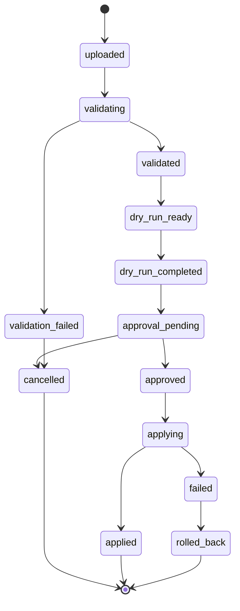
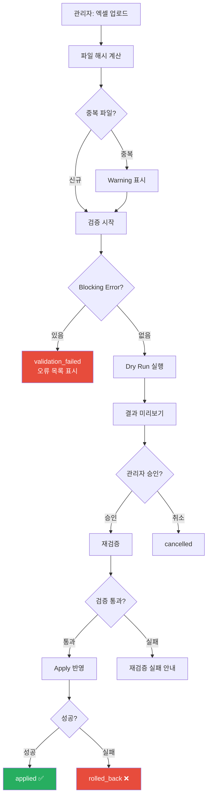

# DATA_IMPORT_SPEC.md

이 문서는 **상품, 가격, 공급조건 데이터 업로드 규칙의 기술 사양 SSOT**입니다.

> **SSOT 참조**
> - DB 스키마 → [DATABASE_SCHEMA.md](DATABASE_SCHEMA.md)
> - Import 정책(STRICT_ATOMIC) → [BUSINESS_RULES.md](BUSINESS_RULES.md)
> - 보안 → [SECURITY_RULES.md](SECURITY_RULES.md)

---

## 1. 공통 원칙

### 1.1 기본 정책: STRICT_ATOMIC

- Blocking Error가 **1건이라도** 있으면 전체 배치를 반영하지 않음
- Warning만 있는 경우 관리자가 확인 후 승인 가능
- 부분 반영 금지 대상: 가격, 공급가, 거래처 개별가격, 권한, 주문, 세금, 정산

### 1.2 업무코드 기반

UUID를 Excel에 노출하지 않음. 사용할 업무코드:

| 코드 | 설명 | 예시 |
|---|---|---|
| `internal_sku_code` | SKU 식별자 | TTC-NP150-EA |
| `price_book_code` | 가격표 식별자 | PB-B2B-DEFAULT |
| `supplier_code` | 공급업체 식별자 | SUP-001 |
| `brand_code` | 브랜드 식별자 | TTC |
| `category_code` | 카테고리 식별자 | CAT-BLADE |
| `uom_code` | 판매단위 코드 | EA, PACK, BOX |

### 1.3 텍스트 처리

- 상품코드, 바코드, 모델명은 **TEXT로 처리** — Excel의 숫자 자동변환 방지
- 선행 0 보존 (바코드 EAN-13: `4901165101198`)
- 지수표기 방지 (`1.23E+10` → 원본 텍스트 복구 또는 오류)

### 1.4 오류 구분

| 구분 | 설명 | 배치 영향 |
|---|---|---|
| **Blocking Error** | 반영을 차단하는 오류 | 전체 배치 미반영 |
| **Warning** | 관리자 확인 후 반영 가능한 경고 | 승인 시 반영 |

---

## 2. Import State Machine

| 상태 전이 | 전이 주체 | 설명 |
|---|---|---|
| uploaded → validating | 시스템 | 자동 시작 |
| validating → validated | 시스템 | Blocking Error 0건 |
| validating → validation_failed | 시스템 | Blocking Error 1건+ |
| validated → dry_run_ready | 시스템 | 자동 |
| dry_run_ready → dry_run_completed | 시스템 | Dry Run 완료 |
| dry_run_completed → approval_pending | 시스템 | 자동 |
| approval_pending → approved | **관리자** | 결과 확인 후 승인 |
| approved → applying | 시스템 | 재검증 후 반영 시작 |
| applying → applied | 시스템 | 반영 성공 |
| applying → failed | 시스템 | 반영 중 오류 |
| failed → rolled_back | 시스템 | 전체 롤백 |
| * → cancelled | **관리자** | 언제든 취소 가능 |

---

## 3. SKU Master Import 템플릿

### 3.1 컬럼 사양

| 컬럼명 | 한국어 표시 | 타입 | 필수 | 키 | 허용값/설명 |
|---|---|---|---|---|---|
| internal_sku_code | 상품코드 | TEXT | ✅ | PK | UNIQUE, 신규/수정 판별 기준 |
| brand_code | 브랜드코드 | TEXT | ✅ | FK | brands.brand_code와 일치 |
| category_code | 카테고리코드 | TEXT | ✅ | FK | categories.category_code와 일치 |
| product_name | 상품명 | TEXT | ✅ | | |
| model_name | 모델명 | TEXT | | | |
| specification_text | 규격 | TEXT | | | 예: 150mm, SK-5 |
| specifications_json | 규격JSON | TEXT | | | JSON 문자열 |
| base_uom_code | 기본단위 | TEXT | ✅ | | EA, PACK 등 |
| sales_uom_code | 판매단위 | TEXT | ✅ | | 기본 판매단위 |
| conversion_to_base | 단위변환비 | NUMERIC | ✅ | | 양수, 0 불가 |
| quantity_precision | 수량정밀도 | INTEGER | | | 기본 0 |
| allow_fractional | 소수허용 | BOOLEAN | | | true/false |
| minimum_order_quantity | MOQ | NUMERIC | | | 기본 1 |
| order_increment | 증가단위 | NUMERIC | | | 기본 1 |
| barcode | 바코드 | TEXT | | | EAN-13, CODE128 등 |
| barcode_packaging_level | 바코드포장 | TEXT | | | ea, inner, case |
| origin_country_code | 원산지 | TEXT | | | ISO 국가코드 |
| search_terms | 검색어 | TEXT | | | 쉼표 구분 |
| status | 상태 | TEXT | | | active, inactive |

### 3.2 검증 규칙

#### Blocking Errors

| 코드 | 조건 | 메시지 |
|---|---|---|
| SKU-001 | internal_sku_code 누락 | 상품코드는 필수입니다 |
| SKU-002 | brand_code가 DB에 없음 | 등록되지 않은 브랜드코드입니다: {value} |
| SKU-003 | category_code가 DB에 없음 | 등록되지 않은 카테고리코드입니다 |
| SKU-004 | product_name 누락 | 상품명은 필수입니다 |
| SKU-005 | base_uom_code 누락 또는 미지원 | 기본단위는 필수이며 지원되는 값이어야 합니다 |
| SKU-006 | conversion_to_base ≤ 0 | 단위변환비는 0보다 커야 합니다 |
| SKU-007 | 파일 내 internal_sku_code 중복 | 파일 내 상품코드 중복: {value} |
| SKU-008 | barcode가 다른 SKU에 이미 등록 | 바코드가 다른 상품에 이미 등록되어 있습니다 |
| SKU-009 | MOQ ≤ 0 | MOQ는 0보다 커야 합니다 |
| SKU-010 | order_increment ≤ 0 | 증가단위는 0보다 커야 합니다 |

#### Warnings

| 코드 | 조건 | 메시지 |
|---|---|---|
| SKU-W01 | specifications_json 파싱 실패 | 규격JSON 형식 오류, 무시됩니다 |
| SKU-W02 | search_terms 비어있음 | 검색어가 없으면 검색에 불리합니다 |
| SKU-W03 | barcode 형식이 표준과 다름 | 바코드 형식을 확인하세요 |

### 3.3 생성/수정 대상

| internal_sku_code 존재 여부 | 동작 |
|---|---|
| DB에 없음 | 신규 생성 (products + product_skus + sku_uoms + sku_barcodes) |
| DB에 있음 | 기존 레코드 수정 (변경된 필드만 업데이트) |

---

## 4. Price Book Import 템플릿

### 4.1 컬럼 사양

| 컬럼명 | 한국어 표시 | 타입 | 필수 | 키 | 허용값/설명 |
|---|---|---|---|---|---|
| price_book_code | 가격표코드 | TEXT | ✅ | FK | price_books.price_book_code |
| internal_sku_code | 상품코드 | TEXT | ✅ | FK | product_skus.internal_sku_code |
| uom_code | 판매단위 | TEXT | ✅ | FK | sku_uoms.uom_code |
| min_quantity | 최소수량 | NUMERIC | ✅ | | 수량구간 하한 |
| max_quantity | 최대수량 | NUMERIC | | | NULL = 상한 없음 |
| unit_price | 단가 | NUMERIC | ✅ | | 양수 |
| currency_code | 통화 | TEXT | | | 기본 KRW |
| tax_inclusion_mode | 세금포함 | TEXT | | | exclusive(기본), inclusive |
| valid_from | 적용시작 | DATE | | | YYYY-MM-DD |
| valid_to | 적용종료 | DATE | | | YYYY-MM-DD |
| status | 상태 | TEXT | | | active(기본), inactive |

### 4.2 검증 규칙

#### Blocking Errors

| 코드 | 조건 | 메시지 |
|---|---|---|
| PRC-001 | price_book_code가 DB에 없음 | 등록되지 않은 가격표코드입니다 |
| PRC-002 | internal_sku_code가 DB에 없음 | 등록되지 않은 상품코드입니다 |
| PRC-003 | uom_code가 해당 SKU에 없음 | 해당 상품에 등록되지 않은 판매단위입니다 |
| PRC-004 | unit_price ≤ 0 | 단가는 0보다 커야 합니다 |
| PRC-005 | min_quantity ≤ 0 | 최소수량은 0보다 커야 합니다 |
| PRC-006 | max_quantity < min_quantity | 최대수량이 최소수량보다 작습니다 |
| PRC-007 | **수량구간 중복** | 같은 (가격표+상품+UOM+기간)에서 수량구간이 겹칩니다 |
| PRC-008 | **기간 중복** | 같은 (가격표+상품+UOM+수량구간)에서 적용기간이 겹칩니다 |
| PRC-009 | valid_from > valid_to | 적용시작이 적용종료보다 늦습니다 |
| PRC-010 | 통화코드 불일치 | 가격표의 통화와 다른 통화입니다 |

#### 수량구간 중복 검증 상세

동일 (price_book_code, internal_sku_code, uom_code, 적용기간)에서:
- 기존 행과 새 행의 [min_quantity, max_quantity] 구간이 겹치면 **Blocking Error**
- max_quantity가 NULL이면 상한 없음으로 간주
- 파일 내 행 간 + DB 기존 행과 모두 비교

---

## 5. Supplier Offer Import 템플릿

### 5.1 컬럼 사양

| 컬럼명 | 한국어 표시 | 타입 | 필수 | 키 | 허용값/설명 |
|---|---|---|---|---|---|
| supplier_code | 공급업체코드 | TEXT | ✅ | FK | |
| internal_sku_code | 상품코드 | TEXT | ✅ | FK | |
| uom_code | 판매단위 | TEXT | ✅ | FK | |
| supplier_item_code | 공급업체상품코드 | TEXT | | | |
| purchase_price | 매입가 | NUMERIC | ✅ | | 양수 |
| currency_code | 통화 | TEXT | | | 기본 KRW |
| minimum_order_quantity | MOQ | NUMERIC | | | |
| order_increment | 증가단위 | NUMERIC | | | |
| stock_status | 재고상태 | TEXT | | | in_stock, limited, out_of_stock, discontinued, unknown |
| available_quantity | 가용수량 | NUMERIC | | | |
| lead_time_min_days | 최소납기(일) | INTEGER | | | |
| lead_time_max_days | 최대납기(일) | INTEGER | | | |
| direct_ship_available | 직배송가능 | BOOLEAN | | | |
| valid_from | 적용시작 | DATE | | | |
| valid_to | 적용종료 | DATE | | | |
| last_verified_at | 검증일 | DATE | | | |
| last_stock_checked_at | 재고확인일 | DATE | | | |
| stock_source | 재고출처 | TEXT | | | manual, api, excel |
| status | 상태 | TEXT | | | active, inactive |

### 5.2 검증 규칙

| 코드 | 조건 | 메시지 |
|---|---|---|
| SUP-001 | supplier_code가 DB에 없음 | 등록되지 않은 공급업체코드입니다 |
| SUP-002 | internal_sku_code가 DB에 없음 | 등록되지 않은 상품코드입니다 |
| SUP-003 | uom_code가 해당 SKU에 없음 | 해당 상품에 등록되지 않은 판매단위입니다 |
| SUP-004 | purchase_price ≤ 0 | 매입가는 0보다 커야 합니다 |
| SUP-005 | lead_time_min > lead_time_max | 최소납기가 최대납기보다 큽니다 |
| SUP-006 | stock_status가 허용값이 아님 | 지원되지 않는 재고상태값입니다 |

---

## 6. 동시성 및 재검증

### 6.1 중복 파일 감지

- `source_file_hash` (SHA-256)로 동일 파일 재업로드 감지
- 동일 해시가 이미 `applied` 상태로 존재하면 **Warning** (재실행 의도 확인)

### 6.2 데이터 변경 감지

| 시점 | 검증 |
|---|---|
| Dry Run 후 → 승인 전 | `target_data_version` 비교 |
| 승인 후 → Apply 전 | **재검증** (가격·수량·상태 변경 감지) |

- Apply 직전에 전체 검증을 다시 실행
- Dry Run 이후 대상 데이터가 변경되었으면 Warning 또는 Blocking Error 발생
- 관리자가 재확인 후 재승인

### 6.3 중복 Apply 차단

- 하나의 Import 배치에 대해 `applied` 또는 `applying` 상태이면 Apply 차단
- 같은 가격표를 동시에 수정하는 Import 배치가 있으면 **후속 배치 대기 또는 차단**

### 6.4 실패 시 롤백

- Apply 중 오류 발생 시 **전체 트랜잭션 롤백**
- 상태 → `failed` → 자동 `rolled_back`
- 롤백 후 원본 데이터 무변경 보장

---

## 7. Import 흐름 요약

---

## 8. 결과 파일

### 8.1 성공 결과

| 항목 | 설명 |
|---|---|
| 행 번호 | 엑셀 행 |
| 업무코드 | internal_sku_code 등 |
| 동작 | 신규 생성 / 업데이트 / 변경 없음 |
| 경고 | Warning 내용 |
| 변경 필드 | 업데이트 시 변경된 필드 목록 |

### 8.2 실패 결과

| 항목 | 설명 |
|---|---|
| 행 번호 | 엑셀 행 |
| 업무코드 | |
| 오류코드 | SKU-001, PRC-007 등 |
| 오류 설명 | 한국어 메시지 |
| 수정 안내 | 구체적 수정 방법 |
| 심각도 | Blocking Error / Warning |

---

## 관련 문서

| 문서 | 참조 내용 |
|---|---|
| BUSINESS_RULES.md | STRICT_ATOMIC 정책, UOM, 수량구간 |
| DATABASE_SCHEMA.md | catalog_imports, catalog_import_rows, catalog_import_errors |
| SECURITY_RULES.md | Import 승인 권한, 파일 보안 |
| TEST_PLAN.md | Import 테스트 케이스 |
