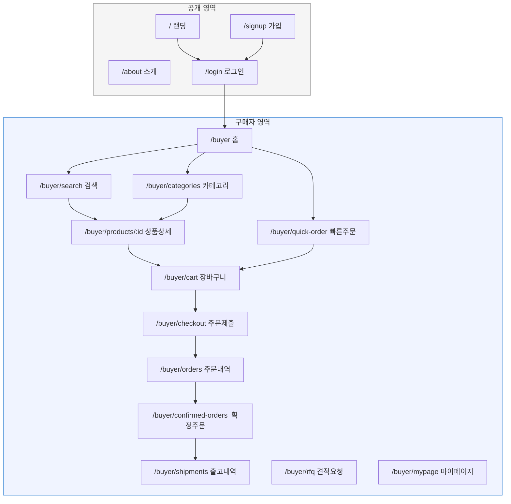
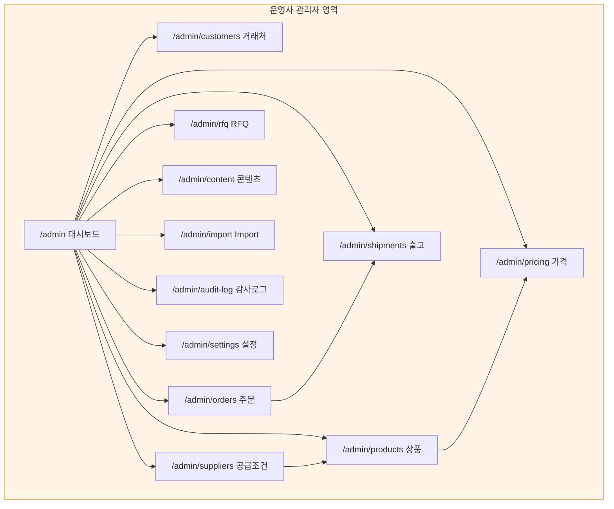

# Information Architecture

사이트맵, 화면 계층, 내비게이션 구조를 정의합니다.

> **SSOT 참조**
> - 기능 범위 → [PRODUCT_REQUIREMENTS.md](PRODUCT_REQUIREMENTS.md)
> - 가격·주문 규칙 → [BUSINESS_RULES.md](BUSINESS_RULES.md)
> - 역할·권한 → [USER_ROLES.md](USER_ROLES.md)
> - 업무 흐름 → [USER_FLOWS.md](USER_FLOWS.md)
> - 디자인 → DESIGN_SYSTEM.md (Checkpoint C)

---

## 1. 공개 영역 (Public)

로그인 없이 접근할 수 있는 페이지입니다.

| 경로 | 페이지 | 설명 |
|---|---|---|
| `/` | 랜딩 페이지 | 플랫폼 소개, 가입 안내 |
| `/about` | 회사 소개 | 플랫폼 비전, 운영사 소개 |
| `/brands` | 공개 브랜드 목록 | 취급 브랜드 소개 (가격 미노출) |
| `/brands/:slug` | 브랜드 상세 | 브랜드 스토리, 대표 상품 (가격 미노출) |
| `/catalog` | 공개 카탈로그 | 상품 카테고리 탐색 (가격 미노출) |
| `/catalog/:id` | 공개 상품 정보 | 기본 사양 (가격·재고 미노출) |
| `/signup` | 사업자 회원가입 | 사업자등록번호, 회사명, 담당자 |
| `/login` | 로그인 | 이메일 + 비밀번호 |
| `/forgot-password` | 비밀번호 찾기 | 이메일 인증 |
| `/inquiry` | 해외 바이어 문의 | 향후 Export Buyer 진입점 |

**핵심 규칙:**
- 비회원에게 **가격을 절대 노출하지 않음**
- 상품 사양과 이미지는 공개 가능 (권한이 확인된 자산만)
- 가입 유도 CTA를 자연스럽게 배치

---

## 2. 구매자 영역 (Buyer)

승인된 거래처 사용자가 접근하는 영역입니다.

### 2.1 모바일 하단 내비게이션

| 순서 | 탭 | 아이콘 | 대상 경로 |
|---|---|---|---|
| 1 | 홈 | 🏠 | `/buyer` |
| 2 | 카테고리 | 📂 | `/buyer/categories` |
| 3 | 빠른주문 | ⚡ | `/buyer/quick-order` |
| 4 | 주문내역 | 📋 | `/buyer/orders` |
| 5 | 마이 | 👤 | `/buyer/mypage` |

### 2.2 홈 화면 콘텐츠 우선순위

모바일 홈에서 다음 순서를 우선합니다:

| 순위 | 영역 | 설명 |
|---|---|---|
| 1 | 🔍 통합 검색창 | 상품명, 모델명, 코드, 바코드 |
| 2 | 📦 최근 주문상품 | 최근 주문한 상품 빠른 재주문 |
| 3 | ⚡ 빠른 재주문 | 자주 주문하는 상품 목록 |
| 4 | 📊 진행 주문 | 현재 진행 중인 주문 상태 요약 |
| 5 | 🆕 신제품 브리핑 | 새로 등록된 상품 |
| 6 | 💰 이달의 가격 경쟁 상품 | 경쟁력 있는 가격의 상품 |
| 7 | 🏷️ 브랜드 스포트라이트 | 이달의 추천 브랜드 |

> 프로모션이 검색과 주문 경험을 **방해하지 않게** 합니다.

### 2.3 구매자 페이지 목록

#### 검색·탐색

| 경로 | 페이지 | 설명 |
|---|---|---|
| `/buyer` | 홈 | 검색, 재주문, 진행 주문 |
| `/buyer/search` | 검색 결과 | 필터, 정렬, 인라인 장바구니 추가 |
| `/buyer/categories` | 카테고리 목록 | 대분류 → 중분류 → 소분류 |
| `/buyer/categories/:id` | 카테고리 상품 | 해당 카테고리 상품 목록 |
| `/buyer/products/:id` | 상품 상세 | 사양, UOM 선택, 수량구간 가격, 장바구니 |
| `/buyer/brands` | 브랜드 목록 | 취급 브랜드 목록 |
| `/buyer/brands/:slug` | 브랜드 상세 | 브랜드 스토리, 해당 브랜드 상품 |

#### 주문

| 경로 | 페이지 | 설명 |
|---|---|---|
| `/buyer/quick-order` | 빠른 주문 | 상품코드로 빠른 추가, 엑셀 대량주문 |
| `/buyer/cart` | 장바구니 | UOM·수량 수정, MOQ 검증, 소계 |
| `/buyer/checkout` | 주문 요청 제출 | 배송지, 결제조건, 요청사항, 최종 확인 |
| `/buyer/orders` | 주문 요청 내역 | 전체 주문 요청 목록, 상태 필터 |
| `/buyer/orders/:id` | 주문 요청 상세 | 품목, 상태, 수정안 확인 |
| `/buyer/orders/:id/revision` | 수정안 확인 | 변경 내용 비교, 승인/거절 |
| `/buyer/confirmed-orders` | 확정 주문 내역 | 확정된 주문 목록 |
| `/buyer/confirmed-orders/:id` | 확정 주문 상세 | 품목, 수량, 출고 현황 |

#### 출고·배송

| 경로 | 페이지 | 설명 |
|---|---|---|
| `/buyer/shipments` | 출고 내역 | 전체 출고 목록, 송장 추적 |
| `/buyer/shipments/:id` | 출고 상세 | 품목, 송장번호, 배송 상태 |

#### RFQ·기타

| 경로 | 페이지 | 설명 |
|---|---|---|
| `/buyer/rfq` | RFQ 요청 | 미등록 상품 견적 요청 작성 |
| `/buyer/rfq/list` | RFQ 내역 | 견적 요청 목록, 응답 확인 |
| `/buyer/favorites` | 즐겨찾기 | 즐겨찾기 상품 목록 (Release 1 Optional) |

#### 마이페이지

| 경로 | 페이지 | 설명 |
|---|---|---|
| `/buyer/mypage` | 마이페이지 | 계정 관리 허브 |
| `/buyer/mypage/company` | 회사정보 | 사업자정보 조회·수정 |
| `/buyer/mypage/profile` | 담당자 정보 | 이름, 연락처, 비밀번호 변경 |
| `/buyer/mypage/addresses` | 배송지 관리 | 배송지 등록·수정·삭제 |
| `/buyer/mypage/users` | 사용자 관리 | 거래처 관리자만, 직원 초대·권한 |
| `/buyer/mypage/inquiries` | 문의 내역 | 문의·답변 |

### 2.4 구매사 내부 승인 활성화 시 추가 페이지

내부 승인 기능이 활성화된 거래처에만 표시됩니다.

| 경로 | 페이지 | 설명 |
|---|---|---|
| `/buyer/approval/pending` | 내부 승인 대기함 | 승인 대기 중인 주문 요청 |
| `/buyer/approval/history` | 내부 승인 내역 | 과거 승인/거절 이력 |
| `/buyer/approval/settings` | 승인정책 관리 | 거래처 관리자만 접근 |

---

## 3. 운영사 관리자 영역 (Admin)

운영사 직원이 접근하는 관리 영역입니다. 권한에 따라 메뉴가 제한됩니다.

### 3.1 관리자 사이드바 내비게이션

```
📊 대시보드
👥 거래처 관리
📦 상품 관리
💰 가격 관리
🏭 공급조건 관리
📋 주문 관리
🚚 출고 관리
📩 RFQ 관리
📝 콘텐츠 관리
📥 엑셀 Import
📜 감사로그
⚙️ 시스템 설정
```

### 3.2 관리자 페이지 목록

#### 대시보드

| 경로 | 페이지 | 설명 |
|---|---|---|
| `/admin` | 대시보드 | 오늘 주문, 승인 대기, 출고 대기, 알림 |

#### 거래처 관리

| 경로 | 페이지 | 필요 권한 |
|---|---|---|
| `/admin/customers` | 거래처 목록 | can_manage_customers |
| `/admin/customers/pending` | 승인 대기 목록 | can_manage_customers |
| `/admin/customers/:id` | 거래처 상세 | can_manage_customers |
| `/admin/customers/:id/prices` | 거래처 개별가격 | can_manage_prices |
| `/admin/customers/:id/orders` | 거래처 주문이력 | can_manage_orders |

#### 상품 관리

| 경로 | 페이지 | 필요 권한 |
|---|---|---|
| `/admin/products` | 상품 목록 | can_manage_products |
| `/admin/products/:id` | 상품 상세/수정 | can_manage_products |
| `/admin/products/:id/skus` | SKU 관리 | can_manage_products |
| `/admin/products/:id/skus/:skuId/uoms` | UOM 관리 | can_manage_products |
| `/admin/products/:id/skus/:skuId/barcodes` | 바코드 관리 | can_manage_products |
| `/admin/brands` | 브랜드 관리 | can_manage_products |
| `/admin/categories` | 카테고리 관리 | can_manage_products |
| `/admin/search-keywords` | 검색 키워드 관리 | can_manage_products |

#### 가격 관리

| 경로 | 페이지 | 필요 권한 |
|---|---|---|
| `/admin/pricing` | 가격표 목록 | can_manage_prices |
| `/admin/pricing/:id` | 가격표 상세 (수량구간 포함) | can_manage_prices |
| `/admin/pricing/overrides` | 거래처 개별가격 관리 | can_manage_prices |
| `/admin/pricing/history` | 가격 변경 이력 | can_manage_prices |

#### 공급조건 관리

| 경로 | 페이지 | 필요 권한 |
|---|---|---|
| `/admin/suppliers` | 공급업체 목록 | can_manage_suppliers |
| `/admin/suppliers/:id` | 공급업체 상세 | can_manage_suppliers |
| `/admin/suppliers/:id/offers` | 공급조건 (supplier_offers) | can_manage_suppliers |
| `/admin/suppliers/freshness` | 공급조건 신선도 확인 | can_manage_suppliers |

#### 주문 관리

| 경로 | 페이지 | 필요 권한 |
|---|---|---|
| `/admin/orders/requests` | 주문 요청 목록 | can_manage_orders |
| `/admin/orders/requests/:id` | 주문 요청 검토 | can_manage_orders |
| `/admin/orders/requests/:id/revision` | 수정안 작성/발행 | can_manage_orders |
| `/admin/orders/confirmed` | 확정 주문 목록 | can_manage_orders |
| `/admin/orders/confirmed/:id` | 확정 주문 상세 | can_manage_orders |

#### 출고 관리

| 경로 | 페이지 | 필요 권한 |
|---|---|---|
| `/admin/shipments` | 출고 목록 | can_manage_shipments |
| `/admin/shipments/pending` | 출고 준비 목록 | can_manage_shipments |
| `/admin/shipments/:id` | 출고 상세 (송장 등록) | can_manage_shipments |

#### RFQ 관리

| 경로 | 페이지 | 필요 권한 |
|---|---|---|
| `/admin/rfq` | 견적 요청 목록 | can_manage_orders |
| `/admin/rfq/:id` | 견적 상세/응답 | can_manage_orders |

#### 콘텐츠 관리

| 경로 | 페이지 | 필요 권한 |
|---|---|---|
| `/admin/content/promotions` | 프로모션 관리 | can_manage_content |
| `/admin/content/collections` | 기획전 관리 | can_manage_content |
| `/admin/content/banners` | 배너 관리 | can_manage_content |
| `/admin/content/brand-stories` | 브랜드 스토리 관리 | can_manage_content |
| `/admin/content/new-arrivals` | 신제품 관리 | can_manage_content |

#### 엑셀 Import

| 경로 | 페이지 | 필요 권한 |
|---|---|---|
| `/admin/import` | Import 허브 | can_manage_products |
| `/admin/import/sku` | SKU Master Import | can_manage_products |
| `/admin/import/pricing` | Price Book Import | can_manage_prices |
| `/admin/import/suppliers` | Supplier Offer Import | can_manage_suppliers |
| `/admin/import/history` | Import 이력 | can_manage_products |

#### 감사로그·설정

| 경로 | 페이지 | 필요 권한 |
|---|---|---|
| `/admin/audit-log` | 감사로그 | Operator Admin |
| `/admin/settings` | 시스템 설정 | Operator Admin |

---

## 4. 향후 공급업체 영역 (Supplier Portal) — Stage 3

> Stage 3(Phase 8)에서 구현 예정. 현재는 화면 구조만 정의합니다.

| 경로 | 페이지 | 설명 |
|---|---|---|
| `/supplier` | 대시보드 | 오늘 주문, 출고 대기, 공급조건 알림 |
| `/supplier/company` | 회사·브랜드 정보 | 사업자정보, 브랜드 관리 |
| `/supplier/products` | 상품 관리 | 자기 상품 등록·수정 |
| `/supplier/offers` | 공급조건 관리 | 공급가, MOQ, 재고, 납기 |
| `/supplier/orders` | 주문 확인 | 배정된 주문 수락·거절 |
| `/supplier/shipments` | 출고 관리 | 송장 등록, 직배송 관리 |
| `/supplier/settlements` | 정산 조회 | 판매현황, 정산내역 |

---

## 5. 사이트맵 — 구매자 영역



## 6. 사이트맵 — 관리자 영역



---

## 7. 반응형 레이아웃 원칙

| 디바이스 | 레이아웃 | 내비게이션 |
|---|---|---|
| 모바일 (< 768px) | 단일 컬럼, 하단 탭 바 | 5탭 하단 내비게이션 |
| 태블릿 (768~1024px) | 2컬럼 활용, 하단 탭 또는 사이드바 | 축소 사이드바 |
| 데스크톱 (> 1024px) | 다중 컬럼, 고밀도 정보 | 좌측 사이드바 |

**모바일 우선 원칙:**
- 터치 영역 최소 44px
- 상품 목록에서 인라인 수량 입력·장바구니 추가
- 3회 이내 터치로 재주문 가능
- 가로 스크롤 없이 주문 완료
- 검색창이 항상 빠르게 접근 가능

---

## 관련 문서

| 문서 | 참조 내용 |
|---|---|
| PRODUCT_REQUIREMENTS.md | 기능 분류 (Must-Have / Optional / Future) |
| BUSINESS_RULES.md | 가격·주문·출고 규칙 |
| USER_ROLES.md | 역할·권한·Capability |
| USER_FLOWS.md | 업무 흐름 다이어그램 |
| DESIGN_SYSTEM.md | 디자인 토큰, 컴포넌트 (Checkpoint C) |
