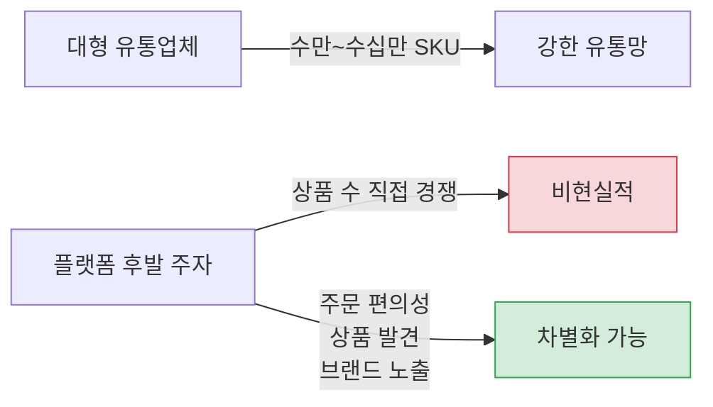
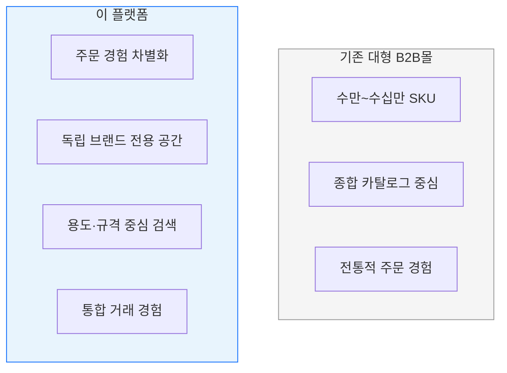

# MARKET_CONTEXT.md — 시장 배경과 포지셔닝

> **문서 목적**: 이 플랫폼이 왜 필요한지, 시장 구조와 문제점, 차별화 방향을 설명한다.
>
> **SSOT 범위**: 시장 배경, 공급·구매 측 문제, 포지셔닝 방향
>
> **관련 문서**: 구체적인 가격·주문 규칙 → `BUSINESS_RULES.md` / MVP 범위 → `PRODUCT_REQUIREMENTS.md` / 개발 순서 → `ROADMAP.md`

---

## 1. 국내 공구 유통시장 구조

국내 공구·산업재 유통시장은 **대형 종합유통업체 중심**으로 형성되어 있다.

| 구분 | 설명 |
|------|------|
| 주요 대형 유통업체 | 크레텍책임, 동신툴피아, 프로툴, 무창상사, 케이비원, 한국기업 등 |
| 유통 방식 | 종합 카탈로그 + B2B 쇼핑몰을 통한 전국 유통망 |
| 공급 구조 | 제조사·수입사·전문 업체 → 대형 유통업체 → 최종 거래처 |

- 대형 유통업체들은 수만~수십만 SKU를 종합 카탈로그와 자체 B2B 쇼핑몰을 통해 유통하며, 강한 유통망을 형성하고 있다.
- 과거에 이름이 알려졌거나 자체 브랜드를 보유한 **중소 제조사, 수입사, 전문 업체**들도 결국 대형 유통업체에 상품을 공급하는 구조로 편입되어 있다.

---

## 2. 공급 측 문제

독립 브랜드와 중소 공급사가 겪는 핵심 문제:

| # | 문제 | 설명 |
|---|------|------|
| 1 | **브랜드 비가시성** | 자체 브랜드가 최종 거래처(공구상, 제조업체 구매팀 등)에 잘 드러나지 않음 |
| 2 | **자체 B2B몰 구축 부담** | 쇼핑몰 개발·운영에 필요한 인력·비용·기술 여력 부족 |
| 3 | **거래처 접근 한계** | 전국 공구상과 산업재 거래처에 직접 접근하기 어려움 |
| 4 | **수요 파악 불가** | 어떤 거래처가 어떤 제품을 찾는지 알기 어려움 |
| 5 | **상품정보 비표준화** | 상품정보, 이미지, 규격, 카탈로그가 디지털 데이터로 표준화되지 않음 |
| 6 | **상품 매몰** | 기술적으로 우수한 제품도 유명 브랜드와 대형 유통사의 방대한 상품 수에 묻힘 |
| 7 | **수출 준비 부담** | 수출용 영문 상품정보, HS Code, 포장정보, 해외 견적 체계 준비가 어려움 |

---

## 3. 구매 측 문제

공구상, 시공업체, 제조업체 구매팀 등 구매 거래처가 겪는 핵심 문제:

| # | 문제 | 설명 |
|---|------|------|
| 1 | **반복 주문 고착** | 항상 주문하던 품목만 반복 주문, 새로운 상품 탐색이 거의 없음 |
| 2 | **취급 품목 인지 부족** | 거래 중인 유통업체가 다른 품목도 취급한다는 사실을 모름 |
| 3 | **대체상품 발견 어려움** | 작은 전문 브랜드나 대체 가능한 상품을 찾기 어려움 |
| 4 | **주문 채널 분산** | 전화, 팩스, 카카오톡, 문자, 엑셀 등 주문 방식이 분산되어 관리 비용 증가 |
| 5 | **상품 검색 난이도** | 모델명과 규격이 복잡해 원하는 상품을 정확히 찾기 어려움 |
| 6 | **비교 구매 부담** | 여러 공급업체의 가격과 납기를 일일이 확인해야 함 |

---

## 4. 상품 수 경쟁을 피해야 하는 이유

- 대형 유통업체는 이미 **수만~수십만 SKU**를 보유하고 있다.
- 플랫폼 후발 주자가 상품 수로 직접 경쟁하는 것은 **비현실적**이다.
- 차별점은 상품 수가 아니라 **주문 편의성**, **상품 발견**, **브랜드 노출**에 있다.

---

## 5. 재주문 편의성의 기회

B2B에서는 같은 상품을 반복 주문하는 비율이 매우 높다. 이 특성을 활용하면 전화·카카오톡 주문보다 편리한 경험을 제공할 수 있다.

### 핵심 재주문 기능

| 기능 | 설명 |
|------|------|
| 최근 주문 | 가장 최근에 주문한 상품 목록을 바로 제시 |
| 자주 주문 | 주문 빈도가 높은 상품을 자동 정렬 |
| 이전 주문 복사 | 과거 주문을 그대로 복사해 수량만 조정 |
| 즐겨찾기 | 자주 쓰는 상품을 미리 등록 |
| 엑셀 대량주문 | 엑셀 파일로 여러 상품을 한 번에 주문 |
| 상품코드 빠른 주문 | 상품코드를 직접 입력해 빠르게 장바구니에 추가 |

> [!TIP]
> **목표: 3회 이내 터치로 재주문 완료** — 이 수준이 달성되면 전화·카카오톡 주문보다 확실히 편리하다.

---

## 6. 상품 발견의 기회

구매 거래처가 **'이 회사가 이런 상품도 취급한다'**는 점을 자연스럽게 발견할 수 있도록 한다.

### 상품 발견 시나리오

| 시나리오 | 설명 |
|----------|------|
| **연관품목 추천** | 현재 주문 품목과 관련되지만 아직 구매하지 않은 품목을 제안 |
| **함께 주문하는 상품** | 다른 거래처들이 함께 자주 주문하는 상품 조합을 보여줌 |
| **대체 가능 브랜드** | 동일 규격·용도의 독립 브랜드 상품을 대안으로 제시 |
| **신제품·신규 브랜드** | 새로 입점한 상품과 브랜드를 자연스럽게 소개 |

---

## 7. 독립 브랜드의 디지털 유통 문제

독립 브랜드(자체 브랜드를 가진 중소 제조사, 수입사)가 디지털 유통에서 겪는 구조적 문제:

| # | 문제 | 설명 |
|---|------|------|
| 1 | 자체 쇼핑몰 부담 | 개발 비용, 서버 운영, 유지보수 인력 확보가 어려움 |
| 2 | 대형 유통업체 내 노출 한계 | 대형 유통업체의 방대한 카탈로그 안에서 브랜드가 묻힘 |
| 3 | 신제품 노출 어려움 | 작은 업체의 신제품이 대형 업체의 카탈로그에 묻혀 발견되지 않음 |
| 4 | 상품정보 디지털화 부족 | 이미지, 규격, 기술자료 등 디지털 콘텐츠가 체계적으로 준비되지 않음 |

> [!IMPORTANT]
> **플랫폼의 가치 제안**: 독립 브랜드가 자체 몰 없이도 B2B 판매채널을 확보할 수 있다. 플랫폼이 상품정보 디지털화를 지원하고, 브랜드 전용 공간을 제공한다.

---

## 8. 초기 목표 고객

### 구매 거래처

| 구분 | 대상 |
|------|------|
| 공구·철물 유통 | 전국 공구점, 철물점 |
| 산업재 유통 | 산업재 유통업체 |
| 현장 사용 | 시공업체, 정비 업체 |
| 기업 구매 | 제조업체 구매팀 |

### 공급 파트너 후보

| 구분 | 예시 |
|------|------|
| 독립 공구 브랜드 | TTC, 협성, 대원 등 _(SAMPLE — 실제 파트너는 별도 관리)_ |
| 중소 제조사 | 자체 브랜드를 보유한 국내 공구·산업재 제조사 |
| 전문 수입사 | 해외 브랜드를 수입·유통하는 전문 업체 |
| PB 상품 공급사 | 자체 브랜드(PB) 상품을 생산·공급하는 업체 |

> [!NOTE]
> 위 브랜드명은 예시(SAMPLE)이며, 실제 파트너 목록과 계약 상태는 별도 문서에서 관리한다.

---

## 9. 플랫폼의 포지셔닝

### 목표

> **"전문적인 산업재 시스템과 현대적인 커머스 앱의 중간"**

전통적인 산업재 ERP/주문 시스템의 깊이와 현대적인 커머스 앱의 사용 편의성을 결합한다.

### 기존 대형 B2B몰과의 차이

| 관점 | 차별화 방향 |
|------|-------------|
| 주문 경험 | 상품 수가 아니라 **주문 편의성**에서 차별화 |
| 브랜드 공간 | 독립 브랜드와 전문 상품을 위한 **전용 공간** 제공 |
| 검색 방식 | 용도·규격 중심의 검색 (동의어, 현장용어, 작업재질 지원) |
| 거래 통합 | 하나의 로그인, 하나의 장바구니, 하나의 주문 |

### 기존 대형 B2B몰에서 참고할 점

| 항목 | 이유 |
|------|------|
| 업계 표준 카테고리 구조 | 구매자가 익숙한 분류 체계를 유지하기 위함 |
| 공구 유통의 거래 관행 | MOQ(최소주문수량), UOM(판매단위), 단가 체계 등 업계 관행 반영 |
| 거래처 신뢰를 위한 정보 구성 | 상품 규격, 인증, 원산지 등 B2B 거래에 필요한 신뢰 정보 |

### 기존 대형 B2B몰에서 복제하지 않을 것

| 항목 | 이유 |
|------|------|
| 디자인, 문구, 이미지, 콘텐츠 | 독자적 브랜드 아이덴티티 구축 |
| 상품 수 중심의 경쟁 전략 | 후발 주자로서 비현실적 — 편의성으로 차별화 |
| 과도한 할인 문구와 배너 | B2B의 전문성과 신뢰감 유지 |

---

## 주의사항

> [!CAUTION]
> - 특정 경쟁사의 문구, 디자인, 이미지, 카탈로그 내용을 **복제하지 않는다**.
> - 실제 시장 점유율이나 매출 수치를 **임의로 만들지 않는다**.
> - 구체적인 브랜드 전략은 `PRODUCT_REQUIREMENTS.md`를 참조한다.
> - 구체적인 가격 전략과 주문 규칙은 `BUSINESS_RULES.md`를 참조한다.
> - 확정되지 않은 사항은 `OPEN_DECISIONS.md`를 참조한다.

---

_최종 업데이트: 2026-07-16_
