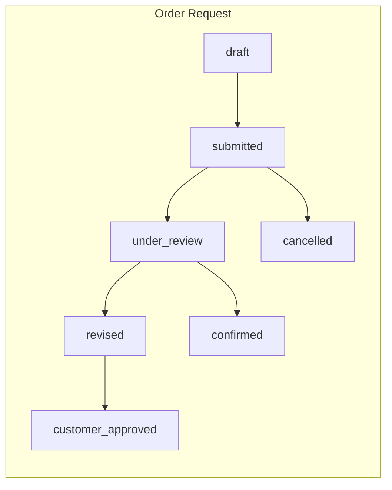
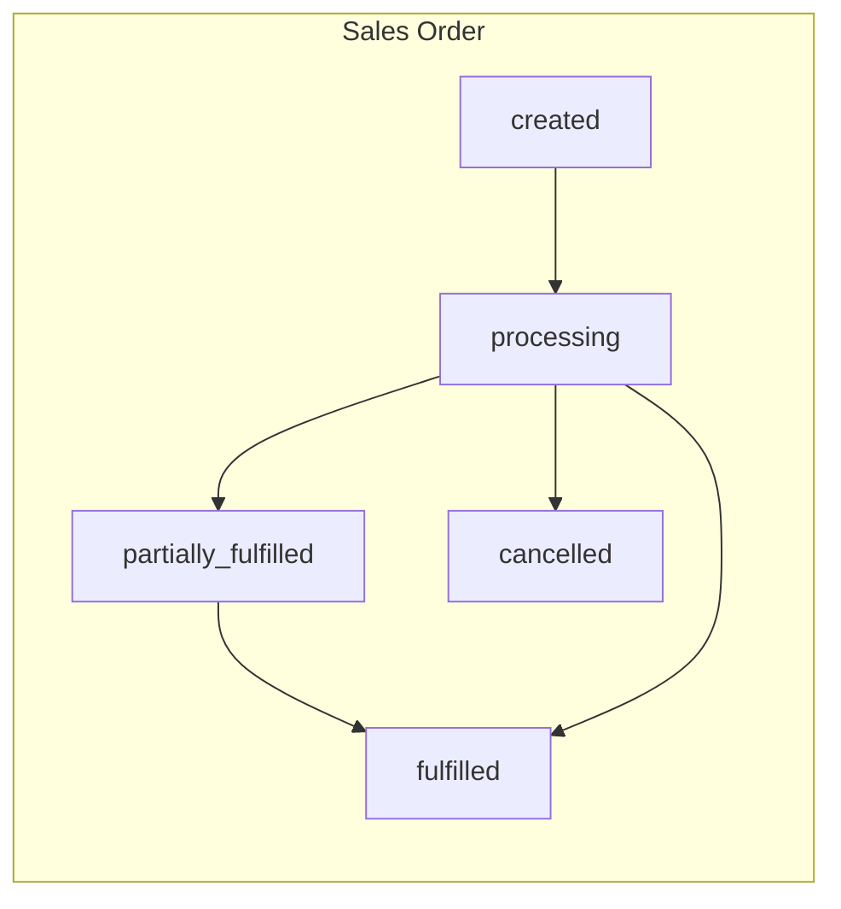
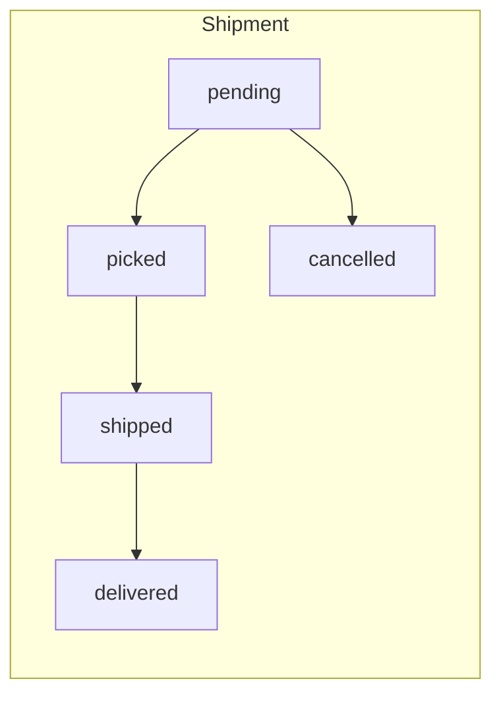

# PRODUCT_REQUIREMENTS.md

> **SSOT**: 이 문서는 **MVP 기능 범위**의 Single Source of Truth입니다.
>
> - 가격·MOQ·UOM·주문·출고 **상세 규칙** → `BUSINESS_RULES.md` 참조
> - DB 스키마 → `DATABASE_SCHEMA.md` 참조
> - 보안·권한 → `SECURITY_RULES.md` 참조
> - 개발 순서 → `ROADMAP.md` 참조
> - 확정 결정 → `DECISION_LOG.md` 참조
> - 미확정 사항 → `OPEN_DECISIONS.md` 참조

---

## 문서 범례

| 기호 | 의미 |
|------|------|
| **R1-Must** | Release 1 Must-Have — MVP 출시에 반드시 포함 |
| **Pilot-Must** | Customer Pilot Must-Have — 시험 운영에 반드시 포함 |
| **R1-Opt** | Release 1 Optional — MVP 출시 시점에 선택적 포함 |
| **Future** | Future Extension — Stage 3 이후 또는 조건부 도입 |

---

## Release 1 Must-Have

> MVP 출시에 **반드시 포함**되어야 하는 핵심 기능.

### 인증 및 거래처 관리

| # | 기능 | 설명 |
|---|------|------|
| 1 | **사업자 회원가입** | 사업자등록번호, 회사명, 대표자, 업종, 담당자 정보를 입력하여 가입 신청. 가입 즉시 이용 불가 — 관리자 승인 후 활성화. |
| 2 | **관리자 거래처 승인/거절** | 운영사 관리자가 가입 신청을 검토하여 승인 또는 거절. 승인 시 가격등급 배정. |
| 3 | **로그인/로그아웃** | 이메일+비밀번호 기반 인증. 세션 관리. |
| 4 | **역할별 접근권한** | RLS(Row-Level Security, 행 단위 보안) 기반. 역할에 따라 접근 가능 데이터가 제한됨. 상세는 `SECURITY_RULES.md` 참조. |
| 5 | **조직 다중 역할** | `organization_roles` 테이블 기반. 하나의 조직이 buyer(구매사), supplier(공급사), brand_owner(브랜드사) 등 복수 역할을 동시에 보유 가능. |

### 상품 및 검색

| # | 기능 | 설명 |
|---|------|------|
| 6 | **브랜드 및 카테고리 관리** | 브랜드 목록·카테고리 트리 등록/수정/삭제. 상품은 반드시 하나의 브랜드와 카테고리에 소속. |
| 7 | **상품-SKU 분리 구조** | 상품(Product)과 SKU를 분리. 하나의 상품에 여러 SKU(규격·옵션 변형)가 연결됨. SKU는 UUID PK + `internal_sku_code` UNIQUE. |
| 8 | **SKU별 여러 판매단위 UOM** | `sku_uoms` 테이블 기반. 하나의 SKU에 EA(낱개), PACK(묶음), BOX(박스) 등 복수 판매단위를 등록. |
| 9 | **UOM별 MOQ와 주문 증가단위** | 판매단위(UOM)마다 최소주문수량(MOQ)과 주문 증가단위(increment)를 개별 설정. 상세는 `BUSINESS_RULES.md` 참조. |
| 10 | **복수 바코드 지원** | `sku_barcodes` 별도 테이블. 하나의 SKU에 여러 바코드(EAN-13, CODE128 등)를 등록. 검색·스캔에 활용. |
| 11 | **상품 이미지·기술자료·카탈로그** | 상품별 대표 이미지, 추가 이미지, 기술 사양서(PDF 등), 카탈로그 파일 업로드 및 관리. |
| 12 | **상품 검색 (PostgreSQL 기반, 6단계 우선순위)** | 아래 우선순위로 검색 결과를 정렬: |

**검색 우선순위 (높은 순)**:

```
1순위  정확 일치     — 상품코드, 바코드, 모델명
2순위  접두 일치     — 모델명, 상품명 앞부분 일치
3순위  별칭/동의어   — 등록된 동의어·별칭과 일치
4순위  브랜드+규격   — 브랜드명과 규격 조합 매칭
5순위  pg_trgm      — 트라이그램(3-글자 단위) 유사도 검색
6순위  부분문자열    — LIKE '%keyword%' 형태의 포함 검색
```

| # | 기능 | 설명 |
|---|------|------|
| 13 | **검색어 정규화** | 단위(mm↔밀리 등), 공백, 하이픈, 전각/반각 문자를 자동 변환하여 검색 정확도 향상. |
| 14 | **검색 키워드와 동의어** | SKU별 검색 키워드 등록. 동의어 사전 관리(예: 스패너=렌치). |
| 15 | **엑셀 상품 일괄등록** | SKU Master Import. `STRICT_ATOMIC` 정책 — 파일 내 1건이라도 오류 시 전체 롤백. 상세는 `BUSINESS_RULES.md` 참조. |

### 가격

| # | 기능 | 설명 |
|---|------|------|
| 16 | **가격표 (price_books)** | 등급별 가격표 생성·관리. 가격표마다 SKU+UOM별 단가를 설정. |
| 17 | **거래처 가격등급 (organization_price_books)** | 거래처(조직)에 가격표를 배정. 거래처가 해당 등급의 가격을 적용받음. |
| 18 | **거래처 개별가격 (company_price_overrides)** | 특정 거래처에 대해 SKU+UOM 단위로 개별 단가를 설정. 가격표보다 우선 적용. |
| 19 | **수량구간 가격 (tiered pricing)** | `min_quantity` / `max_quantity` 기반. 주문 수량에 따라 단가가 달라짐. 상세는 `BUSINESS_RULES.md` 참조. |
| 20 | **가격 선택 규칙** | 우선순위: 거래처 개별가격 → 가격표 → 기본 B2B가 → 견적문의. 상세는 `BUSINESS_RULES.md` 참조. |
| 21 | **가격 엑셀 일괄등록** | Price Book Import. `STRICT_ATOMIC` 정책. 상세는 `BUSINESS_RULES.md` 참조. |

**가격 선택 우선순위**:

```
1순위  거래처 개별가격  (company_price_overrides)
2순위  가격표          (price_books)
3순위  기본 B2B가
4순위  견적문의        (가격 미등록 시)
```

### 주문

| # | 기능 | 설명 |
|---|------|------|
| 22 | **장바구니** | SKU+UOM 단위로 장바구니에 추가. 수량 변경·삭제. 가격은 장바구니 조회 시 서버에서 실시간 계산. |
| 23 | **주문 요청 (Order Request)** | 3개 독립 State Machine으로 관리. 상세는 아래 다이어그램 및 `BUSINESS_RULES.md` 참조. |
| 24 | **관리자 검토 및 수정안 발행** | `order_revisions` + `order_revision_items` 기반. 관리자가 주문 내용(수량·단가·품목)을 수정하여 수정안(revision)을 발행. |
| 25 | **구매자 재승인** | `requires_customer_approval` 플래그. 관리자가 수정안을 발행하면 구매자가 변경 내용을 확인하고 승인/거절. |
| 26 | **확정 주문 생성 (Sales Order)** | 구매자 승인 완료 후 Sales Order로 확정. 확정 시점의 가격·조건이 스냅샷으로 저장. |
| 27 | **주문 스냅샷** | 확정 시점의 회사정보, 가격 산출근거, VAT 정책, 품목별 단가·수량·부가세를 불변 기록으로 저장. |
| 28 | **부분 확정** | 품목별로 accepted / rejected / backordered / cancelled quantity와 `line_status`를 개별 관리. `accepted_quantity` 기반 수량 모델. |
| 29 | **부분 출고** | `shipments` + `shipment_items` 테이블 기반. 하나의 Sales Order에서 여러 번에 나눠 출고 가능. |
| 30 | **취소** | 확정 전: 즉시 취소 가능. 확정 후: 취소 요청 → 관리자 승인 필요. 상세는 `BUSINESS_RULES.md` 참조. |
| 31 | **서버 측 가격 재계산** | 주문 제출·확정 시 서버에서 가격을 재계산. 브라우저에서 전달된 가격을 신뢰하지 않음. |
| 32 | **수량 불변식 검증** | 품목별 수량 합계가 원래 요청 수량과 일치하는지 서버에서 검증. 상세는 `BUSINESS_RULES.md` 참조. |

**3개 독립 State Machine 개요**:







> [!NOTE]
> 각 State Machine의 상세 전이 조건, 트리거, 유효성 검증은 `BUSINESS_RULES.md` 참조.

### 관리자

| # | 기능 | 설명 |
|---|------|------|
| 33 | **거래처 승인/등급/개별가격 관리** | 가입 신청 검토, 가격등급 배정, 개별가격 설정. |
| 34 | **상품/SKU/UOM/바코드 관리** | 상품·SKU 등록/수정/삭제. UOM·바코드 추가/수정/삭제. |
| 35 | **가격표/수량구간/개별가격 관리** | 가격표 생성·편집, 수량구간 가격 설정, 거래처 개별가격 관리. |
| 36 | **공급조건 관리 (supplier_offers)** | 공급업체별 SKU 공급 조건(공급가, 리드타임, MOQ 등) 관리. |
| 37 | **주문 검토/확정/출고 관리** | 주문 요청 검토, 수정안 발행, Sales Order 확정, 출고 처리. |
| 38 | **감사로그** | 주요 데이터 변경(가격·주문·거래처 상태 등)에 대한 감사 기록. |
| 39 | **엑셀 Import 관리** | Import 이력 조회, 오류 로그 확인, 재시도. |

### 출고

| # | 기능 | 설명 |
|---|------|------|
| 40 | **배송 방식 선택** | 택배 / 화물 / 방문수령 중 선택. |
| 41 | **송장번호 등록** | 택배·화물 출고 시 운송장 번호 입력. |
| 42 | **부분출고/분할출고** | 하나의 Sales Order를 여러 출고 건으로 나누어 처리. |

### 상태 분리

| # | 기능 | 설명 |
|---|------|------|
| 43 | **4개 독립 상태 관리** | `order_status`, `fulfillment_status`, `payment_status`, `tax_invoice_status`를 각각 독립적으로 관리. 하나의 상태 변경이 다른 상태에 자동 영향을 주지 않음. |

---

## Customer Pilot Must-Have

> 시험 거래처 운영(Customer Pilot)에 **반드시 포함**되어야 하는 기능과 운영 요건.

| # | 기능 | 설명 |
|---|------|------|
| 44 | **미등록 상품 RFQ** | 구매자가 미등록 상품에 대해 견적을 요청. 입력: 상품명, 브랜드, 모델명, 규격, 수량, 사진, 요청사항. **운영사만 응답** (공급업체 포털은 Stage 3). |
| 45 | **검색 실패어 수집 및 운영 분석** | 검색 결과 0건인 검색어를 자동 수집. 운영자가 주기적으로 분석하여 동의어·키워드 보완. |
| 46 | **핵심 200개 상품 등록** | Customer Pilot 시작 전 핵심 거래 품목 200개 이상 등록 완료. |
| 47 | **시험 거래처 3~5곳 운영** | 실제 거래처 3~5곳을 대상으로 시험 운영. |
| 48 | **Customer Pilot 사업 성과 지표 측정** | 아래 KPI를 측정·보고. |

**Customer Pilot 핵심 KPI**:

| 지표 | 목표 |
|------|------|
| 거래처당 SKU 수 | 추적·측정 |
| 신규 SKU 조회 → 장바구니 → 주문 전환 | 추적·측정 |
| 전화/카톡 없이 완료된 주문 비율 | 추적·측정 |
| 재주문 거래처 수 | 추적·측정 |
| 검색 성공률 (핵심 상품) | **100%** |
| 검색 성공률 (전체) | **90% 이상** |
| 가격 노출 사고 | **0건** |
| UOM / MOQ / 가격구간 오류 | **0건** |

---

## Release 1 Optional

> MVP 출시 시점에 **선택적으로 포함**. 기본 비활성화이거나 후순위 구현.

| # | 기능 | 설명 | 비고 |
|---|------|------|------|
| 49 | **즐겨찾기 (favorites)** | 구매자가 자주 주문하는 SKU를 즐겨찾기에 저장. | |
| 50 | **상품 연관관계 (product_relations)** | 대체품(alternative), 액세서리(accessory), 소모품(consumable), 호환품(compatible), 번들(frequently_bundled). | |
| 51 | **브랜드 스토리 (brand_stories)** | 브랜드별 소개 페이지. Stage 5 '브랜드 미니몰'과는 별도 — 여기서는 정보 제공용. | |
| 52 | **프로모션/기획전 (promotions, collections)** | 기간 한정 할인, 기획전 컬렉션 구성. | |
| 53 | **알림 (notifications)** | 주문 상태 변경, 가격 변경 등 알림. | |
| 54 | **구매사 내부 승인** | 기본 **비활성화**. Feature Flag로 활성화. `buyer_approval_status`: not_required / pending / approved / rejected / cancelled / expired. **1단계 승인**부터 지원. 다단계 승인은 Future. | |
| 55 | **외부 코드 매핑 (external_item_mappings)** | ecount, legacy 등 외부 시스템의 상품코드와 내부 SKU를 매핑. | |
| 56 | **가격 변경 이력 (price_change_history)** | 가격 변경 시 이전 가격·변경 사유·변경자를 기록. | |
| 57 | **배너/홈 콘텐츠** | 메인 페이지 배너, 공지사항, 추천 상품 등 콘텐츠 관리. | |

---

## Future Extension

> Stage 3 이후 또는 **별도 승인이 필요한** 확장 기능.

| # | 기능 | 시기 | 비고 |
|---|------|------|------|
| 58 | **공급업체 포털** | Stage 3 | 공급업체가 직접 주문 확인·출고 관리. |
| 59 | **직배송 자동 분배** | Stage 4 | 주문을 공급업체에 자동 분배. |
| 60 | **공급업체 정산** | Stage 4 | Phase 9B는 **Go/No-Go 별도 승인** 필요. |
| 61 | **브랜드 미니몰** | Stage 5 | 브랜드별 전용 몰. Stage 1의 '브랜드 소개'와 분리. |
| 62 | **다국어** | Stage 6 | UI·상품 정보 다국어 지원. |
| 63 | **해외 RFQ** | Stage 6 | 해외 공급업체 견적 요청. |
| 64 | **PWA** | Basic: Phase 6 이후 조기 도입 / Advanced: Phase 11 | Progressive Web App. |
| 65 | **네이티브 앱** | Phase 13, 조건부 | PWA Advanced 이후 필요 시. |
| 66 | **실시간 이카운트 ERP 연동** | 미정 | 재고·매출·매입 실시간 동기화. |
| 67 | **AI 검색/사진검색/음성주문/OCR** | 미정 | AI 기반 고급 검색 기능. |
| 68 | **다단계 구매사 내부 결재** | 미정 | Release 1 Optional의 1단계 승인 이후 확장. |

---

## Explicitly Excluded

> 아래 기능은 의도적으로 **범위에서 제외**합니다.

| 제외 항목 | 사유 |
|-----------|------|
| 초기 오픈마켓 (여러 판매자가 구매자에게 직접 판매) | Stage 1~2 판매 주체는 운영사. 마켓플레이스는 Stage 3 이후. |
| 공급업체 직접 결제 (초기) | 초기에는 운영사가 결제·정산을 중개. |
| AI 자동가격 변경 | 가격 변경은 반드시 관리자 승인 필요. |
| AI 무승인 주문확정 | 주문 확정은 반드시 관리자 검토 필요. |
| 자동 공급업체 정산 (초기) | 초기에는 수동 정산. Stage 4에서 반자동화. |
| 오프라인 주문 제출 | 온라인 접속 필수. |
| 복잡한 범용 결재 워크플로 엔진 | 1단계 승인만 R1-Opt. 범용 엔진은 불필요한 복잡도. |
| 공동구매 또는 예약발주 | 현재 사업 모델에 불필요. |

---

## 비기능적 요구사항

### UI/UX

| 요구사항 | 설명 |
|----------|------|
| **모바일 우선 반응형 디자인** | 모든 화면은 모바일 → 태블릿 → 데스크톱 순으로 설계. |
| **인라인 수량 입력** | 상품 목록에서 바로 수량 입력 + 장바구니 추가 가능. 상세 페이지 진입 불필요. |
| **3회 이내 터치로 재주문** | 이전 주문 → 재주문 버튼 → 확인까지 3단계 이내. |
| **모바일 가로 스크롤 없이 주문 완료** | 주문 흐름 전체에서 가로 스크롤 발생 금지. |
| **프로모션이 핵심 흐름을 방해하지 않음** | 검색·장바구니·주문 흐름에서 프로모션 배너가 핵심 UI를 가리지 않음. |
| **로딩/빈 상태/오류 상태 UI** | 모든 화면에 로딩 스피너, 빈 상태 안내, 오류 메시지를 구현. |
| **한국어 UI** | UI 텍스트는 한국어. 코드 식별자(변수명, 함수명 등)는 영어. |
| **접근성 고려** | 시맨틱 HTML, ARIA 레이블, 키보드 내비게이션 지원. |

### 보안 및 데이터 무결성

| 요구사항 | 설명 |
|----------|------|
| **서버 측 가격 재검증** | 모든 가격 계산은 서버에서 수행. 브라우저에서 전달된 가격을 신뢰하지 않음. |
| **TypeScript strict mode** | 프론트엔드·백엔드 모두 `strict: true`로 설정. |
| **RLS 기반 데이터 격리** | 거래처 간 데이터가 절대 교차 노출되지 않음. 상세는 `SECURITY_RULES.md` 참조. |

---

## 부록: 기능 번호 색인

> 기능 번호는 본 문서 내에서 고유하며, 다른 문서에서 `PRD-##` 형태로 참조합니다.

| 범위 | 기능 번호 |
|------|-----------|
| Release 1 Must-Have | #1 ~ #43 |
| Customer Pilot Must-Have | #44 ~ #48 |
| Release 1 Optional | #49 ~ #57 |
| Future Extension | #58 ~ #68 |

---

*최종 업데이트: 2026-07-16*
