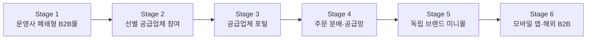
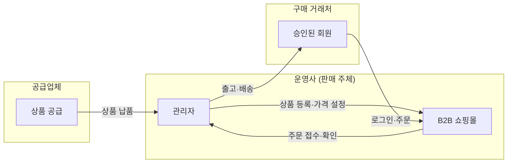

# PROJECT_OVERVIEW.md

> **B2B 공구·산업재 유통 플랫폼 — 프로젝트 개요**
>
> 최종 수정: 2026-07-16 · 버전: 1.0

---

## 목차

1. [사업 배경](#1-사업-배경)
2. [프로젝트 비전](#2-프로젝트-비전)
3. [Business Evolution Stage 1~6](#3-business-evolution-stage-16)
4. [핵심 원칙](#4-핵심-원칙)
5. [초기 제품 범위](#5-초기-제품-범위)
6. [모바일 우선 전략](#6-모바일-우선-전략)
7. [해외 확장 방향](#7-해외-확장-방향)

---

## 1. 사업 배경

### 국내 공구 B2B 유통 시장 현황

국내 공구·산업재 B2B 유통은 크레텍책임, 동신툴피아, 프로툴, 무창상사, 케이비원, 한국기업 등 **대형 종합 유통업체**들이 시장을 주도하고 있다. 이들은 수만 종의 SKU를 담은 종합 카탈로그와 자체 B2B 쇼핑몰을 운영하며, 전국 공구상·산업재 거래처에 강력한 유통망을 형성해 왔다.

과거에 이름이 알려졌거나 자체 브랜드를 보유한 **중소 제조사, 수입사, 전문 업체**들도 결국 대형 유통업체에 상품을 공급하는 구조에 편입되어, 독립적인 B2B 판매 채널을 갖기 어려운 상황이다.

### 공급업체(중소 제조사·수입사)가 겪는 문제

| 문제 영역 | 설명 |
|---|---|
| **브랜드 미노출** | 대형 유통사 카탈로그에 묻혀 브랜드 인지도가 구매자에게 전달되지 않음 |
| **자체 B2B몰 구축 어려움** | 개발 비용, 운영 인력, 결제·물류 시스템 구축 부담이 큼 |
| **전국 거래처 접근 한계** | 영업 인력 한계로 특정 지역·거래처에 편중 |
| **상품 데이터 비표준화** | 규격·이미지·인증 정보가 업체마다 다르고, 체계적 관리가 안 됨 |
| **수출 준비 부족** | 영문 카탈로그, HS Code, Incoterms 등 해외 수출 대비가 되어 있지 않음 |

### 구매 거래처(공구상·산업재 유통·현장)가 겪는 문제

| 문제 영역 | 설명 |
|---|---|
| **반복 주문에 갇힘** | 항상 같은 상품만 재주문하고, 새로운 상품을 발견할 기회가 없음 |
| **대체상품 발견 어려움** | 기존 상품 단종·품절 시 규격이 맞는 대체상품 찾기가 번거로움 |
| **주문 채널 분산** | 전화, 팩스, 카카오톡, 문자 등 채널이 분산되어 주문 이력 관리가 안 됨 |
| **규격 복잡성** | 공구·산업재는 규격(사이즈, 재질, 규격코드 등)이 복잡하여 선택 실수가 잦음 |
| **가격비교 어려움** | 여러 공급업체의 가격을 한 번에 비교할 수 없어 비효율적 |

---

## 2. 프로젝트 비전

> **"독립 공구 브랜드와 중소 제조·수입사의 상품을 표준화하여, 전국 공구상과 산업재 거래처가 한 번에 검색하고 자기 가격으로 주문하며, 향후 해외 바이어까지 연결할 수 있는 B2B 유통 플랫폼"**

### 이해관계자별 핵심 가치

#### 구매 거래처 (공구상·산업재 유통·현장)

- **한 번 로그인**으로 여러 브랜드의 상품을 검색
- 거래처별 **승인된 거래가격** 즉시 확인
- 이전 주문 기반 **빠른 재주문**
- 용도·규격 중심 검색으로 **대체상품 발견**
- 여러 브랜드 상품을 **하나의 장바구니**에 담아 **통합 주문**
- 주문 접수부터 배송 완료까지 **주문·배송 상태 실시간 확인**
- 대량·특수 주문에 대한 **견적 요청**

#### 공급업체 / 독립 브랜드 (중소 제조사·수입사)

- 자체 쇼핑몰 구축 없이 **B2B 판매 채널 확보**
- 플랫폼 내 **브랜드 전용 페이지** 운영
- 규격·이미지·인증 정보 등 **상품 데이터 표준화** 지원
- **전국 거래처에 브랜드 노출** 기회
- 재고 수량, 공급가, 납기일 등 **공급 조건 직접 관리**
- 향후 **해외 RFQ**(견적 요청) 연결
- **기존 거래처 보호** 정책 지원 (거래처 충돌 방지)

#### 운영사 (플랫폼 운영 주체)

- 직접 재고를 보유하지 않는 상품까지 **취급 범위 확장**
- 기존 거래처의 **구매 품목 수 증가** (Cross-sell 기회)
- 전화·팩스·카톡 주문을 **디지털 주문으로 전환**
- 구매자 통합 주문을 공급업체별로 **주문 분배**
- 물류, 정산, 판매 데이터 기반 **사업 고도화**

---

## 3. Business Evolution Stage 1~6

플랫폼은 한 번에 모든 기능을 구축하지 않는다. **사업 발전단계(Business Evolution Stage)**를 정의하고, 각 단계에서 검증할 핵심 가설과 구축할 역량을 구분한다.

> [!NOTE]
> 각 Stage의 구체적인 개발 범위와 일정은 [ROADMAP.md](./ROADMAP.md) 참조.
> MVP 범위 및 기능 요구사항은 [PRODUCT_REQUIREMENTS.md](./PRODUCT_REQUIREMENTS.md) 참조.

---

### Stage 1 — 운영사 폐쇄형 B2B몰

> 운영사가 **유일한 판매 주체**로서, 승인된 구매 거래처에게만 상품과 가격을 공개하는 폐쇄형 B2B 쇼핑몰.

| 항목 | 내용 |
|---|---|
| **판매 주체** | 운영사 단독 |
| **공급업체 역할** | 운영사에 상품을 공급 (플랫폼에 직접 접근하지 않음) |
| **가격 공개 범위** | 승인된 회원(구매 거래처)에게만 거래가격 공개 |
| **결제 방식** | 온라인 카드결제 없음. 주문 접수 → 관리자 확인 → 기존 거래조건 적용 |
| **거래 조건** | 월말결제, 선입금, 방문결제 등 기존 오프라인 거래조건 유지 |
| **배송 방식** | 운영사 자체 출고 + 일부 협력사 직배송 |

> [!IMPORTANT]
> Stage 1~2에서 운영사가 판매 주체라는 원칙은 주문 흐름, 가격 정책, 권한 모델 전반에 영향을 준다.
> 상세는 [BUSINESS_RULES.md](./BUSINESS_RULES.md) 참조.

---

### Stage 2 — 선별된 공급업체 참여

> 2~3개 공급업체가 **시험적으로 참여**하여, 대표 상품을 플랫폼에 등록. 구매자에게는 **하나의 통합 B2B몰**로 보인다.

| 항목 | 내용 |
|---|---|
| **참여 공급업체** | 2~3개 업체 시험 참여 |
| **상품 수** | 공급업체당 20~50개 대표 상품 |
| **상품 등록** | 관리자가 상품 데이터를 검수·등록 (공급업체 직접 등록 아님) |
| **구매자 경험** | 공급업체 구분 없이 하나의 통합 B2B몰에서 검색·주문 |
| **판매 주체** | 운영사 (Stage 1과 동일) |

---

### Stage 3 — 공급업체 포털

> 공급업체가 **자체 관리 화면(포털)**을 통해 상품과 공급 조건을 직접 관리하고, 주문을 확인·수락한다.

| 기능 | 설명 |
|---|---|
| **상품·공급조건 관리** | 공급업체가 직접 상품 정보, 공급가, 재고, 납기를 등록·수정 |
| **주문 확인·수락** | 공급업체에 배분된 주문을 확인하고, 수락 또는 납기 조정 |
| **출고 정보 등록** | 송장번호, 출고일, 배송정보 입력 |
| **정산·판매현황** | 정산 내역, 판매 현황 데이터 조회 |
| **관리자 승인** | 공급업체가 등록한 상품·가격 변경은 **관리자 승인 후 반영** |

---

### Stage 4 — 주문 분배 및 공급망 플랫폼

> 구매자가 하나의 장바구니에서 주문하면, 시스템이 **공급업체별로 주문을 자동 분리**하고 각각의 배송·정산을 관리한다.

| 기능 | 설명 |
|---|---|
| **주문 자동 분리** | 구매자의 통합 주문을 공급업체별 Sales Order로 분리 |
| **배송 유형 구분** | 운영사 자체 출고 / 공급업체 직배송 / 주문제작 등 구분 |
| **복합 배송** | 하나의 주문이 여러 건의 배송으로 나뉠 수 있음 |
| **정산 관리** | 공급업체별 수수료, 물류비, 정산 주기 관리 |
| **기존 거래처 보호** | 공급업체의 기존 오프라인 거래처와 플랫폼 거래의 충돌 방지 정책 |

> [!NOTE]
> 주문 흐름은 3개의 독립 State Machine(Order Request / Sales Order / Shipment)으로 관리된다.
> 상세는 [BUSINESS_RULES.md](./BUSINESS_RULES.md) 참조.

---

### Stage 5 — 독립 브랜드 미니몰

> 공급업체·브랜드가 플랫폼 안에서 **자체 브랜드 전용 페이지(미니몰)**를 갖는다.

| 항목 | 내용 |
|---|---|
| **URL 형태** | `platform.co.kr/brands/brand-name` 또는 `partner-name.platform.co.kr` |
| **브랜드 정체성** | 브랜드 로고, 배너, 색상 등 전용 디자인 적용 |
| **공유 인프라** | 상품 DB, 회원, 주문, 보안은 플랫폼 공유 — 화면에서만 브랜드 정체성 표현 |

---

### Stage 6 — 모바일 앱 및 해외 B2B

> 모바일 네이티브 경험과 해외 바이어 연결을 통해 플랫폼을 확장한다.

| 영역 | 내용 |
|---|---|
| **모바일 앱** | PWA(Progressive Web App) 우선 배포 → iOS / Android 네이티브 앱 |
| **모바일 기능** | 바코드 스캔 주문, 카메라 기반 상품 검색, 푸시 알림 |
| **다국어** | 영어(en), 중국어(zh) 지원 |
| **해외 B2B** | RFQ(견적 요청) 기반 해외 거래, Proforma Invoice, HS Code, Incoterms 지원 |

---

### Stage 요약 비교

| 구분 | Stage 1 | Stage 2 | Stage 3 | Stage 4 | Stage 5 | Stage 6 |
|---|---|---|---|---|---|---|
| **판매 주체** | 운영사 | 운영사 | 운영사 | 운영사+공급업체 | 운영사+공급업체 | 운영사+공급업체 |
| **상품 등록** | 관리자 | 관리자 | 공급업체(승인) | 공급업체(승인) | 공급업체(승인) | 공급업체(승인) |
| **주문 분배** | — | — | 수동 | 자동 | 자동 | 자동 |
| **브랜드 페이지** | — | — | — | — | ✓ | ✓ |
| **해외 거래** | — | — | — | — | — | ✓ |
| **모바일 앱** | 반응형 웹 | 반응형 웹 | 반응형 웹 | 반응형 웹 | 반응형 웹 | PWA → 네이티브 |

---

## 4. 핵심 원칙

### 4.1 운영사 중심 주문 창구

- **Stage 1~2에서 운영사가 유일한 판매 주체**이자 고객응대 주체이다.
- 공급업체 직배송이 발생하더라도, 구매 거래처에게는 **운영사가 단일 주문 창구**로 보인다.
- 구매자가 공급업체와 직접 거래하는 구조가 아니다.

### 4.2 통합 구매 경험

구매 거래처는 다음과 같은 **단일 흐름**으로 주문한다:

### 4.3 경쟁 전략

- 기존 대형 유통업체와 **상품 수(SKU 수)로 직접 경쟁하지 않는다.**
- 차별점은 다음에 집중한다:

| 차별점 | 설명 |
|---|---|
| **재주문 편의성** | 이전 주문 기반 빠른 재주문, 자주 구매 상품 관리 |
| **새로운 상품 발견** | 기존에 몰랐던 독립 브랜드·대체상품 발견 기회 제공 |
| **용도·규격 중심 검색** | 카테고리 나열이 아닌, 용도와 규격 기반의 탐색 경험 |
| **독립 브랜드 노출** | 대형 유통사에 묻히던 브랜드를 전면에 노출 |

---

## 5. 초기 제품 범위

### 상품 규모

- 초기 목표: **약 1,000 SKU**
- 단계적으로 공급업체 참여에 따라 확장

### 초기 참여 브랜드 (예정)

| 브랜드 | 비고 |
|---|---|
| TTC | — |
| 협성 | — |
| 대원 | — |
| OLFA | — |
| 운영사 수입상품 | 운영사가 직접 수입하는 상품 |
| PB 상품 | 운영사 자체 브랜드 상품 |

> [!NOTE]
> 초기 브랜드 목록은 확정 전이며, 구체적인 참여 조건은 사업 협의에 따라 변경될 수 있다.
> 미확정 사항은 [OPEN_DECISIONS.md](./OPEN_DECISIONS.md) 참조.

### 재고 상태 유형

상품의 공급 가능 여부를 나타내는 상태값:

| 상태 | 설명 |
|---|---|
| `in_stock` | 재고 있음 — 즉시 출고 가능 |
| `available` | 주문 가능 — 재고는 없지만 입고 후 출고 |
| `incoming` | 입고 예정 — 특정 날짜에 입고 예정 |
| `drop_ship` | 협력사 직배송 — 공급업체에서 구매자에게 직접 배송 |
| `made_to_order` | 주문제작 — 주문 접수 후 제작 시작, 납기 별도 안내 |
| `quote_required` | 견적 문의 — 수량·사양에 따라 가격·납기를 별도 협의 |
| `discontinued` | 판매 중지 — 더 이상 판매하지 않는 상품 |

> [!NOTE]
> 재고 상태별 주문 가능 여부, 화면 표시 규칙 등 상세 비즈니스 로직은 [BUSINESS_RULES.md](./BUSINESS_RULES.md) 참조.

---

## 6. 모바일 우선 전략

공구상·현장 구매자는 **현장에서 모바일로 주문**하는 경우가 많다. 따라서 모바일 환경에서의 주문 편의성을 최우선으로 설계한다.

### 설계 원칙

| 원칙 | 설명 |
|---|---|
| **모바일에서 빠른 주문** | 최소 탭(tap)으로 재주문·장바구니 담기가 가능한 UX |
| **PC에서 정보밀도** | 데스크톱에서는 더 많은 정보를 한 화면에 표시하되, 답답하지 않은 레이아웃 |
| **터치 영역** | 모바일 터치 대상(버튼, 링크 등) 최소 크기 **44px × 44px** 확보 |
| **반응형 우선** | Stage 1~5는 반응형 웹, Stage 6에서 PWA → 네이티브 앱 전환 |

> [!NOTE]
> UI 컴포넌트, 타이포그래피, 색상 등 디자인 상세는 [DESIGN_SYSTEM.md](./DESIGN_SYSTEM.md) 참조.

---

## 7. 해외 확장 방향

Stage 6에서 해외 바이어를 대상으로 플랫폼을 확장한다.

### 핵심 방향

- 해외 거래는 **RFQ(Request for Quotation, 견적 요청) 중심**이다.
  - 국내처럼 장바구니 → 즉시 결제 방식이 아님.
  - 바이어가 상품·수량을 지정하여 견적을 요청하면, 공급업체가 조건을 제시하는 흐름.

### 다국어 지원

| 코드 | 언어 | 비고 |
|---|---|---|
| `ko` | 한국어 | 기본 언어 |
| `en` | 영어 | 해외 바이어 대상 |
| `zh` | 중국어 | 해외 바이어 대상 |

- 상품 정보 다국어는 `product_translations` 구조로 관리한다.
- 통화별 가격표를 지원한다 (KRW, USD, CNY 등).

### 해외 거래 지원 기능

| 기능 | 설명 |
|---|---|
| **Proforma Invoice** | 해외 거래 시 발행하는 사전 견적 송장 |
| **HS Code** | 관세 분류를 위한 국제 상품 분류 코드 |
| **Incoterms** | 국제 무역 거래 조건 (FOB, CIF, EXW 등) |

> [!NOTE]
> 해외 거래 관련 데이터 모델은 [DATABASE_SCHEMA.md](./DATABASE_SCHEMA.md) 참조.
> 해외 결제·정산 정책은 [BUSINESS_RULES.md](./BUSINESS_RULES.md) 참조.

---

## 관련 문서

| 문서 | SSOT 영역 |
|---|---|
| [BUSINESS_RULES.md](./BUSINESS_RULES.md) | 가격, VAT, MOQ, 주문 흐름, 출고 규칙 |
| [DATABASE_SCHEMA.md](./DATABASE_SCHEMA.md) | 테이블, 컬럼, 관계 |
| [SECURITY_RULES.md](./SECURITY_RULES.md) | 인증, 권한, RLS |
| [DESIGN_SYSTEM.md](./DESIGN_SYSTEM.md) | UI 컴포넌트, 색상, 타이포그래피 |
| [PRODUCT_REQUIREMENTS.md](./PRODUCT_REQUIREMENTS.md) | MVP 범위, 기능 요구사항 |
| [ROADMAP.md](./ROADMAP.md) | 개발 단계(Phase 0~13), 일정 |
| [DECISION_LOG.md](./DECISION_LOG.md) | 확정된 기술·사업 결정 |
| [OPEN_DECISIONS.md](./OPEN_DECISIONS.md) | 미확정 사항, 논의 필요 항목 |
