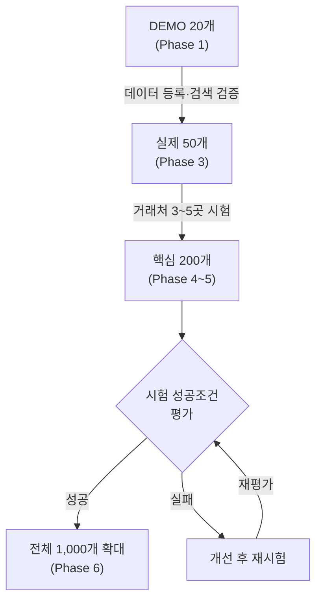
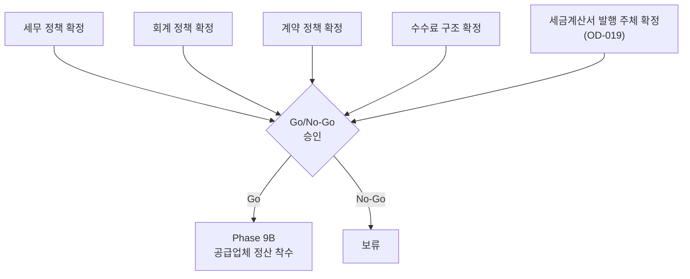

# ROADMAP.md

> **SSOT**: 이 문서는 **개발 순서(Development Phases)**의 Single Source of Truth입니다.
>
> - 기능 상세 → [PRODUCT_REQUIREMENTS.md](PRODUCT_REQUIREMENTS.md)
> - 가격·주문 규칙 → [BUSINESS_RULES.md](BUSINESS_RULES.md)
> - DB 스키마 → [DATABASE_SCHEMA.md](DATABASE_SCHEMA.md)
> - 테스트 → [TEST_PLAN.md](TEST_PLAN.md)
> - 미확정 사항 → [OPEN_DECISIONS.md](OPEN_DECISIONS.md)
> - 확정 결정 → [DECISION_LOG.md](DECISION_LOG.md)

---

## 1. Development Phase 총괄

Business Evolution Stage(사업 발전단계)와 Development Phase(개발 단계)의 대응 관계입니다.

| Phase | 이름 | 대응 Stage | 비고 |
|-------|------|-----------|------|
| **Phase 0** | 사업 및 시스템 설계 | 전체 | **현재 단계** |
| **Phase 1** | 정적 화면 시제품 | Stage 1 준비 | DEMO 20개 |
| **Phase 2** | 인증과 거래처 승인 | Stage 1 | Supabase Auth + RLS |
| **Phase 3** | 상품과 검색 | Stage 1 | 엑셀 등록, 실제 50개 |
| **Phase 4** | 가격과 주문 | Stage 1 | UOM, 수량구간, 주문요청→확정 |
| **Phase 5** | 관리자 운영 | Stage 1 | 대시보드, 콘텐츠, RFQ |
| **Phase 6** | 실제 거래처 테스트 | Stage 1 운영 | 3~5곳, 핵심 200개, Customer Pilot |
| **Phase 7** | 선별 공급업체 시험 참여 | Stage 2 | 2~3개 공급업체, 20~50 SKU씩 |
| **Phase 8** | 공급업체 포털 | Stage 3 | 자기 상품/주문 관리 |
| **Phase 9A** | 주문 라우팅 및 직배송 | Stage 4 | 공급업체별 발주, 송장 취합 |
| **Phase 9B** | 공급업체 정산 | Stage 4 | **Go/No-Go 별도 승인** |
| **Phase 10** | 브랜드 전용 페이지와 미니몰 | Stage 5 | 서브도메인, 커스텀 테마 |
| **Phase 11** | PWA | Stage 6 | Basic PWA는 Phase 6 이후 조기 도입 가능 |
| **Phase 12** | 해외 RFQ와 다국어 | Stage 6 | 영문/중문, 수출 견적 |
| **Phase 13** | 네이티브 앱 | Stage 6 | 사용량/기능 수요 충족 시 조건부 |

```mermaid
flowchart LR
    subgraph "Stage 1"
        P1["Phase 1\n정적 시제품"]
        P2["Phase 2\n인증·거래처"]
        P3["Phase 3\n상품·검색"]
        P4["Phase 4\n가격·주문"]
        P5["Phase 5\n관리자 운영"]
        P6["Phase 6\nCustomer Pilot"]
    end
    subgraph "Stage 2"
        P7["Phase 7\n공급업체 시험"]
    end
    subgraph "Stage 3"
        P8["Phase 8\n공급업체 포털"]
    end
    subgraph "Stage 4"
        P9A["Phase 9A\n주문 라우팅"]
        P9B["Phase 9B\n정산\n(Go/No-Go)"]
    end
    subgraph "Stage 5"
        P10["Phase 10\n브랜드 미니몰"]
    end
    subgraph "Stage 6"
        P11["Phase 11\nPWA"]
        P12["Phase 12\n해외 RFQ"]
        P13["Phase 13\n네이티브 앱"]
    end

    P0["Phase 0\n설계 (현재)"] --> P1 --> P2 --> P3 --> P4 --> P5 --> P6
    P6 --> P7 --> P8 --> P9A --> P9B
    P9B --> P10 --> P11 --> P12 --> P13
```

---

## 2. 각 Phase 상세

---

### Phase 0 — 사업 및 시스템 설계

> **현재 단계** (2026-07 기준)

**목표**: 사업 모델, 시스템 아키텍처, 데이터 모델, 비즈니스 규칙을 문서로 확정한다.

**주요 작업**
- [ ] 사업 모델 및 수익 구조 정의
- [ ] SSOT 문서 체계 수립 (ROADMAP, BUSINESS_RULES, DATABASE_SCHEMA 등)
- [ ] DB 스키마 설계 및 문서화
- [ ] 비즈니스 규칙 확정 (가격, VAT, MOQ, 주문 흐름)
- [ ] 보안·인증 정책 설계 (SECURITY_RULES.md)
- [ ] 디자인 시스템 기초 정의 (DESIGN_SYSTEM.md)
- [ ] 미확정 사항 목록 정리 (OPEN_DECISIONS.md)

**완료조건**
- 모든 SSOT 문서 초안 완성
- OPEN_DECISIONS.md에 미확정 사항 모두 등록
- Phase 1 착수에 필요한 결정 사항 확정

---

### Phase 1 — 정적 화면 시제품

**대응**: Stage 1 준비

**목표**: 주요 화면을 DEMO 데이터로 구성하여 UX 흐름을 검증한다.

**주요 작업**
- [ ] DEMO 상품 20개 정적 데이터 구성
- [ ] 카탈로그 목록/상세 화면
- [ ] 장바구니/주문서 화면
- [ ] 로그인/회원가입 화면 (기능 미연결)
- [ ] 관리자 화면 시안
- [ ] 모바일 반응형 레이아웃 검증

**완료조건**
- DEMO 20개 상품이 정적 화면에서 탐색 가능
- 주요 화면 흐름(상품 탐색 → 장바구니 → 주문서)이 클릭 가능
- 이해관계자 화면 리뷰 완료

---

### Phase 2 — 인증과 거래처 승인

**대응**: Stage 1

**목표**: 실제 로그인·권한 체계를 구축하고, 거래처 승인 워크플로를 구현한다.

**주요 작업**
- [ ] Supabase Auth 연동 (이메일/비밀번호)
- [ ] RLS(Row Level Security, 행 단위 보안) 정책 적용
- [ ] 조직(organization) 생성 및 역할(organization_roles) 관리
- [ ] 거래처 가입 신청 → 운영사 승인 워크플로
- [ ] 조직 프로필(organization_business_profiles) 및 buyer_accounts 분리 구조
- [ ] 비인가 접근 차단 검증

**완료조건**
- 승인된 거래처만 상품·가격 조회 가능
- 미승인 사용자는 가격/재고 정보 접근 불가
- RLS 정책이 모든 테이블에 적용됨 (상세는 SECURITY_RULES.md 참조)

---

### Phase 3 — 상품과 검색

**대응**: Stage 1

**목표**: 엑셀 기반 상품 등록과 검색 기능을 구현한다.

**주요 작업**
- [ ] 엑셀 Import (STRICT_ATOMIC 정책 — 1건이라도 오류 시 전체 롤백)
- [ ] 실제 상품 50개 등록
- [ ] SKU 구조: UUID PK + `internal_sku_code` UNIQUE
- [ ] 바코드 관리: `sku_barcodes` 별도 테이블
- [ ] 판매단위: `sku_uoms` (복수 UOM 지원)
- [ ] 카테고리/브랜드 필터
- [ ] 텍스트 검색 (상품명, 규격, 브랜드, 모델번호)

**완료조건**
- 50개 상품이 엑셀로 등록되어 검색·필터 가능
- 엑셀 Import 오류 시 전체 롤백 확인
- 검색 결과에서 원하는 상품을 찾을 수 있음

---

### Phase 4 — 가격과 주문

**대응**: Stage 1

> [!IMPORTANT]
> **UOM(Unit of Measure, 판매단위)과 수량구간 가격(tiered pricing)이 핵심 구조입니다.**
> 이 단계에서 가격 계산 정확성이 검증되어야 합니다.

**목표**: 거래처별 가격 등급, 수량구간 할인, UOM 기반 주문 흐름을 구현한다.

**주요 작업**
- [ ] 가격 등급(price tier) 체계 구현
- [ ] 수량구간 가격(tiered pricing) 적용
- [ ] UOM 단위 전환 및 MOQ(최소주문수량) 검증
- [ ] 주문 흐름: Order Request(주문요청) → Sales Order(주문확정)
- [ ] 3개 독립 State Machine 구현: Order Request / Sales Order / Shipment
- [ ] `accepted_quantity` 기반 수량 모델
- [ ] 장바구니 → 주문요청 → 운영사 확인 → 주문확정
- [ ] VAT 계산 (상세는 BUSINESS_RULES.md 참조)

**완료조건**
- 거래처별 가격이 정확히 노출됨
- 수량구간 할인이 자동 적용됨
- UOM 전환 시 가격이 올바르게 계산됨
- 주문요청 → 확정 흐름이 정상 동작
- 주문금액 계산 오류 0건

---

### Phase 5 — 관리자 운영

**대응**: Stage 1

> [!IMPORTANT]
> **RFQ(Request for Quotation, 견적 요청)는 Customer Pilot(Phase 6) 전에 완료해야 합니다.**

**목표**: 운영사 관리자 도구를 구축한다.

**주요 작업**
- [ ] 관리자 대시보드 (주문 현황, 거래처 현황)
- [ ] 주문 관리 (확인, 확정, 취소)
- [ ] 상품 관리 (등록, 수정, 가격 변경)
- [ ] 거래처 관리 (승인, 등급 변경)
- [ ] RFQ(견적 요청) 기능 — 비표준 상품/대량 주문 견적
- [ ] 콘텐츠 관리 (공지사항, 신제품, 브랜드 소개)
- [ ] Claim 단위 검증·만료·게시 차단과 관리자 Preview
- [ ] Public·Buyer·Admin Preview 공통 renderer 및 Surface variant
- [ ] 핵심 200개 상품 등록

**완료조건**
- 관리자가 주문·상품·거래처를 관리할 수 있음
- RFQ 요청 → 견적 응답 흐름 동작
- 검증되지 않았거나 만료된 Claim의 Public·Buyer 노출 0건
- Admin Preview와 실제 Surface가 동일 Content Record·Claim gate·CTA·visibility rule을 사용
- 핵심 200개 상품 등록 완료
- Customer Pilot 착수 준비 완료

---

### Phase 6 — 실제 거래처 테스트 (Customer Pilot)

**대응**: Stage 1 운영

> [!IMPORTANT]
> **사업 성과 지표를 측정하고, 시험 성공조건을 평가하는 핵심 단계입니다.**
> 성공 시 상품 확대(1,000개), 실패 시 개선 후 재시험합니다. (§3 상품 확대 순서 참조)

**목표**: 실제 거래처 3~5곳과 핵심 200개 상품으로 운영 시험을 수행한다.

**주요 작업**
- [ ] 시험 거래처 3~5곳 선정 및 교육
- [ ] 실제 주문 처리 (주문요청 → 확정 → 출고)
- [ ] 성과지표 측정 (§9 Customer Pilot 성과지표 참조)
- [ ] 시험 성공조건 평가 (§3 상품 확대 순서 참조)
- [ ] 거래처 피드백 수집 및 반영
- [ ] 구매사 내부 승인 수요 확인 (Feature Flag, 기본 비활성화)

**완료조건**
- 시험 성공조건 전체 충족 (§3 참조)
- 거래처 피드백 반영 완료
- 1,000개 상품 확대 승인

**중단조건**
- 시험 성공조건 미충족 시: 원인 분석 → 개선 → 재시험
- 거래처 전원 이탈 시: 사업 모델 재검토

---

### Phase 7 — 선별 공급업체 시험 참여

**대응**: Stage 2

**목표**: 2~3개 공급업체가 자기 상품(20~50 SKU)을 직접 등록하고, 운영사를 통해 주문을 처리한다.

**주요 작업**
- [ ] 시험 공급업체 2~3곳 선정 및 계약
- [ ] 공급업체별 20~50 SKU 데이터 수집 및 등록
- [ ] 공급조건 입력 (공급가, 리드타임, MOQ)
- [ ] 운영사 중개 주문 처리 흐름 검증

**완료조건**
- 공급업체 상품이 카탈로그에 노출됨
- 공급업체 상품 주문 → 운영사 중개 → 납품 흐름 동작
- 공급업체 피드백 수집 완료

---

### Phase 8 — 공급업체 포털

**대응**: Stage 3

**목표**: 공급업체가 자기 상품과 주문을 직접 관리할 수 있는 포털을 구축한다.

**주요 작업**
- [ ] 공급업체 전용 로그인 및 대시보드
- [ ] 자기 상품 등록/수정/가격 관리
- [ ] 수주 확인 및 출고 처리
- [ ] 재고 현황 입력

**완료조건**
- 공급업체가 운영사 개입 없이 상품/가격 관리 가능
- 수주 → 출고 처리를 공급업체 포털에서 수행 가능

---

### Phase 9A — 주문 라우팅 및 직배송

**대응**: Stage 4

**목표**: 구매사 주문을 공급업체별로 자동 분배하고, 직배송을 지원한다.

**주요 작업**
- [ ] 주문 내 상품을 공급업체별로 자동 분리(라우팅)
- [ ] 공급업체별 발주서(Purchase Order) 생성
- [ ] 직배송 송장 관리
- [ ] 복수 공급업체 송장 취합 (구매사에게 단일 주문으로 표시)

**완료조건**
- 하나의 주문에서 복수 공급업체로 자동 발주
- 직배송 송장이 정상 추적됨
- 구매사에게 통합 주문 현황 제공

---

### Phase 9B — 공급업체 정산

**대응**: Stage 4

> [!CAUTION]
> **이 Phase는 세무/회계/계약 정책이 확정된 후 별도 Go/No-Go 승인을 받아야 착수할 수 있습니다.**
> 상세는 §6 Phase 9B Go/No-Go를 참조하세요.

**목표**: 공급업체와의 정산(수수료, 정산 주기, 세금계산서)을 시스템화한다.

**주요 작업**
- [ ] 정산 주기 및 수수료 구조 구현
- [ ] 공급업체별 정산 내역서 생성
- [ ] 세금계산서 발행 연동
- [ ] 정산 승인 워크플로

**완료조건**
- 정산 내역이 자동 집계됨
- 세금계산서가 정확히 발행됨
- 공급업체가 정산 내역을 확인할 수 있음

**중단조건**
- Go/No-Go 승인 미통과 시 착수하지 않음

---

### Phase 10 — 브랜드 전용 페이지와 미니몰

**대응**: Stage 5

**목표**: 주요 브랜드에 전용 페이지와 서브도메인 미니몰을 제공한다.

**주요 작업**
- [ ] 브랜드 전용 랜딩 페이지
- [ ] 서브도메인 기반 미니몰 (예: `brand.example.com`)
- [ ] 커스텀 테마/로고/배너 지원
- [ ] 브랜드별 상품 필터 및 프로모션

**완료조건**
- 브랜드 미니몰이 독립 URL로 접근 가능
- 브랜드별 커스텀 테마가 적용됨

---

### Phase 11 — PWA

**대응**: Stage 6

> [!NOTE]
> **Basic PWA는 Phase 6(Customer Pilot) 이후 조기 도입이 가능합니다.**
> 상세는 §4 Basic PWA 조기 도입을 참조하세요.

**목표**: Progressive Web App으로 모바일 사용 경험을 향상한다.

**주요 작업**
- [ ] Advanced PWA 기능 구현
  - 푸시 알림 (재입고, 주문상태)
  - 제한된 캐시 (카탈로그 목록 등)
- [ ] 오프라인 안전 정책 적용
  - 가격/주문/재고/개인정보는 오프라인 저장 안 함
  - 오프라인 주문 제출 미지원

**완료조건**
- 푸시 알림 동작
- 캐시 정책이 보안 규칙을 준수함

---

### Phase 12 — 해외 RFQ와 다국어

**대응**: Stage 6

**목표**: 해외 바이어를 위한 영문/중문 지원과 수출 견적 기능을 추가한다.

**주요 작업**
- [ ] 다국어 지원 (영문, 중문)
- [ ] 해외 RFQ (수출 견적 요청)
- [ ] 다통화 가격 표시

**완료조건**
- 영문/중문으로 카탈로그 탐색 가능
- 해외 바이어가 RFQ를 제출할 수 있음

---

### Phase 13 — 네이티브 앱

**대응**: Stage 6

> [!NOTE]
> **사용량과 기능 수요가 충분히 확인된 후 조건부로 착수합니다.**
> PWA로 충분한 경우 착수하지 않을 수 있습니다.

**목표**: iOS/Android 네이티브 앱을 제공한다.

**주요 작업**
- [ ] 네이티브 앱 기술 스택 선정
- [ ] 핵심 기능 이식 (카탈로그, 주문, 알림)
- [ ] 앱스토어 배포

**완료조건**
- 앱스토어에 배포 완료
- 핵심 주문 흐름이 네이티브에서 동작

**중단조건**
- PWA 사용량이 충분하고, 네이티브 전용 기능 수요가 없는 경우 착수하지 않음

---

## 3. 상품 확대 순서

단계적으로 상품 수를 늘려가며, 각 단계에서 데이터 품질과 사용성을 검증합니다.

| 단계 | 상품 수 | Phase | 목적 |
|------|---------|-------|------|
| DEMO | 20개 | Phase 1 | 화면 시제품, UX 흐름 검증 |
| 실제 등록 | 50개 | Phase 3 | 데이터 등록과 검색 검증 |
| 핵심 상품 | 200개 | Phase 4~5 | 거래처 3~5곳 시험 |
| 전체 확대 | 1,000개 | Phase 6 | 시험 성공 후 확대 |

### 시험 성공조건

다음 **전체 항목**을 충족해야 성공으로 판정합니다:

| # | 조건 | 기준 |
|---|------|------|
| 1 | 재주문 터치 수 | **3회 이내** 터치로 재주문 가능 |
| 2 | 검색 정확도 | 원하는 상품 **80%+** 찾음 |
| 3 | 가격 노출 사고 | **0건** |
| 4 | 주문금액 계산 오류 | **0건** |
| 5 | UOM/MOQ/가격구간 적용 오류 | **0건** |
| 6 | 거래처 피드백 반영 | **완료** |

### 실패 시 개선 항목

시험 실패 시 다음을 점검·개선한 후 재시험합니다:

- 상품 데이터 (명칭, 규격, 이미지)
- 검색어 매칭 (동의어, 약어, 규격 표기)
- 가격 정책 (등급, 구간, 노출 범위)
- MOQ / UOM 설정
- 모바일 UX
- 주문 흐름

---

## 4. Basic PWA 조기 도입

Phase 6(Customer Pilot) 이후, Phase 11(Advanced PWA) 이전에 Basic PWA를 조기 도입할 수 있습니다.

### Basic PWA (Phase 6 이후 도입 가능)

| 기능 | 설명 |
|------|------|
| Web App Manifest | `manifest.json` — 앱 이름, 아이콘, 테마 색상 |
| 앱 아이콘 | 홈 화면 아이콘 |
| 홈 화면 설치 | "홈 화면에 추가" 안내 |
| 전체화면 실행 | `display: standalone` |
| 업데이트 안내 | 새 버전 배포 시 알림 |
| 오프라인 안내 화면 | 네트워크 없을 때 안내 페이지 표시 |

### Advanced PWA (Phase 11)

| 기능 | 설명 | 보안 제약 |
|------|------|----------|
| 푸시 알림 | 재입고 알림, 주문상태 알림 | — |
| 제한된 캐시 | 카탈로그 목록, 정적 자산 | 가격/주문/재고/개인정보는 **캐시하지 않음** |
| 오프라인 주문 | — | **미지원** (오프라인 주문 제출 불가) |

> [!WARNING]
> 가격, 주문, 재고, 개인정보는 오프라인에 저장하지 않습니다.
> 오프라인 상태에서 주문 제출은 지원하지 않습니다.

---

## 5. Operational Readiness Track

소프트웨어 개발과 **병행**하여 준비해야 하는 운영 트랙입니다.

| Track | 내용 | 대응 Phase |
|-------|------|-----------|
| **Catalog Readiness** | 상품 데이터 표준화, 이미지 촬영, 기술사양 정리, 엑셀 템플릿 완성 | Phase 1~3 |
| **Commercial Policy** | 가격등급 확정, 결제조건 확정, VAT 정책 확정, 배송비/반품 정책 | Phase 2~4 |
| **Customer Pilot** | 시험 거래처 선정, 교육, 피드백 수집, 개선 반영 | Phase 6 |
| **Supplier Onboarding** | 시험 공급업체 선정, 계약, 상품 데이터 수집, 공급조건 입력 | Phase 7 |
| **Operations & Compliance** | 사업자등록, 통신판매업, 개인정보처리방침, 이용약관, 운영 매뉴얼 | Phase 4~6 |

```mermaid
gantt
    title Operational Readiness Track
    dateFormat X
    axisFormat Phase %s

    section Catalog Readiness
    상품 데이터 표준화·이미지·템플릿   :cat, 1, 3

    section Commercial Policy
    가격등급·결제·VAT·배송 정책        :com, 2, 4

    section Operations & Compliance
    사업자등록·약관·매뉴얼              :ops, 4, 6

    section Customer Pilot
    거래처 선정·교육·피드백              :pilot, 6, 7

    section Supplier Onboarding
    공급업체 선정·계약·데이터            :sup, 7, 8
```

---

## 6. Phase 9B Go/No-Go

Phase 9B(공급업체 정산)는 **다음 정책이 모두 확정된 후** 별도 Go/No-Go 승인을 받아야 착수할 수 있습니다.

| # | 확정 필요 항목 | 상태 |
|---|---------------|------|
| 1 | 세무 정책 | 미확정 |
| 2 | 회계 정책 | 미확정 |
| 3 | 계약 정책 | 미확정 |
| 4 | 수수료 구조 | 미확정 |
| 5 | 세금계산서 발행 주체 | OPEN_DECISIONS.md OD-019 참조 |

---

## 7. 테이블 Migration 원칙

- **Phase별로 필요한 테이블만 순차 migration** — 전체 테이블을 한 번에 생성하지 않음
- 각 테이블에 다음 메타정보를 부여 (상세는 DATABASE_SCHEMA.md 참조):

| 메타정보 | 설명 | 예시 |
|---------|------|------|
| `first_needed_phase` | 이 테이블이 처음 필요한 Phase | `Phase 2` |
| `required_for_pilot` | Customer Pilot(Phase 6)에 필요한지 여부 | `true` / `false` |
| `migration_group` | 함께 생성되어야 하는 테이블 그룹 | `auth`, `catalog`, `order` |

> [!NOTE]
> 테이블 상세 정의, 컬럼, 관계는 [DATABASE_SCHEMA.md](DATABASE_SCHEMA.md)를 참조하세요.

---

## 8. 구매사 내부 승인

구매사(구매 조직) 내부 결재/승인 기능의 도입 방침:

| 항목 | 방침 |
|------|------|
| 출시 시점 | **Release 1 Optional** — 첫 출시에서 선택적 |
| 기본 상태 | **비활성화** |
| 활성화 방식 | **Feature Flag** — 거래처별로 켜고 끌 수 있음 |
| 수요 확인 | **Phase 6 Customer Pilot**에서 실제 거래처 수요 확인 |

> Phase 6에서 거래처가 내부 승인 기능을 요청하지 않으면, 구현 우선순위를 낮춥니다.

---

## 9. Customer Pilot 성과지표

Phase 6(Customer Pilot)에서 측정할 지표입니다.

### 주문·구매 지표

| 지표 | 설명 |
|------|------|
| 거래처당 구매 SKU 수 | 시험 기간 동안 거래처별 주문한 고유 SKU 수 |
| 신규 SKU 조회/장바구니/주문 수 | 기존에 주문하지 않던 상품에 대한 활동량 |
| 전화/카톡 없이 완료 주문 비율 | 플랫폼만으로 완결된 주문의 비율 |
| 시험기간 내 재주문 거래처 수 | 2회 이상 주문한 거래처 수 |
| 재주문 완료 시간 | 재주문 시작부터 제출까지 소요 시간 |
| 주문 요청 후 확정까지 소요 시간 | Order Request → Sales Order 전환 시간 |

### 검색 지표

| 지표 | 설명 | 목표 |
|------|------|------|
| 검색결과 없음 비율 | 검색어 입력 후 결과 0건인 비율 | 최소화 |
| 핵심 반복주문 상품 검색 성공률 | 거래처가 자주 주문하는 상품의 검색 성공률 | **100%** |
| 전체 시험 검색어 성공률 | 시험 기간 전체 검색어의 성공률 | **90%+** |

> [!NOTE]
> 성과지표 측정 방법 및 대시보드 구현은 Phase 5(관리자 운영)에서 준비합니다.
> 기능 상세는 [PRODUCT_REQUIREMENTS.md](PRODUCT_REQUIREMENTS.md)를 참조하세요.

---

## 변경 이력

| 날짜 | 변경 내용 | 작성자 |
|------|----------|--------|
| 2026-07-16 | 초안 작성 | — |
