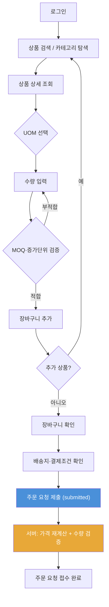
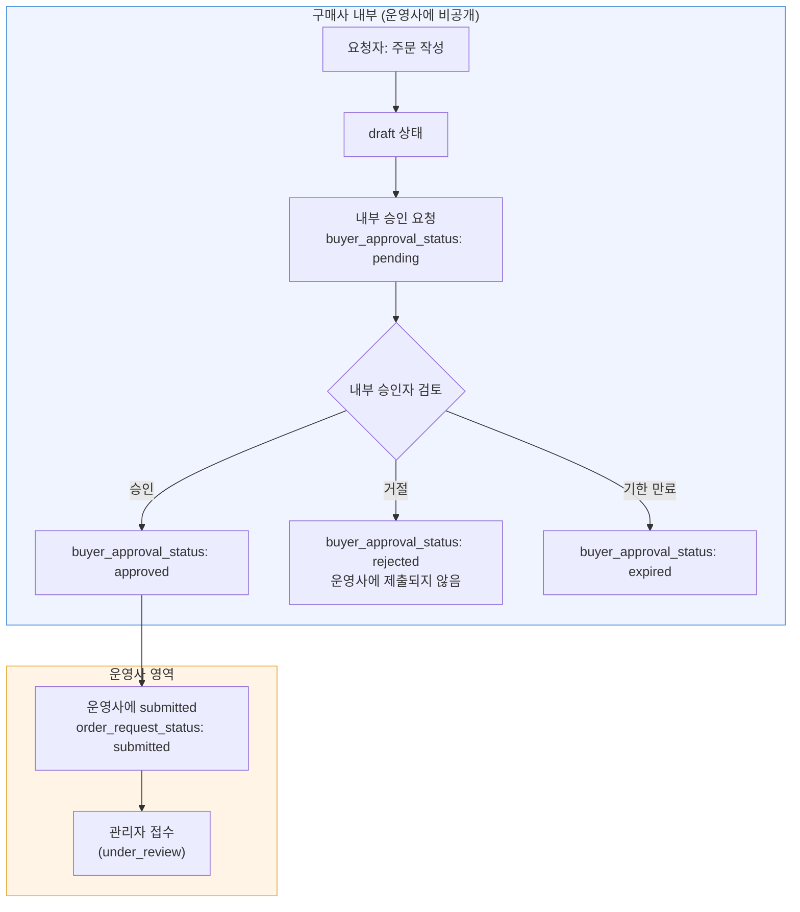
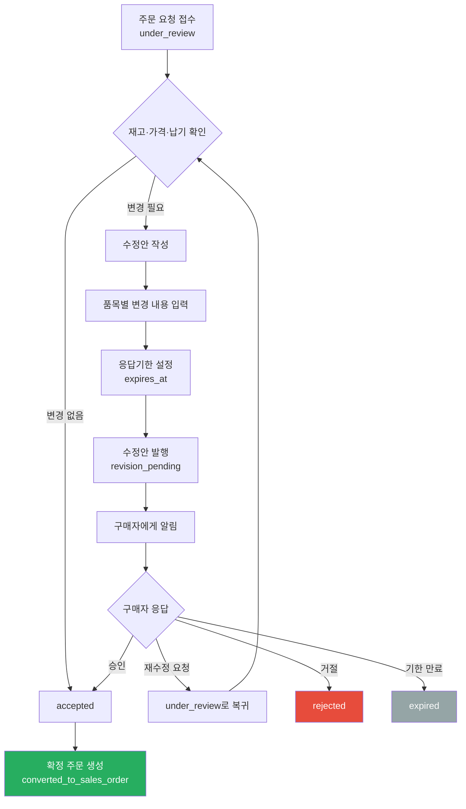
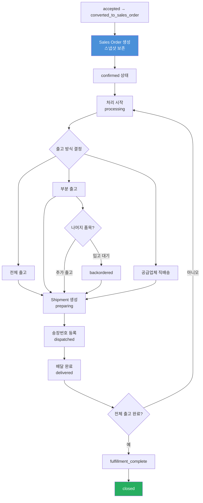
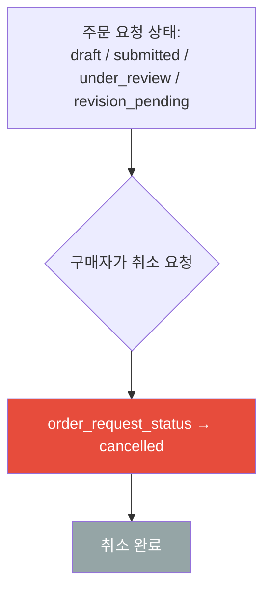
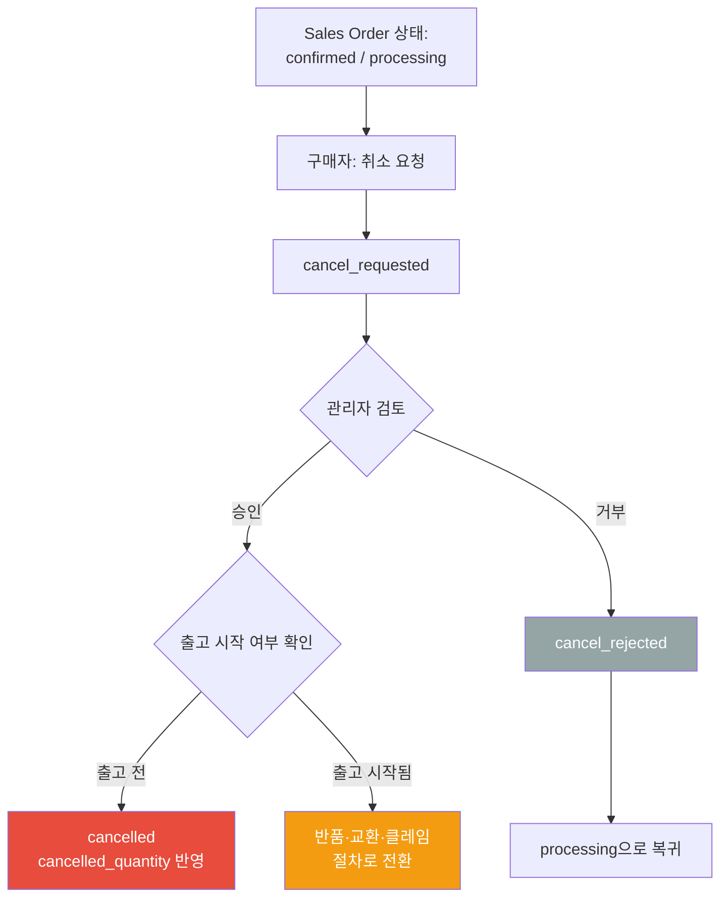
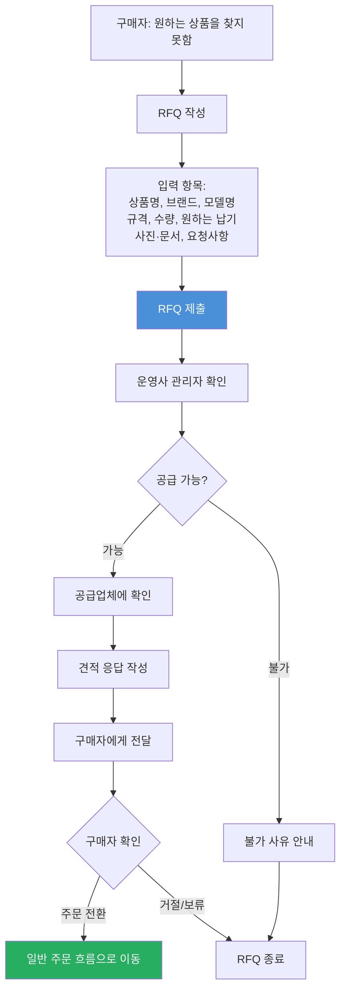
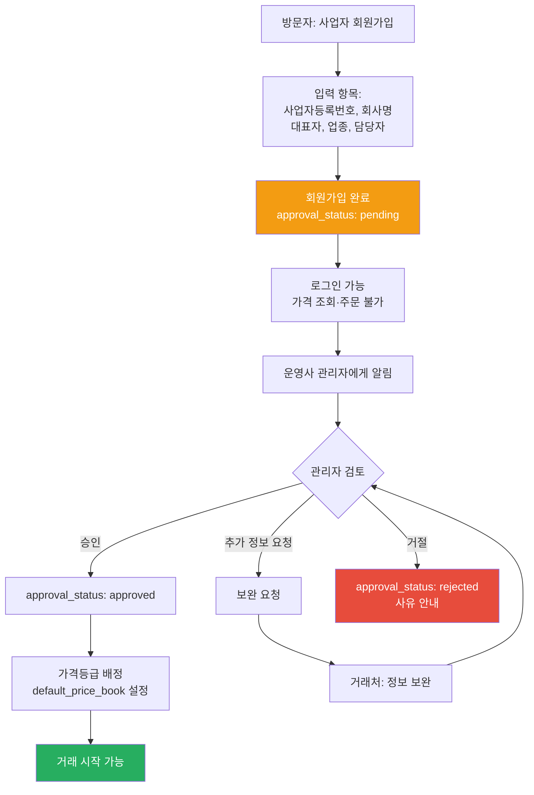
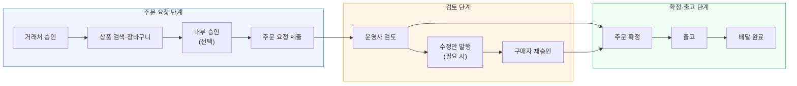

# User Flows

주요 업무 흐름을 Mermaid 다이어그램으로 정의합니다.

> **SSOT 참조**
> - 가격·주문·출고 상세 규칙 → [BUSINESS_RULES.md](file:///C:/Projects/b2b-tool-platform/BUSINESS_RULES.md)
> - 역할·권한 → [USER_ROLES.md](file:///C:/Projects/b2b-tool-platform/USER_ROLES.md)
> - DB 스키마 → DATABASE_SCHEMA.md
> - 미확정 사항 → [OPEN_DECISIONS.md](file:///C:/Projects/b2b-tool-platform/OPEN_DECISIONS.md)

---

## 1. 일반 구매자의 주문 요청 흐름

구매사 내부 승인이 **비활성화**된 일반 거래처의 기본 주문 흐름입니다.

**핵심 규칙:**
- 가격은 로그인 후에만 표시
- UOM 선택 시 해당 UOM의 MOQ와 증가단위가 자동 적용
- 수량구간 가격이 있으면 수량 변경 시 단가가 실시간 갱신
- 주문 제출 시 서버에서 가격을 재계산 (브라우저 전달값 미신뢰)
- 가격 규칙 상세 → BUSINESS_RULES.md 섹션 3 참조

---

## 2. 구매사 내부 승인이 있는 주문 흐름

구매사 내부 승인이 **활성화**된 거래처의 흐름입니다. `buyer_approval_status`와 `order_request_status`는 별도 필드입니다.

> 이 기능은 Release 1 Optional이며, Feature Flag로 활성화합니다.

**핵심 규칙:**
- 내부 승인 중인 `draft` 주문은 **운영사에서 볼 수 없음**
- 한 사용자가 요청자와 승인자 역할을 동시에 가질 수 있음 (소규모 거래처)
- 내부 승인 거절 시 운영사에 제출되지 않음
- 기본값: `buyer_approval_status = not_required`
- 상세 Capability → USER_ROLES.md 섹션 4 참조

---

## 3. 운영사의 주문 검토와 수정안 흐름

운영사 관리자가 주문 요청을 검토하고, 필요 시 수정안을 발행하는 흐름입니다.

**수정안(Revision) 내용:**

| 항목 | 테이블 | 필드 |
|---|---|---|
| 수정안 메타 | `order_revisions` | revision_number, status, reason, expires_at |
| 품목별 변경 | `order_revision_items` | proposed_quantity, proposed_unit_price, proposed_lead_time, change_reason |

- 수정안 상태: `pending` → `approved` / `rejected` / `expired` / `superseded`
- 상세 규칙 → BUSINESS_RULES.md 섹션 5.4 참조

---

## 4. 확정 주문과 부분출고 흐름

주문 요청이 확정되어 Sales Order가 생성된 후, 출고까지의 흐름입니다.

**수량 필드 변화:**

| 단계 | requested | accepted | rejected | shipped | cancelled | open | backordered |
|---|---|---|---|---|---|---|---|
| 주문 확정 | 100 | 80 | 20 | 0 | 0 | 80 | 0 |
| 1차 출고 (50) | 100 | 80 | 20 | 50 | 0 | 30 | 0 |
| 일부 입고대기 | 100 | 80 | 20 | 50 | 0 | 30 | 10 |
| 2차 출고 (30) | 100 | 80 | 20 | 80 | 0 | 0 | 0 |

불변식: `accepted = shipped + cancelled + open`, `backordered ≤ open`

상세 수량 모델 → BUSINESS_RULES.md 섹션 6 참조

---

## 5. 확정 전 취소 흐름

구매자가 주문 확정 전에 직접 취소하는 흐름입니다. **관리자 승인이 불필요**합니다.

**규칙:**
- `draft`, `submitted`, `under_review`, `revision_pending` 상태에서 취소 가능
- 즉시 취소 — 관리자 승인 불필요
- 취소 사유는 기록
- 확정 주문(`confirmed`) 이후에는 이 흐름이 아닌 **확정 후 취소 요청 흐름**을 따름

---

## 6. 확정 후 취소 요청 흐름

확정 주문(`confirmed`) 이후 구매자가 취소를 요청하는 흐름입니다. **관리자 승인이 필요**합니다.

**규칙:**
- 확정 주문 이후에는 단순 취소 불가 → 관리자 승인 필요
- 출고가 시작된 이후에는 일반 취소 아님 → **반품·교환·클레임 절차로 전환**
- 반품·교환·클레임의 상세 구현은 MVP 범위 밖 (원칙만 확정)
- 상세 → BUSINESS_RULES.md 섹션 5.5, 섹션 7 참조

---

## 7. 미등록 상품 RFQ 흐름

초기 상품 수가 약 1,000 SKU이므로, 등록되지 않은 상품을 거래처가 견적 요청하는 흐름입니다.

> Customer Pilot Must-Have

**규칙:**
- 초기에는 **운영사 관리자만** RFQ에 응답
- 공급업체가 직접 RFQ에 답하는 기능은 Future Extension
- RFQ에서 반복 요청되는 상품은 정식 등록 후보로 관리

---

## 8. 거래처 승인 흐름

신규 구매 거래처가 가입하고 운영사가 승인하는 흐름입니다.

**규칙:**
- 승인 전: 로그인 가능, 일부 상품정보 조회 가능, **가격 조회·주문 불가**
- 승인 시: 가격등급(price_book) 배정
- 가격등급이 없으면 기본 B2B 가격표 적용
- 거래처 개별가격은 별도 설정
- 조직 정보: `organization_business_profiles`(사업자정보) + `buyer_accounts`(운영정보) 분리

---

## 흐름 간 관계 요약

---

## 관련 문서

| 문서 | 참조 내용 |
|---|---|
| BUSINESS_RULES.md | State Machine 상세, 수량 모델, 가격 규칙, 출고 규칙 |
| USER_ROLES.md | 역할별 capability, 내부 승인 Capability |
| PRODUCT_REQUIREMENTS.md | 기능 분류 (Must-Have / Optional / Future) |
| INFORMATION_ARCHITECTURE.md | 화면 구조와 페이지 매핑 |
| DATABASE_SCHEMA.md | 테이블 구조 (Checkpoint B) |
