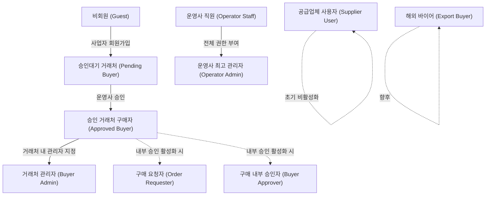
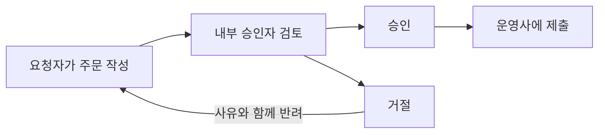
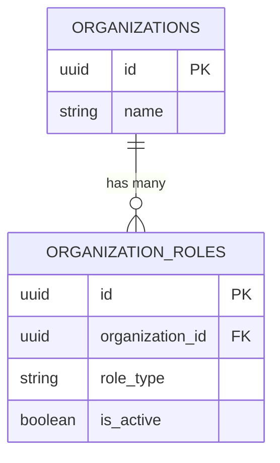
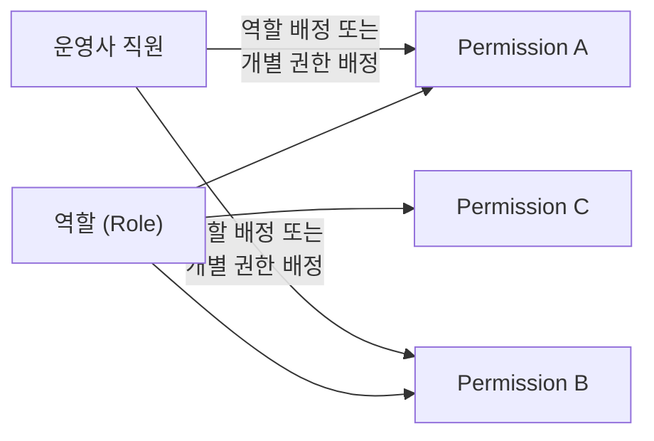
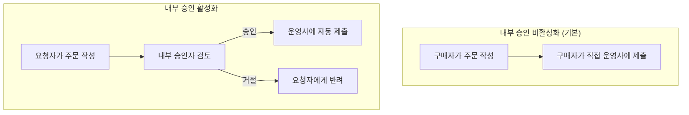

# USER_ROLES.md

> **B2B 공구·산업재 유통 플랫폼 — 사용자 역할과 권한**
>
> 최종 수정: 2026-07-16 · 버전: 1.0

---

## 목차

1. [사용자 역할 정의](#1-사용자-역할-정의)
2. [조직 다중 역할 (organization_roles)](#2-조직-다중-역할-organization_roles)
3. [운영사 직원 세부 권한 (Permissions)](#3-운영사-직원-세부-권한-permissions)
4. [구매사 내부 승인 Capability](#4-구매사-내부-승인-capability)
5. [데이터 접근 요약](#5-데이터-접근-요약)

---

## 1. 사용자 역할 정의

플랫폼에 접근하는 사용자를 역할별로 구분하고, 각 역할이 할 수 있는 범위를 정의한다.

> [!NOTE]
> Stage 1~2에서 **운영사가 유일한 판매 주체**이며, 이 원칙이 역할 모델 전반에 영향을 준다.
> 상세는 [PROJECT_OVERVIEW.md](./PROJECT_OVERVIEW.md) 및 [BUSINESS_RULES.md](./BUSINESS_RULES.md) 참조.

---

### 1.1 비회원 (Guest)

로그인하지 않은 방문자. 플랫폼의 공개 정보만 조회할 수 있다.

| 항목 | 가능 여부 |
|---|---|
| 회사 및 플랫폼 소개 조회 | ✅ |
| 공개 브랜드 페이지 조회 | ✅ |
| 일부 상품정보 조회 (가격 제외) | ✅ |
| 가격 조회 | ❌ |
| 주문 | ❌ |
| 사업자 회원가입 | ✅ |

> [!IMPORTANT]
> B2B 폐쇄형 몰이므로, **가격은 승인된 회원에게만 공개**된다. 비회원은 상품의 존재와 기본 스펙만 확인할 수 있다.

---

### 1.2 승인대기 거래처 (Pending Buyer)

회원가입은 완료했으나, 운영사의 승인을 받지 못한 상태. 가격 조회와 주문이 불가하다.

| 항목 | 가능 여부 |
|---|---|
| 로그인 | ✅ |
| 승인대기 상태 확인 | ✅ |
| 회사정보 보완 (사업자등록증 등) | ✅ |
| 가격 조회 | ❌ |
| 주문 | ❌ |

> [!NOTE]
> 운영사 관리자가 사업자등록증, 거래 조건 등을 확인한 후 승인한다.
> 승인·거절 기준의 상세는 [BUSINESS_RULES.md](./BUSINESS_RULES.md) 참조.

---

### 1.3 승인 거래처 구매자 (Approved Buyer)

운영사가 승인한 거래처의 구매 담당자. 플랫폼의 핵심 사용자이다.

| 기능 | 설명 |
|---|---|
| 자기 거래가격 조회 | 거래처에 배정된 가격표(price book)의 가격 확인 |
| 상품 검색 | 카테고리, 키워드, 규격 기반 검색 |
| 장바구니 | 여러 브랜드 상품을 하나의 장바구니에 담기 |
| 주문 요청(Order Request) 제출 | 장바구니 기반 주문 요청 |
| 수정안 확인 및 승인/거절 | 운영사가 수량·가격을 조정한 경우 확인 후 수락 또는 거절 |
| 견적 요청 (RFQ) | 대량·특수 주문에 대한 견적 문의 |
| 최근 주문 재주문 | 이전 주문을 기반으로 빠르게 재주문 |
| 즐겨찾기 | 자주 구매하는 상품 저장 |
| 배송지 관리 | 자기 배송지 등록·수정 |
| 자기 회사의 주문내역 조회 | 본인이 제출한 주문의 진행 상태 확인 |

---

### 1.4 거래처 관리자 (Buyer Admin)

거래처(구매사) 내에서 사용자와 설정을 관리하는 역할. **승인 거래처 구매자의 모든 권한을 포함**한다.

| 추가 기능 | 설명 |
|---|---|
| 자기 회사 사용자 초대 및 관리 | 같은 거래처 소속의 사용자 추가·비활성화 |
| 회사 배송지 관리 | 회사 전체의 배송지 목록 관리 |
| 회사 전체 주문내역 조회 | 해당 거래처의 모든 사용자가 제출한 주문 조회 |
| 회사 내 구매자별 권한 관리 | 소속 구매자에게 역할 배정 (요청자, 승인자 등) |

> [!NOTE]
> 거래처 관리자는 **자기 회사 범위** 내에서만 관리 권한을 가진다. 다른 거래처의 데이터에는 접근할 수 없다.

---

### 1.5 구매 요청자 (Order Requester) — 내부 승인 활성화 시

구매사 내부 승인 기능이 활성화된 거래처에서, 주문 요청을 **작성**할 수 있지만 직접 운영사에 **제출**할 수 없는 역할.

| 항목 | 설명 |
|---|---|
| 주문 요청 작성 | 장바구니 기반으로 주문 요청을 작성 |
| 운영사에 직접 제출 | ❌ — 내부 승인자의 승인 후 제출됨 |
| 내부 승인 비활성화 시 | 일반 구매자(Approved Buyer)와 동일하게 작동 |

> [!WARNING]
> 구매사 내부 승인은 **Release 1 Optional**, 기본 비활성화, Feature Flag로 관리된다.
> 상세 흐름은 [USER_FLOWS.md](./USER_FLOWS.md) 참조. 미확정 사항은 [OPEN_DECISIONS.md](./OPEN_DECISIONS.md) OD-013, OD-014 참조.

---

### 1.6 구매 내부 승인자 (Buyer Approver) — 내부 승인 활성화 시

구매사 내부에서 주문 요청을 검토하고 **승인 또는 거절**하는 역할.

| 항목 | 설명 |
|---|---|
| 내부 주문 승인/거절 | 요청자가 작성한 주문 요청을 검토 후 승인 또는 거절 |
| 승인 후 제출 | 승인된 주문 요청이 운영사에 자동 제출 |
| 역할 겸임 | 한 사용자가 **요청자 + 승인자** 역할을 동시에 가질 수 있음 (소규모 거래처) |

---

### 1.7 운영사 직원 (Operator Staff)

운영사 소속 직원. 배정된 **세부 권한(permissions)**에 따라 접근 범위가 제한된다.

| 항목 | 설명 |
|---|---|
| 업무 범위 | 승인받은 업무 범위 내에서 상품, 주문, 거래처 관리 |
| 접근 제한 | 세부 권한(permissions)에 따라 접근 범위 제한 |
| 매입가격 | 권한 있는 직원(`can_view_purchase_cost`)만 조회 가능 |
| 감사로그 | 가격 변경과 주문 변경은 감사로그(audit log)에 기록 |

> [!IMPORTANT]
> 운영사 직원의 세부 권한은 [섹션 3. 운영사 직원 세부 권한](#3-운영사-직원-세부-권한-permissions) 참조.

---

### 1.8 운영사 최고 관리자 (Operator Admin)

플랫폼의 **모든 관리 권한**을 가진 최상위 역할.

| 관리 범위 | 설명 |
|---|---|
| 거래처 | 모든 거래처 승인, 등급 관리, 가격표 배정 |
| 공급업체 | 모든 공급업체, 공급조건 관리 |
| 상품 | 모든 상품, SKU, 카테고리 관리 |
| 가격 | 가격표, 거래처별 가격, 매입가 전체 관리 |
| 주문 | 모든 주문 요청 검토, Sales Order 확정·변경 |
| 출고 | 모든 출고, 송장 관리 |
| 콘텐츠 | 브랜드 페이지, 프로모션 콘텐츠 관리 |
| 사용자 | 사용자 역할과 세부 권한 관리 |
| 시스템 | 시스템 설정, Feature Flag 관리 |

---

### 1.9 공급업체 사용자 (Supplier User) — 초기 비활성화 / Feature Flag

공급업체 소속 사용자. **Stage 3 이후 활성화** 예정이며, 초기에는 Feature Flag로 비활성화된다.

| 기능 | 설명 |
|---|---|
| 자기 회사·브랜드 정보 조회 | 자기 회사의 브랜드 페이지 정보 확인 |
| 자기 상품·공급조건 관리 | 상품 정보, 공급가, 재고, 납기 등록·수정 |
| 주문 확인 | 자기 회사에 배분된 주문 확인 |
| 출고 등록 | 송장번호, 출고일, 배송정보 입력 |
| 정산 조회 | 정산 내역, 판매 현황 데이터 조회 |

> [!NOTE]
> 공급업체 사용자의 상품·가격 변경은 운영사 **관리자 승인 후 반영**된다 (Stage 3 기준).

---

### 1.10 해외 바이어 (Export Buyer) — 향후

Stage 6에서 활성화 예정인 해외 바이어 역할.

| 기능 | 설명 |
|---|---|
| 영문/중문 상품 조회 | 다국어(en, zh)로 제공되는 상품 정보 검색 |
| 해외 RFQ | Request for Quotation — 견적 요청 제출 |
| 수출 견적 | Proforma Invoice, HS Code, Incoterms 기반 견적 수령 |

> [!NOTE]
> 해외 확장 방향의 상세는 [PROJECT_OVERVIEW.md](./PROJECT_OVERVIEW.md) 섹션 7 참조.

---

### 역할 활성화 시점 요약

| 역할 | 활성화 시점 | 비고 |
|---|---|---|
| Guest | Stage 1 | 항상 활성 |
| Pending Buyer | Stage 1 | 항상 활성 |
| Approved Buyer | Stage 1 | 핵심 역할 |
| Buyer Admin | Stage 1 | 핵심 역할 |
| Order Requester | Release 1 Optional | Feature Flag, 기본 비활성화 |
| Buyer Approver | Release 1 Optional | Feature Flag, 기본 비활성화 |
| Operator Staff | Stage 1 | 핵심 역할 |
| Operator Admin | Stage 1 | 핵심 역할 |
| Supplier User | Stage 3 이후 | Feature Flag, 초기 비활성화 |
| Export Buyer | Stage 6 | 향후 |

---

## 2. 조직 다중 역할 (organization_roles)

`organization_roles` 테이블을 통해 **한 조직이 여러 역할을 동시에** 가질 수 있다.

> [!NOTE]
> 이 구조는 [DEC-012](./DECISION_LOG.md)에서 확정되었다. DB 스키마 상세는 [DATABASE_SCHEMA.md](./DATABASE_SCHEMA.md) 참조.

### 역할 유형

| role_type | 설명 |
|---|---|
| `operator` | 플랫폼 운영 주체 |
| `buyer` | 상품을 구매하는 거래처 |
| `supplier` | 상품을 공급하는 업체 |
| `brand_owner` | 자체 브랜드를 보유한 업체 |
| `export_buyer` | 해외 바이어 (향후) |

### 다중 역할 예시

실제 B2B 유통에서는 한 업체가 여러 역할을 동시에 수행하는 경우가 흔하다.

| 예시 | 보유 역할 | 설명 |
|---|---|---|
| A업체 | `buyer` + `supplier` + `brand_owner` | 공구를 구매하면서, 자체 PB상품을 공급하고, 브랜드 페이지도 운영 |
| B업체 | `buyer` + `supplier` | 특정 품목은 구매하고, 다른 품목은 공급 |
| C업체 | `supplier` + `brand_owner` | 자체 브랜드 상품을 제조·공급 |
| 운영사 | `operator` + `brand_owner` | 플랫폼 운영 + 자체 PB 브랜드 보유 |

> [!IMPORTANT]
> 조직의 역할(organization_roles)과 사용자의 역할(user role)은 구분된다.
> - **조직 역할**: 해당 조직이 플랫폼에서 어떤 사업적 역할을 수행하는지 (buyer, supplier 등)
> - **사용자 역할**: 해당 조직 소속의 개인이 어떤 기능에 접근할 수 있는지 (Buyer Admin, Order Requester 등)

---

## 3. 운영사 직원 세부 권한 (Permissions)

운영사 직원(Operator Staff)의 접근 범위는 **역할(role)이 아닌 세부 권한(permissions) 단위**로 제어된다.

### 역할과 세부 권한의 관계

- **역할(Role)**: 사용자의 기본 유형을 구분 (Operator Admin, Operator Staff 등)
- **세부 권한(Permission)**: 특정 기능에 대한 접근 여부를 제어하는 단위
- **역할은 여러 세부 권한의 묶음**일 수 있다. 예: "주문 담당자" 역할 = `can_manage_orders` + `can_manage_shipments`

### Permission 목록

| Permission | 설명 | 주요 대상 화면 |
|---|---|---|
| `can_manage_orders` | 주문 조회·검토·확정·변경 | 주문 관리 |
| `can_view_purchase_cost` | 매입가·공급업체 원가 조회 | 상품 상세, 주문 상세 |
| `can_manage_prices` | 가격표·거래처 가격 등록·변경 | 가격 관리 |
| `can_manage_customers` | 거래처 승인·등급 관리 | 거래처 관리 |
| `can_manage_content` | 상품·프로모션·브랜드 콘텐츠 관리 | CMS, 브랜드 페이지 |
| `can_manage_shipments` | 출고·송장 관리 | 출고 관리 |
| `can_manage_products` | 상품·SKU 등록·수정 | 상품 관리 |
| `can_manage_suppliers` | 공급업체·공급조건 관리 | 공급업체 관리 |

### 역할별 Permission 배정

| | `can_manage_orders` | `can_view_purchase_cost` | `can_manage_prices` | `can_manage_customers` | `can_manage_content` | `can_manage_shipments` | `can_manage_products` | `can_manage_suppliers` |
|---|:---:|:---:|:---:|:---:|:---:|:---:|:---:|:---:|
| **Operator Admin** | ✅ | ✅ | ✅ | ✅ | ✅ | ✅ | ✅ | ✅ |
| **Operator Staff** | 배정 시 | 배정 시 | 배정 시 | 배정 시 | 배정 시 | 배정 시 | 배정 시 | 배정 시 |

> [!IMPORTANT]
> - **Operator Admin**은 **모든 permission**을 자동으로 보유한다.
> - **Operator Staff**는 관리자가 **배정한 permission만** 보유한다.
> - 가격 변경(`can_manage_prices`)과 주문 변경(`can_manage_orders`)은 **감사로그(audit log)**에 기록된다.
> - 매입가(`can_view_purchase_cost`)는 민감 정보이므로, 필요한 직원에게만 부여한다.

> [!NOTE]
> RLS 정책(Row Level Security)과 상세 접근 매트릭스는 [SECURITY_RULES.md](./SECURITY_RULES.md) 참조.

---

## 4. 구매사 내부 승인 Capability

구매사(거래처) 내부에서 주문 요청의 제출 전에 **내부 승인 절차**를 거치도록 하는 기능.

> [!WARNING]
> 구매사 내부 승인은 **Release 1 Optional**이며, **기본 비활성화**된다.
> Feature Flag로 거래처별로 활성화/비활성화할 수 있다.
> 관련 결정: [DEC-014](./DECISION_LOG.md). 미확정 사항: [OPEN_DECISIONS.md](./OPEN_DECISIONS.md) OD-013, OD-014.

### Capability 목록

| Capability | 설명 |
|---|---|
| `can_create_order_request` | 주문 요청을 작성할 수 있음 |
| `can_submit_order_request` | 주문 요청을 운영사에 직접 제출할 수 있음 |
| `can_approve_buyer_order` | 구매사 내부에서 주문 요청을 승인할 수 있음 |
| `can_manage_buyer_approval_policy` | 내부 승인 정책(금액 기준, 승인자 지정 등)을 관리할 수 있음 |

### 내부 승인 비활성화 시 (기본값)

모든 구매자가 주문 요청을 작성하고 직접 운영사에 제출할 수 있다.

| 역할 | `can_create_order_request` | `can_submit_order_request` | `can_approve_buyer_order` | `can_manage_buyer_approval_policy` |
|---|:---:|:---:|:---:|:---:|
| Approved Buyer | ✅ | ✅ | — | — |
| Buyer Admin | ✅ | ✅ | — | — |

### 내부 승인 활성화 시

주문 요청 작성자와 승인자가 분리된다.

| 역할 | `can_create_order_request` | `can_submit_order_request` | `can_approve_buyer_order` | `can_manage_buyer_approval_policy` |
|---|:---:|:---:|:---:|:---:|
| 구매 요청자 (Order Requester) | ✅ | ❌ | ❌ | ❌ |
| 구매 내부 승인자 (Buyer Approver) | — | — | ✅ | ❌ |
| 소규모 거래처 대표 (겸임) | ✅ | ✅ | ✅ | ❌ |
| Buyer Admin | ✅ | ✅ | ✅ | ✅ |

> [!TIP]
> **소규모 거래처 대표**는 `can_create_order_request` + `can_submit_order_request` + `can_approve_buyer_order`를 동시에 보유하여, 직접 작성·승인·제출을 모두 할 수 있다.

> [!NOTE]
> 내부 승인 흐름의 상세한 화면 흐름과 상태 전이는 [USER_FLOWS.md](./USER_FLOWS.md) 참조.

---

## 5. 데이터 접근 요약

역할별 주요 데이터 접근을 요약한다.

| 데이터 | Guest | Pending Buyer | Approved Buyer | Buyer Admin | Operator Staff | Operator Admin | Supplier User |
|---|:---:|:---:|:---:|:---:|:---:|:---:|:---:|
| 공개 상품정보 | 👁️ | 👁️ | 👁️ | 👁️ | 👁️✏️ | 👁️✏️ | 자사 👁️✏️ |
| 거래가격 | ❌ | ❌ | 자사 👁️ | 자사 👁️ | 권한별 | 👁️✏️ | ❌ |
| 매입가 | ❌ | ❌ | ❌ | ❌ | 권한별 | 👁️ | ❌ |
| 장바구니 | ❌ | ❌ | ✅ | ✅ | ❌ | ❌ | ❌ |
| 주문 요청 | ❌ | ❌ | 자사 👁️✏️ | 자사 전체 👁️ | 권한별 | 👁️✏️ | 자사 👁️ |
| Sales Order | ❌ | ❌ | 자사 👁️ | 자사 전체 👁️ | 권한별 | 👁️✏️ | 자사 👁️ |
| 출고·배송 | ❌ | ❌ | 자사 👁️ | 자사 전체 👁️ | 권한별 | 👁️✏️ | 자사 👁️✏️ |
| 거래처 정보 | ❌ | 자사 👁️✏️ | 자사 👁️ | 자사 👁️✏️ | 권한별 | 👁️✏️ | ❌ |
| 사용자 관리 | ❌ | ❌ | ❌ | 자사 ✏️ | ❌ | ✏️ | ❌ |
| 공급업체 정보 | ❌ | ❌ | ❌ | ❌ | 권한별 | 👁️✏️ | 자사 👁️✏️ |
| 정산 | ❌ | ❌ | ❌ | ❌ | 권한별 | 👁️ | 자사 👁️ |
| 시스템 설정 | ❌ | ❌ | ❌ | ❌ | ❌ | ✏️ | ❌ |

**범례**: 👁️ = 조회, ✏️ = 생성/수정, ❌ = 접근 불가, 자사 = 자기 조직 범위로 제한, 권한별 = 배정된 permission에 따라 결정

> [!IMPORTANT]
> 이 표는 요약이며, **상세한 RLS 정책과 접근 매트릭스**는 [SECURITY_RULES.md](./SECURITY_RULES.md) 참조.
> DB 테이블 구조는 [DATABASE_SCHEMA.md](./DATABASE_SCHEMA.md) 참조.

---

## 관련 문서

| 문서 | 참조 내용 |
|---|---|
| [BUSINESS_RULES.md](./BUSINESS_RULES.md) | 주문 흐름, 가격 정책, 거래처 승인 규칙 |
| [DATABASE_SCHEMA.md](./DATABASE_SCHEMA.md) | organization_roles, permissions 등 테이블 스키마 |
| [SECURITY_RULES.md](./SECURITY_RULES.md) | RLS 정책, 상세 접근 매트릭스, 인증 |
| [USER_FLOWS.md](./USER_FLOWS.md) | 구매사 내부 승인 상세 흐름, 화면 흐름 |
| [PROJECT_OVERVIEW.md](./PROJECT_OVERVIEW.md) | Business Evolution Stage, 해외 확장 방향 |
| [DECISION_LOG.md](./DECISION_LOG.md) | DEC-012 (조직 다중 역할), DEC-014 (내부 승인) |
| [OPEN_DECISIONS.md](./OPEN_DECISIONS.md) | OD-013 (내부 승인 수요), OD-014 (내부 승인 금액기준) |
